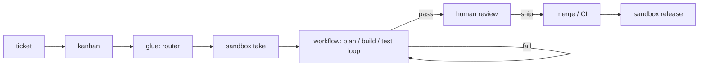

# aifactory


自前で持てる**ソフトウェアファクトリー**。チケットを入れると、隔離された VM の中でエージェントが計画・実装し、コードがテストと lint を回し、人間は最後にレビューだけする。

[English README](README.md) · [ドキュメントサイト](https://akkijp-oss.github.io/aifactory/) · [設計判断（ADR）](docs/adr/) · [変更履歴](CHANGELOG.md)

> 着想は Dan Isler（IndieDevDan）の講演 "FORGET Loop Engineering. Agentic Engineering is about THIS"。一言にすると「ループを作るのではなく **AI developer workflow** を設計せよ。エンジニアは冒頭のプランニングと末尾のレビューにだけ出て、間はエージェントとコードに任せろ」。

**状態:** v1。メンテナの Proxmox 環境で日常的に動き、実際の PR を出しているが、まだ若い。粗い所、日本語優先の文書、操作側の macOS 依存（launchd）がある。

**優先順位: コストより品質。** 安く済ませる工夫より、確実に動き・壊れず・後から読める作りを選ぶ。

## 何をするか



3 つのアクターに、それぞれ得意なことだけをさせる。

| アクター | 特性 | この repo での置き場 |
|---|---|---|
| コード | 速い・毎回同じ・トークン 0 円・最も信頼できる | lint / typecheck / test / CI / ルーター / sandbox 操作 |
| エージェント | 柔軟だが遅く高くブレる | plan / build / test 直し / review 補助 |
| エンジニア | 最も高価 | 冒頭の prompt（plan）と末尾の review だけ |

設計原則: **コードとエージェントを分離する**。「スキルの末尾で lint を走らせる」のではなく、コードが lint を走らせて結果をエージェントに戻す。

## 4 つの区画

| 区画 | 一言 | 実装 |
|---|---|---|
| `sandbox/` | どこで動くか。エージェント 1 体につき 1 台の隔離 VM。人が中に入って見られる | Proxmox VM をテンプレートから複製、スナップショット巻き戻し、Tailscale subnet router、外向き firewall |
| `kanban/` | 何をいつやるか。チケット台帳・採番元・ボード | SQLite + `bin/kb`（「ただのコード、エージェント不在」） |
| `workflow/` | どう進めるか。plan → build → gates ループ → review をコードの分岐でつなぐ | YAML + JSON Schema の定義、runner `bin/run`、役割は markdown |
| `glue/` | 区画をつなぐ | `bin/intake`（自由文 → チケット、LLM 1 回）、`bin/dispatch`（todo → `kb run`、直列） |

その上に、ローカルの **Web コンソール**（`console/bin/console`。Python 標準ライブラリ、127.0.0.1 専用）と **MCP サーバー**（`console/bin/mcp`。AI セッションが型付きツールで読み書きする）。どちらも正本は `console/lib/core.py` 1 つ。

## 前提

- 操作側: macOS（launchd 以外は Linux でも動くはず）、Python 3.11+、`jq`、`gh`、`ssh`、`pip install pyyaml jsonschema`
- [Claude Code](https://claude.com/claude-code) CLI と長期トークン（`claude setup-token`）。エージェントは VM 内で `claude -p` として動く
- sandbox 用の Proxmox VE ホスト（9.x で確認）と、操作側から VM に届くための Tailscale
- エージェントが push / PR できるように GitHub App（推奨、ADR-0008）かトークン

## まず動かす（VM 不要）

```bash
git clone https://github.com/akkijp-oss/aifactory.git && cd aifactory
pip install pyyaml jsonschema

# 運用データは workspace/（git 追跡外）に置かれる。AIFACTORY_WORKSPACE で外にも置ける
kanban/bin/kb new kumitate chore "runner を試す" --body - <<'EOF'
リポジトリの構成を短い markdown にまとめる。

## 完了条件
- work/summary.md がある
EOF
kanban/bin/kb run 100 --dry-run     # 定義を検証し、依頼文を workspace/runs/…-dry/ に書く
console/bin/console --open          # http://127.0.0.1:8765/
python3 -m unittest discover -s console/tests && python3 -m unittest discover -s workflow/tests
bin/install-hooks.sh                # 秘密情報の混入を止める pre-commit / pre-push（gitleaks が PATH にあること）
```

`examples/projects/` に PJ 定義（`project.yml` / `provision.sh` / `gates.sh`）を 2 本同梱している。

- `aifactory/`: このリポジトリ自身。公開リポジトリなので、誰でもテンプレートを焼いてチケットを 1 周回せる。メンテナは dogfooding に使う
- `kumitate/`: 私有の pnpm / Next.js monorepo。大きめのアプリの現実的な参照例

自分の PJ は `workspace/projects/<pj>/` に置く。書き方はドキュメントサイトの「プロジェクトを追加する」。

## sandbox を作る

本番には Proxmox ホストが要る。`sandbox/BUILD.md` を上から順に（人間の操作が要る箇所は 🧑 印。Tailscale 承認、`claude setup-token` など）:

1. `sandbox/templates/env.example` を `~/.config/sandbox/env` に（`PVE_HOST` と `GW_SSH` は必須）
2. `sandbox/proxmox/run.sh 10-sdn.sh` … `50-firewall.sh`: SDN、ゲートウェイ LXC、base テンプレート、PJ テンプレート、プール、firewall
3. `sandbox/bin/install.sh` のあと `sandbox take <pj> <task>` / `sandbox ssh` / `sandbox release`

あとは runner が端から端まで回す: `kb run <id>` → `sandbox take` → VM 内で agent step と code のゲート → PR → `sandbox release`。

## このリポジトリを読む AI へ

人間と複数の AI セッションが交代で、ときに同時に作業する前提で書かれている。

1. この README で全体像（4 区画）を掴む
2. 着手する区画の `README.md` で設計と契約を読む
3. `sandbox/STATUS.md`（雛形）と `$AIFACTORY_WORKSPACE/docs/STATUS.md`（その環境の実機状態）を見て、書かれている進捗と実機が一致するか確かめる
4. 判断を変えたら `docs/adr/` に 1 枚追加する（既存 ADR は書き換えない）

守ること:
- **実機が正**。ドキュメントと実機が食い違ったら実機を信じ、ドキュメントを直す
- 秘密情報（トークン・鍵）はこのリポジトリに書かない。置き場は `sandbox/README.md` の「秘密情報」節
- **同時に別の AI セッションが動いている前提**で振る舞う: ADR を足す前に `ls docs/adr/` で番号を取り直す。`git status` に自分が触っていない変更があっても戻さない。貸出中の sandbox VM（`sandbox ls`）を再起動・巻き戻し・作り替えしない。チケットの状態は `kb` で更新する

## 構成

```
aifactory/
├── sandbox/     設計（README）・構築手順（BUILD）・進捗票の雛形（STATUS）・運用（OPERATIONS）・bin/sandbox・proxmox/・templates/（base, env.example, …）
├── kanban/      bin/kb
├── workflow/    kit/（workflows / roles / steps / schema / routes.env）・bin/run・tests/
├── glue/        bin/intake・bin/dispatch
├── console/     bin/console（HTTP）・bin/mcp（stdio）・lib/core.py・static/・tests/・launchd/
├── examples/    projects/{aifactory,kumitate}/ 同梱の PJ 定義
├── lib/         aifactory_paths.py: 置き場の判断はここ 1 つ（ADR-0016）
├── bin/         migrate-workspace.sh
├── docs/        adr/（設計判断）・ledger.md（構想台帳）・仕組みの解説 HTML
├── website/     ドキュメントサイト（MkDocs Material、ja / en）
└── workspace/   git 追跡外の運用データ: projects/ kanban/ runs/ logs/ docs/
```

## 資料

- ドキュメントサイト（`website/`）: 導入・使い方・仕組み・CLI リファレンス・FAQ。ローカルで見るには `cd website && python3 -m venv .venv && .venv/bin/pip install -r requirements.txt && .venv/bin/mkdocs serve`
- `docs/adr/`: 1 判断 1 ファイル。既存は書き換えず、新しい判断は新しい番号で
- `docs/aifactory-how-it-works.html`、`docs/sandbox-architecture.html`: 図つきの 1 枚解説（ブラウザで開く）
- 各区画の README に契約と「踏んだ罠」がある

## 貢献

[CONTRIBUTING.md](CONTRIBUTING.md)。人にも AI セッションにも同じ約束が適用される。脆弱性の連絡は [SECURITY.md](SECURITY.md)。

## ライセンス

Apache License 2.0。[LICENSE](LICENSE) を参照。
