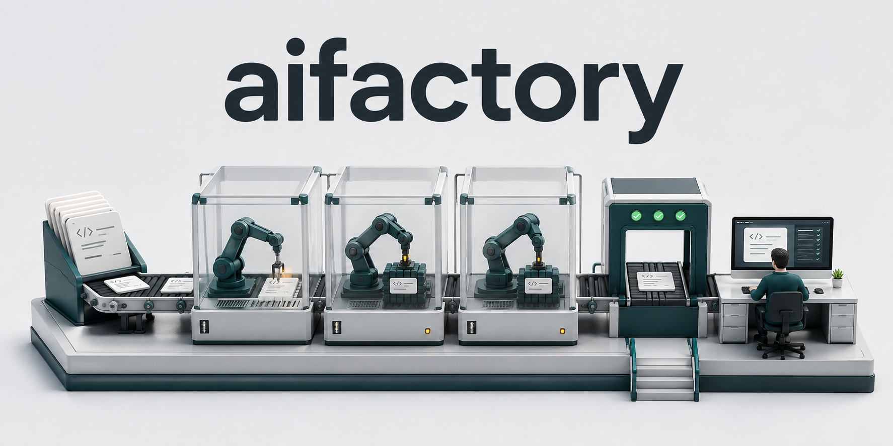
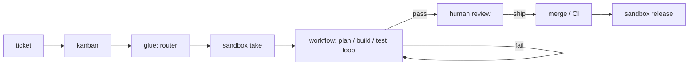

# aifactory



A self-hosted **software factory**: a ticket goes in, an agent plans and implements inside an isolated VM, code runs the tests and lints, and a human only reviews at the end.

[日本語 README](README.ja.md) · [Documentation site](https://akkijp-oss.github.io/aifactory/) · [Design decisions (ADR)](docs/adr/) · [Changelog](CHANGELOG.md)

> Inspired by Dan Isler's (IndieDevDan) talk *"FORGET Loop Engineering. Agentic Engineering is about THIS"*: do not build loops, design an **AI developer workflow**. The engineer shows up for planning at the start and review at the end; everything in between is agents and code.

**Status:** v1. It runs daily on one maintainer's home Proxmox host and has produced real pull requests, but it is young: expect rough edges, Japanese-first documentation, and macOS-specific bits (launchd) on the operator side.

## What it does



Three actors, each doing what it is good at:

| Actor | Traits | Where it lives here |
|---|---|---|
| Code | fast, deterministic, free, most reliable | lint / typecheck / test / CI / router / sandbox control |
| Agent | flexible but slow, expensive, noisy | plan / build / test-fix / review assist |
| Engineer | most expensive | the prompt at the start and the review at the end |

Principle: **keep code and agents separate**. Code runs the tests and hands the result back to the agent, not the other way round.

## The four areas

| Area | One line | Implementation |
|---|---|---|
| `sandbox/` | *Where* it runs: one isolated VM per agent, humans can ssh in and look | Proxmox VMs from a template, snapshot rollback, Tailscale subnet router, egress firewall |
| `kanban/` | *What* and *when*: the ticket ledger, id source, board | SQLite + `bin/kb` ("just code, no agents") |
| `workflow/` | *How*: plan → build → gates loop → review, wired by code | YAML + JSON Schema definitions, `bin/run` runner, roles as markdown |
| `glue/` | connects the areas | `bin/intake` (free text → ticket, one LLM call), `bin/dispatch` (todo → `kb run`, serial) |

On top: a local **Web console** (`console/bin/console`, Python stdlib, 127.0.0.1 only) and an **MCP server** (`console/bin/mcp`) so AI sessions can read and drive the factory with typed tools. Both share one core (`console/lib/core.py`).

The control plane (console, docs site, runner, kanban, workspace) can also live in an LXC **on the Proxmox host itself**, one per **tenant** (an organization you lend the factory to), each with its own network, VM pool, pool-scoped API token and secrets. See the *Tenants* guide on the documentation site and ADR-0017.

## Requirements

- Operator machine: macOS (Linux should work for everything except the launchd helpers), Python 3.11+, `jq`, `gh`, `ssh`, and `pip install pyyaml jsonschema`
- [Claude Code](https://claude.com/claude-code) CLI with a long-lived token (`claude setup-token`); agents run `claude -p` inside the VM
- A Proxmox VE host (tested on 9.x) for the sandbox, and Tailscale for reaching the VMs from the operator machine
- A GitHub App (recommended, ADR-0008) or a token so agents can push branches and open PRs

## Quick start (no VM needed)

```bash
git clone https://github.com/akkijp-oss/aifactory.git && cd aifactory
pip install pyyaml jsonschema

# operational data lives in workspace/ (git-ignored); AIFACTORY_WORKSPACE or ~/.config/aifactory/workspace moves it elsewhere
kanban/bin/kb new kumitate chore "try the runner" --body - <<'EOF'
Explain the repository layout in a short markdown file.

## Done when
- work/summary.md exists
EOF
kanban/bin/kb run 100 --dry-run     # validates definitions and writes the prompts under workspace/runs/…-dry/
console/bin/console --open          # http://127.0.0.1:8765/
python3 -m unittest discover -s console/tests && python3 -m unittest discover -s workflow/tests
bin/install-hooks.sh                # pre-commit / pre-push guards against leaking secrets (needs gitleaks on PATH)
```

Two project definitions ship under `examples/projects/` (`project.yml`, `provision.sh`, `gates.sh`):

- `aifactory/`: this repository itself. Public, so anyone can build the sandbox template and run a ticket end to end. The maintainers use it to dogfood the factory
- `kumitate/`: a private pnpm / Next.js monorepo, kept as a realistic reference for a larger app

Add your own under `workspace/projects/<pj>/`; see the *Add a project* guide on the documentation site.

## Building the sandbox

The real thing needs a Proxmox host. Follow `sandbox/BUILD.md` step by step (it marks the steps that need a human, such as Tailscale approval and `claude setup-token`):

1. `~/.config/sandbox/env` from `sandbox/templates/env.example` (`PVE_HOST` and `GW_SSH` are required)
2. `sandbox/proxmox/run.sh 10-sdn.sh` … `50-firewall.sh`: SDN, gateway LXC, base template, project templates, pool, firewall
3. `sandbox/bin/install.sh`, then `sandbox take <pj> <task>` / `sandbox ssh` / `sandbox release`

The runner then goes end to end: `kb run <id>` → `sandbox take` → agent steps and code gates inside the VM → PR → `sandbox release`.

## Repository layout

```
aifactory/
├── sandbox/     design (README), build steps (BUILD), progress template (STATUS), operations, bin/sandbox, proxmox/ scripts, templates/ (base, env.example, …)
├── kanban/      bin/kb
├── workflow/    kit/ (workflows, roles, steps, schema, routes.env), bin/run, tests/
├── glue/        bin/intake, bin/dispatch
├── console/     bin/console (HTTP), bin/mcp (stdio), lib/core.py, static/, tests/, launchd/
├── examples/    projects/{aifactory,kumitate}/ shipped project definitions
├── lib/         aifactory_paths.py: the one place that decides where data lives (ADR-0016)
├── bin/         migrate-workspace.sh
├── docs/        adr/ (design decisions), ledger.md, how-it-works HTML pages
├── website/     MkDocs Material site (ja / en)
└── workspace/   git-ignored operational data: projects/ kanban/ runs/ logs/ docs/
```

## Documentation

- Documentation site (`website/`): getting started, guides, concepts, CLI reference, FAQ. Build locally with `cd website && python3 -m venv .venv && .venv/bin/pip install -r requirements.txt && .venv/bin/mkdocs serve`
- `docs/adr/`: one file per design decision. Existing ADRs are never edited; a new decision gets a new number
- `docs/aifactory-how-it-works.html`, `docs/sandbox-architecture.html`: single-page illustrated explanations (open in a browser)
- Area READMEs (`sandbox/`, `kanban/`, `workflow/`, `glue/`, `console/`) hold the contracts and the lessons learned

## Contributing

See [CONTRIBUTING.md](CONTRIBUTING.md). The repository is written to be worked on by humans and AI sessions alike, often concurrently; the rules there apply to both. Security issues: [SECURITY.md](SECURITY.md).

## License

Apache License 2.0. See [LICENSE](LICENSE).
