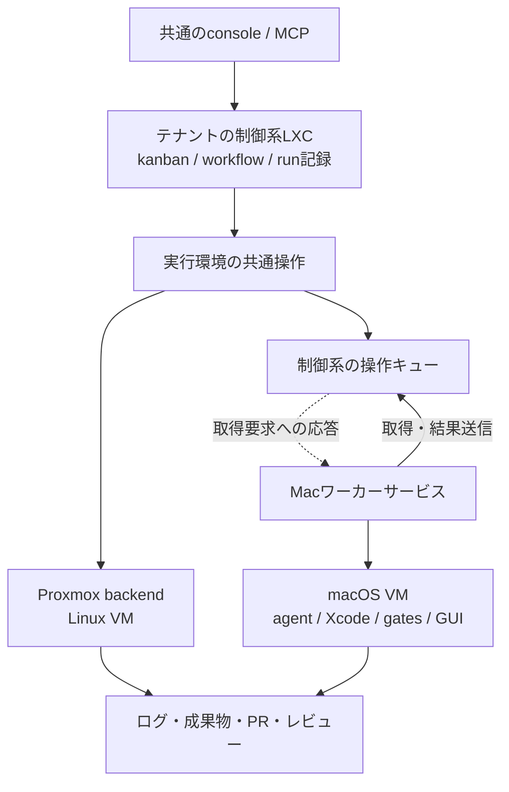

# macOS実行環境の連携検討

2026-09-07 / 状態: ③「Macが仕事を取りに来る方式」をユーザーが選択。詳細設計中・未実装

## 結論

Proxmox上の制御系を維持し、Apple Silicon Mac上のmacOS VMを追加の実行環境として扱う。Mac上のワーカーサービスが制御系へ接続し、操作を取得して実行し、ログと結果を返す。チケット、workflow、ログ、PR、レビューは共通にする。macOSアプリの実装とテストは同じmacOS VMで行う。

対象の `mac-worker` はM1・16GBのMac mini。既存の作業セッションがあるため、専用の空きサーバーとは扱わない。最初の検証候補は1 VM・同時1タスク。4 vCPU・8GB RAMは仮の開始値であり、実測に基づく推奨容量ではない。ホストの通常作業と競合するなら専用化または別機を選ぶ。

現行firewallが止めている制御系→tailnetの新規接続は使用しない。Mac→制御系のワーカー専用受信口を用意し、その接続に対する応答として作業指示を返す。Macからの到達性と応答経路は実機未検証。手元からのSSH復旧だけでは工場への登録は完成しない。

## 検討の基準と実施範囲

- worktree: `../aifactory-macos-study`
- branch: `study/macos-worker`
- 基点: `e3f7e1f`。作成時の元worktreeの未コミット変更とgit非追跡・非ignoreの12ファイルを複製した。ADR-0017など現在進行中のテナント対応を含む。
- この検討で新たに作成したリポジトリ内のファイルはこの文書のみ。複製された変更は今回の実装ではない。コミット・push・PR作成はしていない。
- `other-mac` は最初に指定された別機（Intel MacBook Pro）。訂正後は対象外。
- 正しい接続先についてSSH復旧と読み取り確認を行った。ホスト設定変更、Tart導入、VM作成、アプリのビルド、実行中の作業への介入は行っていない。
- 行番号はこのworktreeの調査時点に対応する。元worktreeの以後の変更は自動では反映されない。
- 実機固有のホスト名・アドレスは一般化した。元の実機記録は非追跡のworkspace/docsへ保管した。

## 実機確認

| 項目 | 観測結果 | 含意 |
|---|---|---|
| 機体 | Mac mini / Macmini9,1 / Apple M1 / 8 cores / 16GB | Apple SiliconのmacOS仮想化を検討できる |
| OS | macOS 26.5.2 / build 25F84 / arm64 | VMのOSとXcodeの組み合わせは別途固定する |
| ストレージ | `/` の `df -h`: 約926Gi、空き777Gi | イメージ作成の候補容量はある。実使用量は未測定 |
| Xcode | `/Applications/Xcode.app` に26.6 / build 17F113 | インストール済み。ゲストには別途準備が必要 |
| 既定の開発環境 | `/Library/Developer/CommandLineTools` | 通常の `xcodebuild -version` は失敗 |
| Xcode個別指定 | `DEVELOPER_DIR=/Applications/Xcode.app/Contents/Developer xcodebuild -version` 成功 | グローバル設定変更なしでバージョン確認可能。build/test成功までは意味しない |
| Tart | PATH、標準インストール先、Homebrewの一覧では検出なし | 未導入として計画。任意の別ディレクトリまでは探索していない |
| ツール | Homebrew、gh、nodeを確認。システムPythonは3.9.6 | 制御系のPython 3.11+要件をホストに一律適用する必要はないが、管理プログラムの要件は決める |
| agent CLI | `~/.local/bin/claude` のリンクあり、SSH login PATHでは見つからない | インストールの有無と無人実行時のPATHを分けて検査する。認証・実行は未確認 |
| GUI | 画面共有接続とconsoleログインを確認 | ホストの状態。ゲストのGUIテスト可否とは別 |
| 電源 | `sleep 1`, `autorestart 0` | 常時稼働の保証はない。実際のsleep抑止状態は未確認。変更なし |

確認は `sw_vers`、`uname -m`、識別子を除いた `system_profiler SPHardwareDataType`、`xcode-select -p`、Xcodeのバージョン取得、`df`、`who`、`pmset -g custom` とツールの存在確認による。画面共有上に既存の開発作業が見えたため、個人の作業ディレクトリや秘密情報の内容は調査していない。

### SSH復旧の記録

1. `ssh mac-worker` は `<previous-lan-address>:22` へのタイムアウトだった。画面共有は接続済み。
2. 名前解決ではTailscaleのFQDNが得られ、その経路ではSSHサーバーまで到達した。
3. `HostKeyAlias=<previous-lan-address>` と `StrictHostKeyChecking=yes` を指定し、既存の信頼済みホスト鍵との一致と公開鍵認証の成功を確認した。ホスト鍵検証を無効化していない。
4. 操作端末の `~/.ssh/conf.d/mac-hosts/config` の対象Hostブロックのみ、HostNameを `mac-worker.example.ts.net` に変更し、上記HostKeyAliasを設定した。
5. 元設定は同ディレクトリの `config.backup-20260907-012918` に保存。通常の別名による `ssh -o BatchMode=yes -o StrictHostKeyChecking=yes mac-worker` の実行成功を再確認した。

Mac側のリモートログイン、firewall、認証鍵は変更していない。復旧の前提は操作端末と対象MacがTailscaleで通信できること。全体を戻す場合は後続編集がないことを確認してバックアップを利用し、後続編集がある場合は対象Hostブロックだけ戻す。

## 提案する構成

制御系と運用データの正本はテナントごとに1つのままにする。Macに独立したkanbanやdispatcherを置かない。Macの停止時にもconsoleとLinuxタスクは動き続け、macOSタスクは待機または接続障害として表示する。

初期対象は1テナント・1 Macホスト・1 macOS VMとし、プロジェクト全体を1種類の実行環境に割り当てる。複数テナントのMac共用、stepごとのOS切り替え、Linuxバックエンドとの複合環境は後段に分ける。

### 通信方式の選択

`sandbox/proxmox/50-firewall.sh:66` は制御系からtailnet宛てをDROPする。さらに同ファイル103–104行では、gwの内部側からtailnet/LANへのNEW転送をDROPする。従って制御系だけに例外を足しても足りない可能性がある。実機のルール、ルーティング、Tailscale側のACLは今回は確認していない。

| 案 | 利点 | 追加設計 | 評価 |
|---|---|---|---|
| 制御系→MacのSSH | 現行runnerの呼び出し方に近い | ctlとgw双方の限定許可、ルート、名前解決、tailnet ACL、Macの管理用権限 | 比較案。本実装では採用しない |
| Mac→制御系の常駐接続 | ワーカー側から接続開始できる | 認証付きの受信口、ジョブ割当、heartbeat、再接続、二重実行防止 | ユーザーが選択した方式③ |

Macワーカーから制御系のワーカーAPIへ接続する。制御系からMacへのSSH許可は追加しない。sandboxゲスト全体へのtailnet許可や、広いRFC1918許可で解決しない。Macから制御系へのルーティング、DNS、ACL、受信口と応答経路の検証は必要である。

Macワーカーがホスト上でTartを操作し、ゲスト向けSSH・ファイル転送を仲介する。ゲストIPやSSH情報はMac側だけで扱う。ProxmoxにMacホストのSSH鍵を配る必要はない。現行の個人用 `<operator>` アカウントは調査用であり、本番の実行権限には採用しない。

## 共通の契約と既存コードの変更候補

下記はAPI案であって実装済みの関数・設定ではない。

| 操作 | 保証すること |
|---|---|
| acquire(requirements, run_id) | OS・arch・イメージを満たす環境を排他的に予約し、leaseを返す |
| exec(lease, command, timeout) | 終了コード、逐次ログ、タイムアウト、キャンセルを共通形式で返す |
| upload / download | ホスト・ユーザー・作業パスの違いを吸収してファイルを受け渡す |
| inspect / capacity | 実際の空き、稼働、切断、GUI利用可否を取得する |
| reset / release | 前タスクのコード・プロセス・秘密情報を次のタスクに持ち越さない |

leaseにはversion、tenant、run ID、backend、worker ID、instance ID、イメージ識別子、作業パス、期限・世代番号を持たせる。ProxmoxのVMIDとIPを共通IDにはしない。割当の正本は制御系、ホストはleaseに対する実体と生存状態を持つ。再接続時に双方を照合し、期限切れだけを根拠に稼働中VMを再貸出ししない。

| 調査箇所 | 現在の結合 | 変更候補 |
|---|---|---|
| `sandbox/bin/sandbox:66–73` | 起動時にProxmox設定とgwが必須 | backend選択後に必要な設定だけ検証 |
| 同154–158、245–259行 | VMID由来IP、VMIDによる貸出管理 | backend固有識別子と排他的lease |
| 同208–225行 | `/run/sandbox/env` とgwのDNS更新 | OS別の秘密情報注入、任意の接続先表示 |
| `workflow/bin/run:145,168–179,195,272–275` | `/home/dev`、state内IP、直接SCP、GNU timeout | backendの作業パス・転送・時間制限へ移動 |
| `workflow/kit/steps/gates.sh:6–8` | 鍵・stateパス・ユーザー・転送先固定 | runnerと同じ転送契約を利用 |
| `workflow/kit/schema/project.schema.json:7` | 未定義プロパティを拒否、実行先指定なし | requirementsを正式定義。設定追加だけでは動かない |
| `glue/bin/dispatch:21,49,74` | PJごとの固定台数 | 複数PJで共有するMacの実capacityと排他を確認 |
| `console/lib/core.py:191` | HTTP URLを全タスクに生成 | Web、画面接続、成果物を型付きで表示 |
| `sandbox/proxmox/50-firewall.sh:58–66,103–104` | 受信はSSH/console中心、外部Macへの新規接続を遮断 | Mac発のワーカーAPIへの限定受信と応答を許可。外向き遮断は維持 |

macOSではホームパスだけでなくGNU/BSDコマンド、login shellのPATH、Xcode選択、GUIセッション、トークン配置の違いを扱う。ホストの個人環境をVMへコピーせず、固定したゲストイメージに必要なツールを準備する。

## VMのライフサイクル

Tartを差し替え可能な実装候補にする。公式Quick StartにはApple SiliconホストでのmacOS VM起動、複製、ゲストへのSSHの手順がある。[Tart Quick Start](https://tart.run/quick-start/)

1. macOS・Xcode・依存関係・agent CLI・テスト用GUI設定を固定した基準イメージを管理者が作る。個人のApple Account、署名鍵、実行トークンは焼き込まない。
2. タスク用VMを複製して起動。OS/arch/Xcode、SSH、GUI、ディスク残量を検査する。
3. タスク用の短命な秘密情報を注入して作業する。ゲストの鍵は準備時に検証可能な方法で登録する。
4. ログ・変更・テスト結果を回収する。回収に失敗したらVMを破棄せず、回収待ちとして保持する。
5. 通常終了ではゲストを破棄し次回複製する。リセットも同じ清浄化保証を満たす。ProxmoxのRAM込み復帰と性能を同一視しない。

テンプレートは変更可能な `latest` のまま使わず、版・digest等で追跡する。複製時間、起動時間、Xcodeのコールド/ウォームビルド、メモリ圧迫は未実測。ホスト上のXcodeインストールはゲストの準備完了を意味しない。

## GUI、レビュー、署名

- 共通workflowのgatesから `xcodebuild build/test` を呼び、ログと `.xcresult` を回収する。具体的なscheme、destination、最低OSは対象アプリが決まってから定義する。
- Appleの資料ではAppKit/UIKitを使うテストにAquaセッションが必要であり、GUIログインのないSSH接続は別のセッションになる。資料はアーカイブなので現行Xcodeと対象テストで再検証する。[Apple: Automating the Test Process](https://developer.apple.com/library/archive/documentation/DeveloperTools/Conceptual/testing_with_xcode/chapters/08-automation.html)
- `who` とホストの画面共有成功はゲストのUIテスト成功を証明しない。初回起動、権限ダイアログ、画面ロック、再起動後をそれぞれ検証する。
- 初期の画面確認はconsoleに接続案内を表示して画面共有アプリへ渡す。ブラウザ内のライブ画面は別の配信・認証機構が必要で、初期必須にしない。
- 現行 `--keep`（`workflow/bin/run:197`）を参考に、レビュー中保持と明示返却を扱う。1台しかないと保持中は次のmacOSタスクが待つ。成果物確認だけで済むタスクは解放する。
- 配布用署名・公証は開発ループとは独立した権限で実行し、鍵を通常の実装VMや基準イメージに常備しない。配布物の検証方法は対象アプリに合わせる。
- GPU、USB、カメラ、システム拡張など実機依存の要件が出たら、VMで再現できるか評価し、専用実機テストを追加する。今回その可否は検証していない。

## 隔離、復旧、運用

- ホストのホームやKeychainをゲストに共有しない。個人利用中のMac上で権限の強いagentをネイティブ実行する案は初期の工場用途に採用しない。
- ProxmoxのfirewallはMac上のゲストを保護しない。guest→host、LAN、他テナント、制御系管理口への到達を別途検証する。Tartのネットワークモードごとに性質が異なるため、NATだけで隔離済みと判定しない。[Tart FAQ](https://tart.run/faq/)
- 接続断はgate失敗と区別する。再接続後に既存プロセス・lease・成果物を照合してから再開し、PR作成など外部作用のあるstepを無条件に再実行しない。
- タイムアウト後は遠隔プロセスも停止できたか確認する。制御系のSSHプロセス終了だけで返却済みとしない。
- sleep、ホスト再起動、guest停止、満杯ディスク、回収失敗を個別の状態として表示する。保持VMはTTLと手動延長を持たせる案とする。
- Tartは現行公式説明でFair Source License。ホスト規模等で条件が異なるため、aifactory本体のApache-2.0と分けて採用判断する。macOS/Xcodeの使用条件・ゲスト数・第三者への貸出条件も、配備時の対象版と運用形態に合わせて確認する。本書は許諾可否の判断ではない。[Tart Licensing](https://tart.run/licensing/)

## 方式③の詳細設計案

以下はユーザーが選択した方向を具体化した提案であり、API名、数値、ファイル配置は未実装。

### 責務と初期構成

| 配置 | 担当 | 保持する状態 |
|---|---|---|
| 制御系の既存runner | plan→implement→gates→reviewの遷移、プロンプト生成 | 既存のrun記録 |
| 制御系の実行環境サービス | ワーカー認証、排他的割当、操作キュー、結果受領 | ワーカー・lease・操作・イベント受領位置のDB |
| Macのワーカーサービス | 仕事の取得、Tart管理、ゲスト操作、ログ・成果物送信 | 実行済み操作の記録、VM対応表、未送信データ |
| macOSゲスト | agent、Xcode、プロジェクトのテスト | タスクの作業ツリーと成果物 |

「Macが仕事を取りに来る」の仕事は、初期設計ではworkflow丸ごとではなく `prepare / exec / upload / download / reset / release` の操作単位とする。1 runに同じVMを予約し続け、制御系runnerがstepの結果を受け取って次の操作を登録する。Macはworkflowの分岐やkanbanの状態を決めない。

制御系の共通backendは、Proxmoxでは既存操作を呼び、macOSではキューへ登録して完了を待つ。待機中も既存形式のログを更新する。`gates.sh` 等の直接SCPもこの境界へ移し、Mac側に制御系のシェルスクリプト一式を無条件に実行させない。

Macのホスト操作は管理者が設定したVMイメージと作業領域に限定する。タスク由来の自由なシェルコマンドは必ずゲスト内で実行する。最初は1テナント専属・capacity=1、ゲストイメージも1種類とする。ホスト側サービスの常駐方法は専用アカウントのlaunchdを候補とし、GUIセッションとの関係は実機検証で確定する。

### 利用者の操作

1. 工場の管理者がワーカー登録を作成する。対象テナントと利用可能なプロジェクトを指定する。
2. Macの管理者が接続設定を投入し、ワーカーを起動する。consoleに「準備中→利用可能」が表示される。
3. プロジェクトにmacOSの実行要件を設定する。通常のチケット投入操作は共通。
4. 適合するMacが空いていれば予約し、実行する。空きがなければ「実行環境待ち」。Linux用の仕事は続行する。
5. ログ、テスト結果、PR、必要な場合の画面確認案内を同じrun画面で見る。

ワーカー設定は `backend: macos-pull`、`os: macos`、`arch: arm64`、固定したイメージ識別子とGUI要否を表せる形を候補とする。物理ホスト名はプロジェクトの事実から分離し、管理者のワーカープール設定で指定する。現行schemaは未知の項目を拒否するため、この設定例を既存project.ymlへそのまま追加しても動かない。

### 接続と登録

- Macは同じテナントのtailnet経由で制御系へ接続する。初期は別ポートのワーカー専用HTTPS受信口を設ける案とする。TLS終端を含む配備方法とポート番号は実装時に確定する。Macが信頼する証明書を用意し、検証を無効化しない。
- consoleのHTTP/8765や共通 `CONSOLE_TOKEN` を、そのままワーカーの管理権限に流用しない。ワーカーAPIは自分の割当取得と結果報告に権限を限定する。
- 登録用の短時間・一回限りのコードを、worker IDに結び付いた個別の認証情報へ交換する案とする。登録・失効・更新は管理者の操作で、他のワーカーを巻き込まずに行える。
- tenantは認証情報から決める。リクエスト本文のtenantやworker IDだけを信頼しない。登録時のイメージ・プロジェクト許可と、ワーカーが報告する稼働状態を分ける。
- 既存gw経由のsubnet接続では送信元がSNATされる場合がある。IPだけでワーカーの所属を判定しない。gw、ctlのルールはワーカー受信口に必要な範囲で設計し、VM発の外向き遮断は維持する。
- 初期はshort pollから始める設計とし、空き確認は約3秒、heartbeatは約10秒を仮値とする。実行中も別ループでheartbeat・ログ送信・キャンセル取得を続ける。Macへの着信ポートや逆SSHトンネルは要求しない。
- agent/GitHubの実行用秘密情報はワーカー認証とは別。割当対象だけに渡し、更新・失効を操作として届ける。基準イメージ、汎用ログ、操作履歴の平文payloadには保存しない。

### 操作とデータの契約

| 契約案 | 内容 |
|---|---|
| register | 一回限りの登録コード、プロトコル版、worker情報を交換 |
| poll | capacity、既知の操作IDと状態を報告し、自分宛ての次の操作を取得 |
| acknowledge | 操作を永続記録したことを応答。重複配信を同じ操作へ対応付ける |
| heartbeat | boot/session ID、VM、lease、実行中操作、空き容量を報告 |
| append-events | 操作IDと連番付きログを送信し、制御系が永続化済み位置を応答 |
| transfer | 入出力をサイズ・digest・再開位置付きで送受信 |
| complete | 終了コード、失敗種別、成果物manifestを報告。制御系が受領を確定 |

操作の識別子は `tenant / run UUID / attempt / lease generation / operation UUID`。チケット番号だけでは再実行を区別できない。execの入力はコマンド、ゲスト内cwd、環境変数の参照、timeout、入力ファイル参照。出力は終了コードとログ・成果物の参照を基本とし、ネットワークエラーをexit codeのテスト失敗へ変換しない。

ログは操作内の連番で重複排除し、順序の欠落を検出する。Macは制御系の受領済み位置までは再送できるよう保持する。成果物は割当run内に限定し、相対パス・サイズ上限・digestを検証する。アーカイブを扱う場合もパストラバーサルとsymlinkによるrun外書き込みを防ぐ。

新しい操作DBは制御系の実行環境サービスだけが正本として更新し、runner/CLI/console/MCPは同じサービス境界を使う。初期はSQLiteのトランザクションで予約とキュー追加を原子的に行う案とする。既存kanban.dbと役割を混同せず、run記録は既存形式へ投影する。

### 切断・再実行・キャンセル

配送は再送を許し、実行の「必ず一回」を保証すると表現しない。操作の永続記録と外部作用の照合で重複を抑える。

| 状況 | 制御系 | Macワーカー |
|---|---|---|
| 空きMacなし | タスクを待機。待機中のrunで直列dispatcherを塞がない | 空きと接続状態を報告 |
| 操作応答の紛失 | 同じ操作IDを再送可能 | 記録済みなら再実行せず既存状態・結果を返す |
| 実行中に通信断 | 接続不明と表示し、同じ仕事を別Macへ自動再配布しない | 新規操作を開始せず、実行中処理を所定の猶予内で継続しログを保存 |
| 猶予を超過 | 要復旧として保持 | ゲスト内プロセス群を停止し、停止確認と成果物保存。猶予はプロジェクト方針で定義 |
| Macまたはサービス再起動 | lease・操作状態を照合するまで再割当しない | 永続記録とVM実体を照合。終了が不明なら勝手に再実行しない |
| 制御系再起動 | DBから操作を復元し、runnerは既存操作へ再接続 | 同じ操作IDで状態と未受領データを再送 |
| キャンセル要求 | 要求中を表示。応答がなければ停止済みにしない | 実行中操作とは独立して要求を取得し、ゲストプロセス停止を報告 |
| 成果物回収失敗 | 回収待ち。releaseを発行しない | VMと未送信成果物を保持し再送 |
| 返却・清浄化失敗 | 使用不可としcapacityへ戻さない | エラーを報告し、そのVMを再利用しない |

世代番号は古い割当の結果を新しいrunへ混ぜることを防ぐが、切断したゲストによるGitHubへのpush等を止める保証にはならない。停止確認まで再割当を抑止し、結果不明のPR作成・マージはGitHub上の事実と照合する。失効したワーカーからの通常操作は拒否し、残ったVMや成果物の回収は別の管理手順で扱う。

MacでVMを保持中のreviewはcapacityを消費する。期限切れに伴う自動破棄は、必要な成果物が制御系で受領済みの場合だけとする。ホストのディスク上限へ近づいたら新規受付を止め、未受領成果物を黙って削除しない。

### 既存運用への導入順序

1. 共通backendの契約と既存Proxmox実装の境界を作る。従来のプロジェクトは実行先未指定でもProxmoxを選ぶ。
2. ワーカー登録・操作キュー・認証・永続記録を、VM不要の偽ワーカーで検証する。
3. Mac側のTart管理とゲスト操作を加え、サンプルアプリで1 runを通す。
4. runnerとcode stepsの直接SSH/SCP依存を整理し、同じworkflowからMacへ操作を流す。
5. dispatcherの待機処理とconsole/MCPのワーカー状態・成果物表示を統合する。macOS待ちでもLinuxを配車する。
6. 切断・再起動・重複配信・キャンセル・回収失敗を検証してから、実プロジェクトを登録する。

初期対象外はMacホストの複数テナント共用、複数OSを使う1 run、ブラウザ内のライブ画面配信、配布用署名の完全自動化。停止・復旧・ログ回収は初期から必須とする。Mac実行先を無効にすれば新規macOSタスクだけを止められる形にし、稼働中leaseを処理してからサービスを止める。

方式③への合格条件は、制御系→Macの新規接続が遮断された状態で、Macの登録からprepare→実行→ログ・成果物回収→releaseまで完走すること。あわせてMacを切断した状態でもLinuxの仕事が進み、Mac復帰後に二重実行せず照合・復旧できることを確認する。

## 後続の検証計画（今回は実行していない）

| 順番 | 検証 | 合格条件 |
|---|---|---|
| 1 | 対象アプリとMacの利用時間・資源を決める | Xcode/OS/arch/GUI要件とホストの利用上限が決まる |
| 2 | Mac→制御系ワーカーAPIの限定経路を用意する | 操作取得と結果送信が可能で、制御系→Macの新規接続許可を増やさない |
| 3 | 1つのmacOS VMを準備する | ゲスト内SSH、Xcode、agent、GUIテストの前提が揃う |
| 4 | 小さなサンプルアプリでbuild/test | 実際のコンパイル・テスト成功とログ/xcresult回収を確認 |
| 5 | GUIテストと人の画面確認 | VM再起動後にも再現し、ホストの通常作業を操作しない |
| 6 | reset/releaseの清浄化 | 前タスクのファイル・秘密情報・プロセスが残らない |
| 7 | 失敗と並行要求の検証 | 切断・停止・回収失敗で成果物を失わず、二重貸出しない |
| 8 | 共通workflowへの統合 | 既存Linux経路と新macOS経路の両方でチケットからレビューまで完走 |

測定する値はVM準備時間、build/test時間、成果物回収時間、ホストのメモリ圧迫・swap・通常作業への影響。許容時間は対象アプリ未定のためまだ設定しない。

現時点で確認できたのは「正しいMacへのSSH接続復旧」「M1・16GBという実機条件」「Xcodeを個別指定して起動できること」「ソース上の統合箇所と通信上の障壁」まで。macOS VM上での工場稼働は未検証である。
