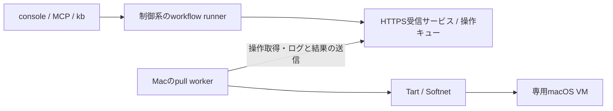

# Macワーカーの導入と運用

初回導入は [ワンライナーで導入する](worker-install.md) を参照。

2026-09-07 / macOS VMでの文書整備からPR作成・VM返却まで実機確認済み。

aifactoryは、Apple Silicon Mac上のmacOS VMをチケットの実行先にできる。制御系はProxmox上に置いたまま、Mac上のGo製ワーカーがHTTPSで仕事を取得する。利用者は通常と同じMCPの `ticket_run` または `kb run` から依頼する。

この文書は現在の運用ガイド。[連携検討メモ](macos-worker-study.md)は実装前の調査記録、[ADR-0018](adr/0018-macos-pull-worker.md)は通信基盤の判断、[ADR-0020](adr/0020-macos-workflow-backend.md)はworkflow統合の判断を記録している。

## 構成と実行の流れ



1. runnerがMacワーカーの準備状態を調べ、run単位の予約（lease）を取得する。
2. Macが停止中の基準VMを複製し、専用ゲストを起動する。
3. ゲスト内でPJの `provision.sh` を実行し、認証情報を渡してリポジトリをcloneする。
4. 同じゲストで計画・実装・ゲート・レビューを進める。`docs` workflowは必要に応じて修正へ戻り、合格後にPRを作成する。
5. 成果物を制御系へ回収してハッシュを照合し、ゲストを停止・削除して予約を解放する。PRは人間のレビュー待ちになる。

チケット台帳とrunの正本は制御系にある。制御系からMacへのSSH接続は実行経路に使わず、ゲストへの操作はMacが `tart exec` で仲介する。管理者のSSHによるホスト設定・復旧は別の経路である。

## 初回セットアップ

### 1. 制御系を準備する

[workersの制御系手順](../workers/README.md#制御系)に従って、ワーカー用HTTPSサービス、SQLite DB、TLS証明書、ワーカーごとのトークンを用意する。Macから受信口（既定8766/TCP）へ到達できるようにする。consoleの認証とは別で、TLS検証を無効にしない。

サービスとrunnerは同じ操作DBを参照する。runnerの指定は `AIFACTORY_WORKER_DB`、既定は `$AIFACTORY_WORKSPACE/workers/queue.sqlite3`。ワーカー登録は制御系の管理CLIで行い、トークンと必要なCA証明書を信頼できる管理経路でMacへ配布する。

### 2. Macホストと基準VMを準備する

- Apple Silicon MacにTartとSoftnetを用意する。GoやPythonはワーカーバイナリ自体の実行には不要。
- 基準VMはTart Guest AgentとPython 3を含むmacOS VMとし、停止しておく。ホストのXcodeやCLIはゲストに引き継がれない。
- 基準VMに個人アカウント、署名鍵、実行トークンを保存しない。専用ゲストには未使用の名前を指定する。
- 取得元・版・digestとゲストOSを記録する。`latest` という名前だけでは再現できない。実機固有の記録は非追跡の `$AIFACTORY_WORKSPACE/docs/` に置く。

ワーカーの設定例とバイナリのビルド方法は [workers/README.md](../workers/README.md) にある。`base_vm` はローカルの基準VM名、`guest_vm` はタスク用の専用ゲスト名。現在の割当は1ワーカーにつき同時1 run、ゲストは4 CPU・8 GiB固定である。

Softnetには管理者によるroot所有・SUID設定が必要。Homebrewで導入した場合は、対象を確認して設定する。

```bash
softnet_binary="$(/opt/homebrew/bin/brew --prefix softnet)/bin/softnet"
sudo chown root:wheel "$softnet_binary"
sudo chmod u+s "$softnet_binary"
stat -f '%Su %Sg %Sp %N' "$softnet_binary"
```

所有者 `root`、グループ `wheel`、所有者の実行権限欄に `s` があることを確認する。初期実装の準備判定はこのSUID方式を対象にする。Softnet更新後は再確認する。

### 3. ワーカーを常駐させる

[LaunchAgentテンプレート](../workers/templates/com.aifactory.worker.plist)の `@BINARY@`、`@CONFIG@`、`@LOGDIR@` を絶対パスに置き換え、`~/Library/LaunchAgents/com.aifactory.worker.plist` に配置する。ログディレクトリは先に作り、XMLの特殊文字をエスケープする。

```bash
launchctl bootstrap "gui/$(id -u)" "$HOME/Library/LaunchAgents/com.aifactory.worker.plist"
launchctl print "gui/$(id -u)/com.aifactory.worker"
```

Tartの絶対パスを設定しても、Tartが呼ぶSoftnetを見つけるPATHは別に必要。テンプレートは `/opt/homebrew/bin` を含む。plist変更時は稼働中の操作がないことを確認し、`launchctl bootout "gui/$(id -u)/com.aifactory.worker"` の後にbootstrapで再読込する。バックアップのplistはLaunchAgentsの外へ置く。

LaunchAgentなのでログイン前の稼働は保証しない。ホストのスリープ、再起動後のログイン、空きメモリ・ディスクは運用側で確認する。

### 4. PJを登録する

制御系の `$AIFACTORY_WORKSPACE/projects/<pj>/project.yml` に指定する最小構成:

```yaml
name: example-mac
repo: example-org/example-app
base_branch: main
backend: macos-pull
worker: mac-worker-01
app_dir: /Users/admin/app
gates: gates.sh
```

`worker` は登録済みIDと一致させ、`app_dir` はゲストのアカウントに合わせる。同じディレクトリにPJ用の `gates.sh` と、必要なら `provision.sh` を置く。ゲートは製品と変更内容に合う検証を行い、失敗時は非ゼロで終了する。

ゲストにはrunner用の `gh`、Claude CLI、GNU `timeout` などが必要。provisionは認証注入前に動き、ツールを準備する。cloneはrunnerが行う。既存ツールの再ダウンロードを避けるなど、provisionは再実行可能にしておく。Linux用のパスやパッケージ管理コマンドをそのまま流用しない。

制御系にはsandboxのPJ別GitHub App設定とClaude OAuthトークンを用意する。GitHub Appの対象リポジトリへのインストールとPR作成に必要な権限を確認する。値をPJ定義・チケット・ログへ書かない。

## 依頼と進捗確認

以下は制御系のリポジトリルートから実行する。`AIFACTORY_WORKSPACE` はその環境の運用ディレクトリに設定しておく。

```bash
python3 workers/bin/control --db "$AIFACTORY_WORKSPACE/workers/queue.sqlite3" list
kanban/bin/kb new example-mac docs 'READMEを現行実装に合わせて整備する' --body /path/to/ticket.md
kanban/bin/kb run <発行されたID> --dry-run
kanban/bin/kb run <発行されたID>
```

MCPでは同じチケットに `ticket_run` を呼び、返されたjob IDを `job_wait` / `job_show` で追う。`run_show` から実run名とログのパスを確認し、`read_file` で工程のログを読む。長い処理でも重複したrunを開始しない。dry-runは依頼文・構成の確認であり、VMの実行確認ではない。

ワーカーの `online` と `info` 内の `lifecycle`・`base_ready`・`network_ready`、予約状態を確認する。直接開始したrunは、onlineのワーカーの基準VM・Softnet準備を最大6時間待てる（`AIFACTORY_MAC_PREPARE_WAIT_S` で変更）。その間はVMもleaseも割り当てない。dispatchは未準備・offline・予約中のワーカーを見送る。

## 成果物と終了確認

`$AIFACTORY_WORKSPACE/runs/<run>/` に記録される。

| 記録 | 確認すること |
|---|---|
| `state.json` | 工程履歴、PR URL、backend・worker・lease、`artifacts_received` と `released` |
| `agent-*.log` / `code-*.log` | 実行内容、ゲート・レビューの判定、ゲストOSなどの検証根拠 |
| `worker-operations.log` | ワーカー操作ID。管理CLIの `show` と対応づける |
| `work/` | 計画・報告・レビュー・ゲート結果・PR URLなど |
| `artifacts.json` | 回収ファイルのSHA-256 |

PR後の `result: human` は人間によるレビュー待ちを表す。これだけで失敗と判断せず、工程履歴とPRを確認する。通常終了ではゲストがTartの一覧から消え、制御系のleaseが空になる。`--keep` を付けた場合は成果物回収後もゲストとleaseを保持する。

成果物はゲスト作業ディレクトリ直下の通常ファイル、合計4 MiBまで。入力転送は1ファイル350,000バイトまで。ディレクトリやsymlinkは回収しない。認証用 `runtime.env` は除外する。大きなビルド成果物や `.xcresult` の回収は、この経路では扱えない。

## 失敗時の復旧

| 症状 | 確認・対処 |
|---|---|
| `network_ready` がfalse | LaunchAgentのPATH、Softnetのroot所有・SUIDを確認する |
| `base_ready` がfalse | 設定したローカル基準VMが存在するか、イメージ取得が完了したかを確認する |
| CLI導入が長時間かかる | provisionログで進行・再取得を確認する。取得済みという理由だけで未検証のバイナリを配置しない |
| GitHub token発行に失敗 | PJ設定とAppのインストール権限を確認する。runnerは同じリポジトリ内のsandbox CLIを呼ぶ。値をログへ出さない |
| 日付をまたいで再開する | `kb run <id> --resume`。チケットに記録されたrunを使う |
| 操作が `uncertain` | ゲスト停止と操作状態を管理者が確認する。ジャーナルを消して再実行しない |
| 成果物回収・VM削除に失敗 | leaseを保持する。回収状況・ゲストの実状態を確定してから復旧する |

`--resume` はそのrunのleaseを所有している場合に限る。認証情報・リポジトリ・工程履歴がまだないprovision失敗なら、同じ稼働中ゲストで再試行できる。途中まで作られたリポジトリや停止したゲストは自動で作り直さない。

`control cancel` は停止要求であり、停止確認ではない。`resolve <operation-id> --confirmed-stopped` は管理者が停止確認した後だけ使う。操作の解決とrunのlease解放は別で、後者は成功した `guest-release` を指定する `control release-lease` が必要。詳しい引数と通信断時の動作は [workersの復旧手順](../workers/README.md#操作と復旧)を参照する。

## 実機で確認した範囲と制約

2026-09-07、M1 Mac mini・16 GB、ホストmacOS 26.5.2、Tart 2.32.1、Softnet 0.19.0、ゲストmacOS 26.6.2（25G83）で文書整備を実行した。これは確認時の組合せであり、最低要件や全バージョンの動作保証ではない。

- MCPからの起動、VM複製・起動、provision、認証注入、clone、計画、執筆、ゲート、レビュー、修正への差し戻し、PR作成まで通過した。
- レビューで3件の誤記を検出し、修正後の再レビューがPASSになった。成果物10ファイルのハッシュ一致、ゲスト削除、lease解放まで確認した。
- ゲストから公開HTTPSへの接続と、gateway・private IPv4の4宛先へのSSH遮断を確認した。全プロトコル・全宛先の遮断試験ではない。
- 文書限定のため、製品のビルド・テスト、アプリのインストール・GUI操作、署名・Keychain操作、PRマージは実施していない。

ゲストはホストのディレクトリ・クリップボード・音声を共有しない。Softnetでprivate IPv4・リンクローカル・tailnet宛てを遮断し、ゲストの `Ethernet` に公開DNSを設定してIPv6を無効にする。このサービス名と、設定に使えるゲストのsudo環境が前提である。

現在のcode step対応は `gates.sh`、`pr-create.sh`、`sync-base`（PR直前のbase取り込み。runner内蔵でPOSIXのgitだけを使う）。`merge-pr`、工程ごとのOS切替、画面の動画配信、自動リソース調整は未対応。1操作のログ上限は16 MiBで、記録全体の容量を自動管理する仕組みはない。初回イメージ取得時間とCLI導入時間はrunの処理時間と分けて測る。

GUI操作を追加する手順は[Mac・Windowsの画面操作](computer-use.md)を参照。
