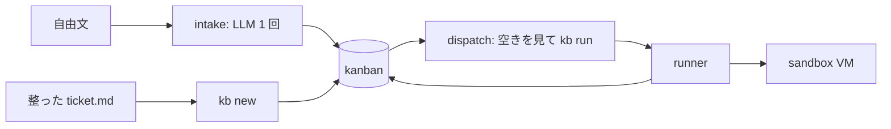

# glue（区画4）: 区画をつなぐ

状態: **v0 実装済み（2026-09-06）**。取り込み（intake）と配車（dispatch）。判断の記録は `../docs/adr/0012-glue-intake-dispatch.md`。

## 役割と実体

| 要素 | 内容 | 実体 |
|---|---|---|
| ルーター | 依頼を読み、どの PJ のどの種別（workflow）かを決めてチケットにする | `bin/intake`。先頭の `pj:` / `kind:` 行か `--pj` / `--kind` で決定的に、決まらない分だけ LLM（judgment クラス）に 1 回聞く。整形（題名・完了条件）も同じ 1 回で行う |
| 配車 | todo を古い順に取り、プールに空きがあれば `kb run` する | `bin/dispatch`。ただのコード。直列。project.yml の無い PJ は `blocked` にする |
| ステップ間の状態 | plan の出力を implement へ、gates の結果を review へ渡す置き場 | runner v1 が持つ: VM の `~/work/<task>/` → `$AIFACTORY_WORKSPACE/runs/<run>/work/`、遷移は `state.json`。glue は作らない（重複させない） |
| ログ | 誰が何をいつやったか | `$AIFACTORY_WORKSPACE/logs/intake.log`（起票）/ `dispatch.log`（配車）/ `$AIFACTORY_WORKSPACE/runs/`（step 単位）/ `kb history`（状態） |

コードは `glue/bin/`、ログは workspace（`AIFACTORY_WORKSPACE`、既定 `<repo>/workspace/`、git 追跡外）。



## 使い方

```bash
# 取り込み（自由文 → チケット）
glue/bin/intake memo.txt                     # LLM が PJ / 種別 / 題名 / 完了条件を決めて kb new
glue/bin/intake memo.txt --pj kumitate --kind bug   # 決まっている分は渡す（LLM は整形だけ）
printf 'pj: kumitate\nkind: chore\n依頼文…' | glue/bin/intake -   # 先頭行でも指定できる
glue/bin/intake memo.txt --dry-run           # 起票せず判定 JSON を見る（添付はしない）
glue/bin/intake memo.txt --attach 画面.png 表.csv   # 起票したチケットに添付する。画像は LLM にも見せる

# 配車（todo → 実行）
glue/bin/dispatch --once                     # 最も古い todo を 1 件回す
glue/bin/dispatch --pj kumitate --max 3      # PJ を絞って 3 件まで
glue/bin/dispatch --dry-run                  # VM を触らず、依頼文の組み立てだけ（状態は進まない）
```

PJ の一覧（intake が LLM に渡す候補、dispatch が見る `project.yml` の有無）は `$AIFACTORY_WORKSPACE/projects/<pj>/` と同梱サンプル `examples/projects/<pj>/` から引く（workspace が優先）。

## 設計の約束
- **intake の出力は提案**。`kb new` が pj / kind の実在を検証し、confidence とモデル名を本文末尾に残す。低ければ人間が `kb set` で直す
- `--attach` の画像（png / jpg / gif / webp）は一時ディレクトリの `attachments/` に複製して `--tools Read` で LLM に見せ、読み取れた事実を本文の `## 現状` に書かせる。画像が無いときの呼び方（`--tools ""`）は変わらない
- 起票はできて添付だけ失敗したときは、id を出したうえで終了コード 2（チケットは在るので `kb attach` でやり直す）
- **dispatch は判断しない**。種別は kanban が持つ。dispatch が見るのは「project.yml があるか」「プール（PJ あたり 3 台）に空きがあるか」だけ
- **直列**。並列にするなら PJ 単位（プールが別）から。ゲートが 15〜60 分かかる観察があるので、並列より先にゲートの差分実行が効く
- LLM は Mac 側の `claude -p`（cwd を一時ディレクトリにし、ツール無しで呼ぶ）。VM は使わない

## 未実装
- 外部の入口（termboard Intent / Notion / 個人タスク台帳）からの取り込み: それぞれ「読んで intake に流す」薄い層になる
- 配車の並列化と、貸出中プールの空き待ち
- 失敗した run の自動再試行（VM 起因の失敗は `kb reopen` → 再配車で足りるが、判別は人間）

## 履歴
- 2026-09-06（公開化）: `intake.log` / `dispatch.log` を `$AIFACTORY_WORKSPACE/logs/` へ
- 2026-09-06: v0。intake（LLM 1 回）と dispatch（直列）。ステップ間の状態は runner に任せると決定
