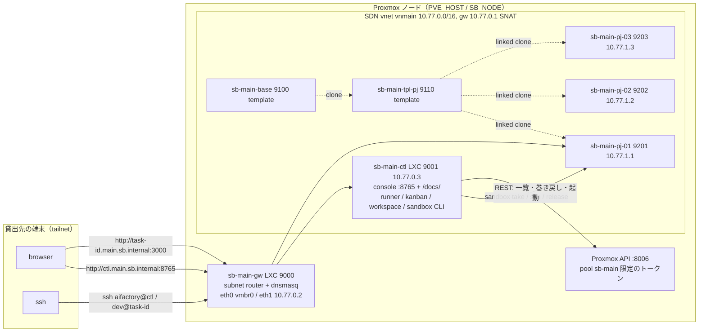

# sandbox: 設計と契約

エージェント1体につき1台、隔離された実行環境を貸し出す仕組み。実体は Proxmox 上の VM。実機の情報（ノード名・IP・VMID の割当・構築日）はリポジトリに書かず、`$AIFACTORY_WORKSPACE/docs/` に置く（ADR-0016）。

- 構築手順: `BUILD.md`
- 進捗と実機確認: `STATUS.md`（雛形。実機の状態は `$AIFACTORY_WORKSPACE/docs/STATUS.md`）
- 運用: `OPERATIONS.md`
- テンプレートの焼き込み: `templates/README.md`
- 判断の理由: `../docs/adr/`
- テナント（貸出先の組織ごとに網・制御系・権限を分ける。制御系も Proxmox 上）: 下の「テナント」節と ADR-0017

## 目的

1. エージェントが互いに踏み合わない（worktree では DB・ポート・プロセスが共有される）
2. 人が中に入って結果を見られる（ブラウザで画面、ssh で作業内容）
3. タスクが終わったら **確実にきれいな状態に戻る**
4. 上に載る workflow から **コードで叩ける**（エージェントに Proxmox を触らせない）

## 契約（workflow 側から見た sandbox）

sandbox は `sandbox` CLI の5操作で完結する。これが区画間のインターフェースで、Proxmox の都合はこの内側に閉じ込める。

| 操作 | 入力 | 保証すること |
|---|---|---|
| `take <pj> <task-id>` | PJ 名、タスク ID | クリーンな VM を1台確保し、`task-<id>.sb.internal` で到達できる状態にする。VM 内に task-id と認証トークンを注入する。空きがなければ非0で終了 |
| `ssh <task-id> [cmd]` | タスク ID | VM に `dev` ユーザーで入る（cmd があれば実行して抜ける） |
| `url <task-id>` | タスク ID | アプリの URL を返す。`http://task-<id>.sb.internal:3000` |
| `reset <task-id>` | タスク ID | VM をスナップショット `clean` に巻き戻す。貸出は継続 |
| `release <task-id>` | タスク ID | reset して名前を外し、プールに返す |
| `ls` | なし | プール VM の一覧（貸出先の task-id / VM 名 / VMID / IP / 稼働状態 / 貸出開始時刻）。稼働状態は Proxmox の電源（running / stopped）で、貸出とは別の軸 |

出力物（diff、PR、テスト結果、スクショ）は sandbox の責務ではない。VM の中で workflow が作り、`ssh` か `git push` で外に出す。

## 構成

1 テナント（貸出先の組織 = 独立した環境）の中身。図は `main` テナント。別テナントは名前・番号・網が全部別になる（下の「テナント」節）。

メンテナ（ホスト管理者）の Mac から `sandbox` CLI を ssh モード（`PVE_HOST` に root で ssh）で使う形も残るが、1 テナントに制御系は 1 つ（貸出台帳が別になるため。`OPERATIONS.md`）。

## 置き場（何がどこにあるか）

| もの | 置き場 | 備考 |
|---|---|---|
| 枠組み（CLI・Proxmox スクリプト・base 層・雛形） | このリポジトリ `sandbox/` | 公開物。環境固有の値を書かない |
| PJ 定義 `project.yml` / `provision.sh` / `gates.sh` | `$AIFACTORY_WORKSPACE/projects/<pj>/` | 私有。無ければ `examples/projects/<pj>/`（同梱サンプル。`kumitate` = akkijp/kumitate）を探す。探索順は workspace → examples |
| 実機の状態（VMID・IP・構築日・所見） | `$AIFACTORY_WORKSPACE/docs/STATUS.md` | `STATUS.md` を写して埋める |
| 制御側の設定 | `~/.config/sandbox/env`（`templates/env.example`）、`~/.config/sandbox/pj/<pj>.env`、`~/.config/sandbox/gh-app/`。制御系 LXC ではさらに `~/.config/aifactory/ctl.env`（コンソールの合言葉・intake 用トークン） | 秘密情報はここだけ。Mac でも制御系 LXC でも同じ置き場 |
| 別テナントの設定（メンテナの手元） | `~/.config/sandbox/tenants/<tenant>.env`（`SB_TENANT=<tenant>` で `run.sh` と `sandbox` が読む。状態は `<tenant>.state.json`） | 構築はメンテナ、日常運用はそのテナントの制御系 LXC |

`AIFACTORY_WORKSPACE` の既定はリポジトリ直下の `workspace/`（`.gitignore` 済み）。

## 決定事項と理由（要約。詳細は ADR）

| 項目 | 決定 | 理由 |
|---|---|---|
| 実行形態 | Proxmox **VM**（LXC でない） | Rails のようなフルスタックをネイティブで動かす。VM のほうが事故が少ない。ADR-0002 |
| ホスト | Proxmox ノード 1 台（`PVE_HOST` で ssh、`SB_NODE` で SDN のノード名） | v0 は単一ノード。RAM は 1 PJ あたり 3 台 × 8GB を目安に見積もる。増設は別ノードにテンプレートを複製する（未決） |
| ディスク | ノードの `local-lvm`（LVM-thin） | linked clone とスナップショット（RAM 込み）が使える。共有ストレージ無しなので v0 は単一ノード |
| 粒度 | **使い回し + スナップショット巻き戻し** | 長生きさせてキャッシュを効かせつつ、タスク間の状態を毎回消す。ADR-0003 |
| アプリ実行 | **VM 内ネイティブ**（Docker 不使用） | DB も VM ローカルなので巻き戻しで一緒に初期化される |
| テンプレート | base（全 PJ 共通）→ PJ 別（Ruby / Node の版が違う） | 2層にして base の更新を PJ に波及させやすくする |
| ネットワーク | 専用 **10.77.0.0/16**（既定。`SB_NET` で変更可。SDN simple zone、SNAT） | IP 空間を分ける（メンテナの判断）。ポート衝突が原理的に起きない |
| 通信制限 | VM は **インターネットと sb-gw の DNS だけ**。LAN・Proxmox ホスト・他 VM・tailnet へは出られない（Proxmox firewall の group `sandbox`、sb-gw の FORWARD DROP） | agent は任意コマンドを実行するので「VM の中で何をしても外に影響しない」を保証する。ADR-0010 |
| 外からの到達 | **ゲートウェイ LXC 1台だけ tailnet に入れる**（subnet router）。貸出先のテナントは **その組織の tailnet** に入れる | VM に Tailscale を入れると巻き戻しでノード鍵が重複する。ADR-0004 / 0017 |
| 制御系の置き場 | **テナントごとに制御系 LXC `<prefix>-ctl`** を vnet 上に置く（console / docs / runner / kanban / workspace / 秘密情報）。Mac 側には何も要らない | Mac の電源やログインに左右されない。貸出先が自分の秘密情報を自分の制御系に入れる。ADR-0017 |
| Proxmox への権限 | 制御系は **API トークン（リソースプール限定）** で一覧・起動・巻き戻しだけ。ホストの root は渡さない | 貸出先の制御系が乗っ取られても他テナントに及ばない。ADR-0017 |
| 名前解決 | `sb-gw` の dnsmasq が `*.sb.internal` を返す。Tailscale split DNS | task-id がそのままホスト名になる |
| エージェント配置 | **VM 内で Claude Code を動かす** | Mac から遠隔操作すると編集のたびに往復して遅い。cmux の surface は ssh になるだけ |
| 認証 | `claude setup-token` の長期トークンを **take 時に tmpfs へ注入** | 巻き戻しで消える。通常 OAuth の焼き込みはリフレッシュトークンの取り合いが起きる。ADR-0005 |
| スナップショット | **RAM 込み**（`--vmstate 1`）でアプリ起動済み状態を保存 | 巻き戻し直後から使える。品質優先 |
| 置き場 | 枠組みと運用データを分け、運用データは `AIFACTORY_WORKSPACE` の下 | 公開リポジトリに環境固有の値と私有 PJ を入れない。ADR-0016 |

## テナント（貸出先の組織ごとの環境。ADR-0017）

1 テナント = 1 貸出先 = 独立した sandbox 環境。`SB_TENANT`（slug `[a-z0-9]{1,6}`。最初の環境は `main`）で指定し、名前・番号・網・権限は `proxmox/_tenant.sh` が導出する。

**命名規則（2026-09-07 メンテナ決定）: すべての名前に `sb` と `<t>` を含める。最初の環境も特別扱いしない。**

| もの | 規則 | `main`（最初の環境） | `demo` | 与えるもの |
|---|---|---|---|---|
| DNS | `<t>.sb.internal`（`gw.` / `ctl.` / `task-<id>.` / `<pj>-NN.` を前に付ける） | `main.sb.internal` | `demo.sb.internal` | |
| SDN zone / vnet（= ブリッジ名） | `sb<t>` / `vn<t>`（英数字 8 文字以内） | `sbmain` / `vnmain` | `sbdemo` / `vndemo` | |
| 網 | `10.<N>.0.0/16`（N はテナントごとに台帳で採番） | `10.77.0.0/16` | `10.78.0.0/16` | **`SB_NET`** |
| VMID 帯 | 1000 刻み。+0 gw、+1 ctl、+100 base、+110〜 PJ テンプレート、+200〜 プール | 9000〜 | 8000〜 | **`SB_VMID_BASE`** |
| VM / CT 名 | `sb-<t>-gw` / `-ctl` / `-base` / `-tpl-<pj>` / `-<pj>-NN` | `sb-main-kumitate-01` | `sb-demo-gw` | |
| firewall group | `sb-<t>`（VM）/ `sb-<t>-ctl`（制御系） | `sb-main` | `sb-demo` | |
| リソースプール / ユーザー / トークン | `sb-<t>` / `sb-<t>@pve` / `ctl` | `sb-main` | `sb-demo` | |
| Tailscale ホスト名 | `sb-<t>-gw` | `sb-main-gw` | `sb-demo-gw` | |
| tailnet | メンテナの tailnet か **貸出先の tailnet**（gw の `tailscale up` をその組織のアカウントで） | | | |

2026-09-06 までの旧命名（zone `sb` / vnet `sbnet` / group `sandbox` / pool `aifactory` / `sb-<pj>-NN` / `sb.internal`）から移すには `proxmox/07-migrate-naming.sh`。

隔離は 3 層: **網**（別 vnet。VM も制御系も RFC1918 全体と tailnet 宛てを DROP するので他テナントに出られない）、**権限**（制御系の API トークンは自分のプールだけ）、**秘密情報**（制御系の中だけ。テナント間で共有しない）。

構築（メンテナ）: `~/.config/sandbox/tenants/<t>.env` に `PVE_HOST` / `SB_NET` / `SB_VMID_BASE` を書き、`SB_TENANT=<t> sandbox/proxmox/run.sh 05-tenant.sh` → `10-sdn.sh` → `20-gateway-lxc.sh` → `25-control-lxc.sh` → `30`〜`50`（`BUILD.md`）。`05` がプール・ロール・ユーザー・ACL、`25` が制御系 LXC（API トークンを発行して LXC に直接書く）。

制御系 LXC の中（貸出先）: `~/aifactory`（checkout）、`~/workspace`、`~/.config/sandbox/env`（API モード）、`~/.config/aifactory/ctl.env`（コンソールの合言葉 `CONSOLE_TOKEN`、intake 用 `CLAUDE_CODE_OAUTH_TOKEN`、runner 用 `GH_TOKEN`）。常駐は systemd（`aifactory-console`、`aifactory-gh-refresh.timer`）。入口は `http://ctl.<domain>:8765/?token=<合言葉>`（docs は `/docs/`）と `ssh aifactory@ctl.<domain>`。

## 命名・採番・アドレス（既定。変えるなら ADR か環境変数）

| 対象 | 規則 | 例 |
|---|---|---|
| VMID | `SB_VMID_BASE`（main は 9000）の帯。+0 = ゲートウェイ（`SB_GW_CT`）、+1 = 制御系（`SB_CTL_CT`）、+100 = base（`SB_BASE_VMID`）、+110.. = PJ テンプレート（PJ ごとに1つ。`TPL_VMID` で指定）、+200.. = プール（起点 `SB_POOL_BASE`） | 9000 / 9001 / 9100 / 9110 / 9204 |
| VM 名 | `<prefix>-gw` / `<prefix>-ctl` / `<prefix>-base` / `<prefix>-tpl-{pj}` / `<prefix>-{pj}-{NN}`（NN は PJ 内連番。`<prefix>` = `sb-<t>`） | `sb-main-kumitate-01` |
| IP | ゲートウェイ 10.77.0.1（ホスト）、gw 10.77.0.2、制御系 10.77.0.3、テンプレート作業用 10.77.0.(VMID−`SB_VMID_BASE`)、プール **10.77.1.(VMID−`SB_POOL_BASE`)**（PJ 横断で一意。ADR-0007。制御側は `SB_POOL_NET` / `SB_POOL_BASE`、Proxmox 側は `SB_NET` / `SB_POOL_BASE` で揃える） | 9204 = 10.77.1.4 |
| DNS 名 | `task-{task-id}.<t>.sb.internal`（貸出中のみ）、`<prefix>-{pj}-{NN}.<t>.sb.internal`（常設）、`gw.<t>.sb.internal`、`ctl.<t>.sb.internal` | `task-001.main.sb.internal` |
| スナップショット | `clean` = 貸出前の基準状態（RAM 込み） | |
| VM 内ユーザー | `dev`（sudo 可、パスワード無し） | |
| VM サイズ | base 4GB / 2 vCPU / 40GB。Rails + MySQL のような重い PJ は 8GB / 4 vCPU（`VM_MEMORY` / `VM_CORES`） | |

task-id は kanban 区画が採番する。手で使うときは `001` のように3桁で与える。

## 秘密情報の置き場

| 情報 | 置き場 | VM への渡し方 |
|---|---|---|
| Claude Code 長期トークン（`claude setup-token` の出力） | **PJ ごと** `~/.config/sandbox/pj/<pj>.env` の `CLAUDE_CODE_OAUTH_TOKEN`（全体既定は `~/.config/sandbox/env`。`sandbox token set <pj>` で保存。ADR-0006） | `take` 時に `/run/sandbox/env`（tmpfs）へ書く。巻き戻しで消える。差し替えは `sandbox token set` → `sandbox reinject` |
| GitHub の push / PR 権限 | **GitHub App**（例: `aifactory-sandbox`）の App ID と秘密鍵を Mac `~/.config/sandbox/gh-app/`（`sandbox/bin/gh-app-setup` が作る。ADR-0008） | `take` / `reinject` のたびに、その PJ のリポジトリ（`pj/<pj>.env` の `GH_REPO`）だけに効く 1 時間有効の installation token を払い出して `/run/sandbox/env` の `GH_TOKEN` に注入。launchd が 45 分ごとに更新。App 未設定なら静的 `GH_TOKEN`（`sandbox token set <pj> gh`）にフォールバック |
| GitHub トークン（テンプレート焼き込み時の clone） | Mac の `gh auth token`（既存の OAuth トークン） | 焼き込み時だけ環境変数で渡し、テンプレートには残さない |
| VM 用 SSH 鍵 | Mac `~/.ssh/conf.d/aifactory/sb_ed25519` | 公開鍵を cloud-init でテンプレートに入れる |
| Proxmox root への SSH | メンテナの `~/.ssh/config` のエイリアス（`PVE_HOST`。例: `pve1`） | `proxmox/run.sh` と ssh モードの CLI が使う。制御系 LXC には渡さない |
| Proxmox API トークン（テナントのプール限定） | 制御系 LXC の `~/.config/sandbox/env` の `PVE_API_TOKEN`（`25-control-lxc.sh` が発行して書く） | API モードの CLI が一覧・起動・巻き戻しに使う。ADR-0017 |
| コンソールの合言葉 | 制御系 LXC の `~/.config/aifactory/ctl.env` の `CONSOLE_TOKEN` | ブラウザが `/?token=` で 1 回入れる。ADR-0017 |

このリポジトリには **一切書かない**。`.gitignore` で `*.env` `*.token` と `workspace/` を除外している。

## 前提リスク

- 単一ノード。ノードが落ちるとプール全滅。増設時は別ノードにテンプレートを複製する（ADR 追加予定）
- ノードの電源投入を遠隔でできない環境では、落ちたときに人間の物理操作が要る。運用前に確認しておく
- テンプレートに焼く SSH 公開鍵・gh 設定は巻き戻しでも残る。トークン類は焼かない

## 未決（着手判断待ち）

- 対象 PJ は `$AIFACTORY_WORKSPACE/projects/<pj>/` に置いたもの。同梱サンプルは `examples/projects/kumitate`。一覧と状態は `$AIFACTORY_WORKSPACE/docs/STATUS.md` の「PJ 一覧」
- 汎用プール `sb-generic-NN`（アプリ無し、sb-base 直下）は PJ プールが揃ったら不要。残すか消すかはメンテナの判断
- 複数ノードへの拡張方法（テンプレート複製 vs VXLAN zone）
- テナントの片付け手順（プール・SDN・LXC・ユーザーの削除）と、テナント別の RAM / ディスク上限（ADR-0017 の未決）
