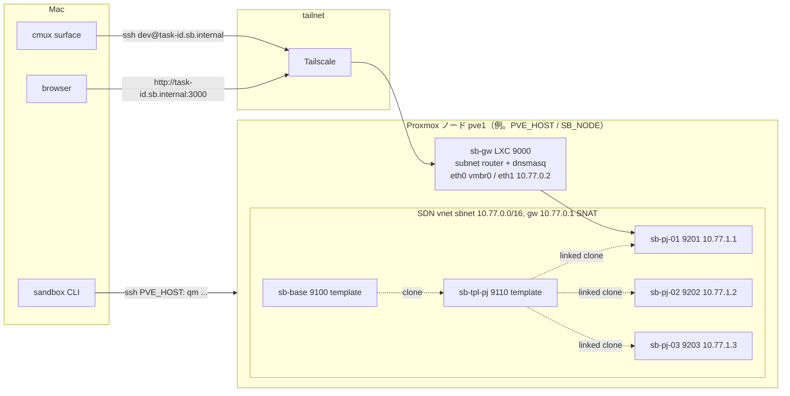

# sandbox: 設計と契約

エージェント1体につき1台、隔離された実行環境を貸し出す仕組み。実体は Proxmox 上の VM。実機の情報（ノード名・IP・VMID の割当・構築日）はリポジトリに書かず、`$AIFACTORY_WORKSPACE/docs/` に置く（ADR-0016）。

- 構築手順: `BUILD.md`
- 進捗と実機確認: `STATUS.md`（雛形。実機の状態は `$AIFACTORY_WORKSPACE/docs/STATUS.md`）
- 運用: `OPERATIONS.md`
- テンプレートの焼き込み: `templates/README.md`
- 判断の理由: `../docs/adr/`

## 目的

1. エージェントが互いに踏み合わない（worktree では DB・ポート・プロセスが共有される）
2. 人が中に入って結果を見られる（ブラウザで画面、ssh で作業内容）
3. タスクが終わったら **確実にきれいな状態に戻る**
4. 上に載る workflow から **コードで叩ける**（エージェントに Proxmox を触らせない）

## 契約（workflow 側から見た sandbox）

sandbox は `sandbox` CLI の5操作で完結する。これが区画間のインターフェースで、Proxmox の都合はこの内側に閉じ込める。

| 操作 | 入力 | 保証すること |
|---|---|---|
| `take <pj> <task-id>` | PJ 名、タスク ID | クリーンな VM を1台確保し、`task-<id>.sb.internal` で到達できる状態にする。VM 内に task-id と認証トークンを注入する。空きがなければ非0で終了 |
| `ssh <task-id> [cmd]` | タスク ID | VM に `dev` ユーザーで入る（cmd があれば実行して抜ける） |
| `url <task-id>` | タスク ID | アプリの URL を返す。`http://task-<id>.sb.internal:3000` |
| `reset <task-id>` | タスク ID | VM をスナップショット `clean` に巻き戻す。貸出は継続 |
| `release <task-id>` | タスク ID | reset して名前を外し、プールに返す |
| `ls` | なし | 貸出状況（VM名 / task-id / IP / 状態） |

出力物（diff、PR、テスト結果、スクショ）は sandbox の責務ではない。VM の中で workflow が作り、`ssh` か `git push` で外に出す。

## 構成

## 置き場（何がどこにあるか）

| もの | 置き場 | 備考 |
|---|---|---|
| 枠組み（CLI・Proxmox スクリプト・base 層・雛形） | このリポジトリ `sandbox/` | 公開物。環境固有の値を書かない |
| PJ 定義 `project.yml` / `provision.sh` / `gates.sh` | `$AIFACTORY_WORKSPACE/projects/<pj>/` | 私有。無ければ `examples/projects/<pj>/`（同梱サンプル。`kumitate` = akkijp/kumitate）を探す。探索順は workspace → examples |
| 実機の状態（VMID・IP・構築日・所見） | `$AIFACTORY_WORKSPACE/docs/STATUS.md` | `STATUS.md` を写して埋める |
| Mac 側の設定 | `~/.config/sandbox/env`（`templates/env.example`）、`~/.config/sandbox/pj/<pj>.env`、`~/.config/sandbox/gh-app/` | 秘密情報はここだけ |

`AIFACTORY_WORKSPACE` の既定はリポジトリ直下の `workspace/`（`.gitignore` 済み）。

## 決定事項と理由（要約。詳細は ADR）

| 項目 | 決定 | 理由 |
|---|---|---|
| 実行形態 | Proxmox **VM**（LXC でない） | Rails のようなフルスタックをネイティブで動かす。VM のほうが事故が少ない。ADR-0002 |
| ホスト | Proxmox ノード 1 台（`PVE_HOST` で ssh、`SB_NODE` で SDN のノード名） | v0 は単一ノード。RAM は 1 PJ あたり 3 台 × 8GB を目安に見積もる。増設は別ノードにテンプレートを複製する（未決） |
| ディスク | ノードの `local-lvm`（LVM-thin） | linked clone とスナップショット（RAM 込み）が使える。共有ストレージ無しなので v0 は単一ノード |
| 粒度 | **使い回し + スナップショット巻き戻し** | 長生きさせてキャッシュを効かせつつ、タスク間の状態を毎回消す。ADR-0003 |
| アプリ実行 | **VM 内ネイティブ**（Docker 不使用） | DB も VM ローカルなので巻き戻しで一緒に初期化される |
| テンプレート | base（全 PJ 共通）→ PJ 別（Ruby / Node の版が違う） | 2層にして base の更新を PJ に波及させやすくする |
| ネットワーク | 専用 **10.77.0.0/16**（既定。`SB_NET` で変更可。SDN simple zone、SNAT） | IP 空間を分ける（メンテナの判断）。ポート衝突が原理的に起きない |
| 通信制限 | VM は **インターネットと sb-gw の DNS だけ**。LAN・Proxmox ホスト・他 VM・tailnet へは出られない（Proxmox firewall の group `sandbox`、sb-gw の FORWARD DROP） | agent は任意コマンドを実行するので「VM の中で何をしても外に影響しない」を保証する。ADR-0010 |
| Mac からの到達 | **ゲートウェイ LXC 1台だけ tailnet に入れる**（subnet router） | VM に Tailscale を入れると巻き戻しでノード鍵が重複する。ADR-0004 |
| 名前解決 | `sb-gw` の dnsmasq が `*.sb.internal` を返す。Tailscale split DNS | task-id がそのままホスト名になる |
| エージェント配置 | **VM 内で Claude Code を動かす** | Mac から遠隔操作すると編集のたびに往復して遅い。cmux の surface は ssh になるだけ |
| 認証 | `claude setup-token` の長期トークンを **take 時に tmpfs へ注入** | 巻き戻しで消える。通常 OAuth の焼き込みはリフレッシュトークンの取り合いが起きる。ADR-0005 |
| スナップショット | **RAM 込み**（`--vmstate 1`）でアプリ起動済み状態を保存 | 巻き戻し直後から使える。品質優先 |
| 置き場 | 枠組みと運用データを分け、運用データは `AIFACTORY_WORKSPACE` の下 | 公開リポジトリに環境固有の値と私有 PJ を入れない。ADR-0016 |

## 命名・採番・アドレス（既定。変えるなら ADR か環境変数）

| 対象 | 規則 | 例 |
|---|---|---|
| VMID | 9000 番台。9000 = ゲートウェイ（`SB_GW_CT`）、9100 = base（`SB_BASE_VMID`）、911x = PJ テンプレート（PJ ごとに1つ。`TPL_VMID` で指定）、92xx = プール（起点 `SB_POOL_BASE` = 9200） | 9000 / 9100 / 9110 / 9204 |
| VM 名 | `sb-gw` / `sb-base` / `sb-tpl-{pj}` / `sb-{pj}-{NN}`（NN は PJ 内連番） | `sb-kumitate-01` |
| IP | ゲートウェイ 10.77.0.1（ホスト）、sb-gw 10.77.0.2、テンプレート作業用 10.77.0.(VMID−9000)、プール **10.77.1.(VMID−9200)**（PJ 横断で一意。ADR-0007。Mac 側は `SB_POOL_NET` / `SB_POOL_BASE`、Proxmox 側は `SB_NET` / `SB_POOL_BASE` で揃える） | 9204 = 10.77.1.4 |
| DNS 名 | `task-{task-id}.sb.internal`（貸出中のみ）、`sb-{pj}-{NN}.sb.internal`（常設） | `task-001.sb.internal` |
| スナップショット | `clean` = 貸出前の基準状態（RAM 込み） | |
| VM 内ユーザー | `dev`（sudo 可、パスワード無し） | |
| VM サイズ | base 4GB / 2 vCPU / 40GB。Rails + MySQL のような重い PJ は 8GB / 4 vCPU（`VM_MEMORY` / `VM_CORES`） | |

task-id は kanban 区画が採番する。手で使うときは `001` のように3桁で与える。

## 秘密情報の置き場

| 情報 | 置き場 | VM への渡し方 |
|---|---|---|
| Claude Code 長期トークン（`claude setup-token` の出力） | **PJ ごと** `~/.config/sandbox/pj/<pj>.env` の `CLAUDE_CODE_OAUTH_TOKEN`（全体既定は `~/.config/sandbox/env`。`sandbox token set <pj>` で保存。ADR-0006） | `take` 時に `/run/sandbox/env`（tmpfs）へ書く。巻き戻しで消える。差し替えは `sandbox token set` → `sandbox reinject` |
| GitHub の push / PR 権限 | **GitHub App**（例: `aifactory-sandbox`）の App ID と秘密鍵を Mac `~/.config/sandbox/gh-app/`（`sandbox/bin/gh-app-setup` が作る。ADR-0008） | `take` / `reinject` のたびに、その PJ のリポジトリ（`pj/<pj>.env` の `GH_REPO`）だけに効く 1 時間有効の installation token を払い出して `/run/sandbox/env` の `GH_TOKEN` に注入。launchd が 45 分ごとに更新。App 未設定なら静的 `GH_TOKEN`（`sandbox token set <pj> gh`）にフォールバック |
| GitHub トークン（テンプレート焼き込み時の clone） | Mac の `gh auth token`（既存の OAuth トークン） | 焼き込み時だけ環境変数で渡し、テンプレートには残さない |
| VM 用 SSH 鍵 | Mac `~/.ssh/conf.d/aifactory/sb_ed25519` | 公開鍵を cloud-init でテンプレートに入れる |
| Proxmox root への SSH | `~/.ssh/config` のエイリアス（`PVE_HOST`。例: `pve1`） | CLI と `proxmox/run.sh` が使う |

このリポジトリには **一切書かない**。`.gitignore` で `*.env` `*.token` と `workspace/` を除外している。

## 前提リスク

- 単一ノード。ノードが落ちるとプール全滅。増設時は別ノードにテンプレートを複製する（ADR 追加予定）
- ノードの電源投入を遠隔でできない環境では、落ちたときに人間の物理操作が要る。運用前に確認しておく
- テンプレートに焼く SSH 公開鍵・gh 設定は巻き戻しでも残る。トークン類は焼かない

## 未決（着手判断待ち）

- 対象 PJ は `$AIFACTORY_WORKSPACE/projects/<pj>/` に置いたもの。同梱サンプルは `examples/projects/kumitate`。一覧と状態は `$AIFACTORY_WORKSPACE/docs/STATUS.md` の「PJ 一覧」
- 汎用プール `sb-generic-NN`（アプリ無し、sb-base 直下）は PJ プールが揃ったら不要。残すか消すかはメンテナの判断
- 複数ノードへの拡張方法（テンプレート複製 vs VXLAN zone）
