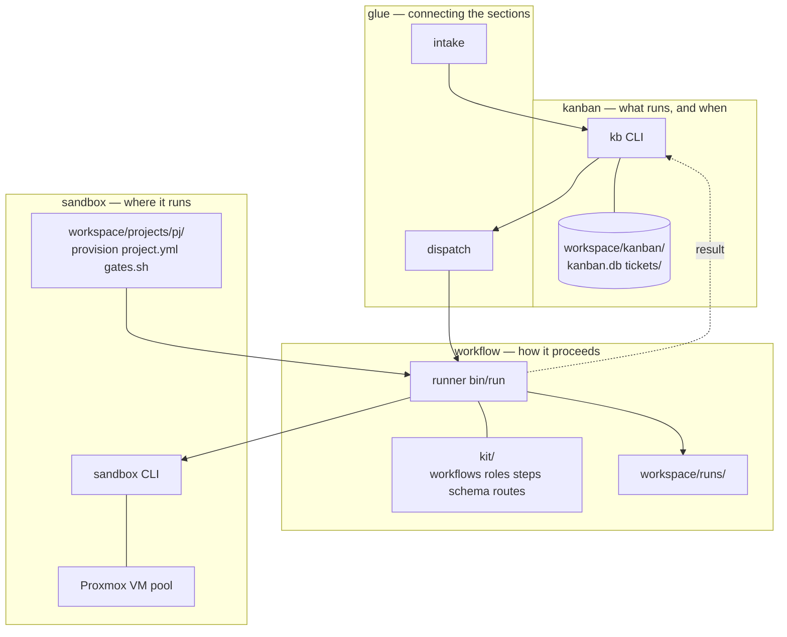
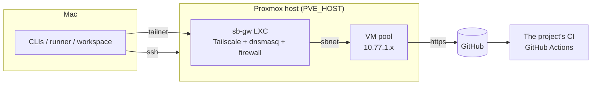

# Architecture

What this page tells you: the role and substance of the four sections, the contracts between them, and how data flows.

## Four sections

Cutting the talk's structure by role gives three sections (where / what / how); discussion added a fourth, "the glue".

| Section | Question | Substance | Is there an agent? |
|---|---|---|---|
| **sandbox** | Where does it run? | `sandbox/bin/sandbox` (Mac CLI), `sandbox/proxmox/` (build scripts), project definitions in `workspace/projects/<pj>/` (samples in `examples/projects/`), the VM pool on Proxmox | Runs inside the VM. Lending and rollback are code |
| **kanban** | What, and when? | `kanban/bin/kb`, `workspace/kanban/kanban.db` (state of record), `workspace/kanban/tickets/` (bodies of record), `workspace/kanban/BOARD.md` (generated) | No |
| **workflow** | How? | `workflow/kit/` (definitions), `workflow/bin/run` (runner), `workspace/runs/` (records) | In agent steps. Branching is code |
| **glue** | What connects them? | `glue/bin/intake`, `glue/bin/dispatch`, `workspace/logs/{intake,dispatch}.log` | intake calls one once. dispatch has none |

## Contracts between sections

Sections know nothing about each other's internals. All they know are these interfaces.

| Boundary | Contract |
|---|---|
| glue → kanban | File with `kb new <pj> <kind> <title> --body`; fetch with `kb list --status todo` / `kb next --json` |
| kanban → workflow | `kb run <id>` calls `workflow/bin/run <pj> <id> <workflow> <ticket.md>`. The result is `workspace/runs/<run>/state.json` |
| workflow → sandbox | The five operations `sandbox take / ssh / url / reset / release` plus `ls`. Proxmox details stay inside |
| workflow → project | `workspace/projects/<pj>/project.yml` and `gates.sh` (falling back to `examples/projects/<pj>/`). A project provides only "facts and policy" |
| sandbox → VM | `/run/sandbox/env` (tokens and task id), `$SANDBOX_APP_DIR`, `~/work/<id>/` |

Whether the five sandbox operations are "enough from the workflow's point of view" was tested in the first lap (2026-09-06). The only missing operation was `reinject` (token refresh), added as an operational helper outside the contract.

## Physical placement

- Control (kanban / glue / runner) lives on the Mac. It is light, so no dedicated server
- Execution (VMs) lives on one Proxmox host. At 8 GB per VM, a host with spare RAM holds more than 20 VMs
- CI is left to whatever the project already has (GitHub Actions). The factory does not add its own CI

## Data flow

| What | From | To |
|---|---|---|
| Ticket body | intake / kb new | `workspace/kanban/tickets/` → the runner copies it to `~/work/<id>/ticket.md` in the VM |
| Prompt | Assembled by the runner in 8 layers | `/home/dev/prompt.md` in the VM → `claude -p` |
| Artifacts (plan.md etc.) | Written by the agent to `~/work/<id>/` in the VM | Collected into `workspace/runs/<run>/work/` on release |
| Code | Committed by the agent inside the VM | Pushed and turned into a PR by `pr-create.sh` |
| Gate results | `gates.sh` run in the VM | `~/work/<id>/gates.txt` and the runner's `code-gates-*.log` |
| State | The runner's `state.json` | Read by `kb run` / `kb sync` into `kanban.db` |
| Tokens | `~/.config/sandbox/` on the Mac | Into the VM's tmpfs on every take. Gone on rollback |

## Why the sandbox came first

- It depends on neither the ticket nor the workflow content, so it is the most reusable
- It is the next step up from the predecessor (git worktrees + terminal multiplexing). The talk says worktrees are a good start but not the destination
- It is the hardest piece of infrastructure. Nailing the hard piece first makes the workflows on top easier
- A sandbox alone has no value, though, so a minimal workflow was run alongside it to draw out requirements

Details in `docs/ledger.md` (the concept ledger) and ADR-0001 to 0004.
