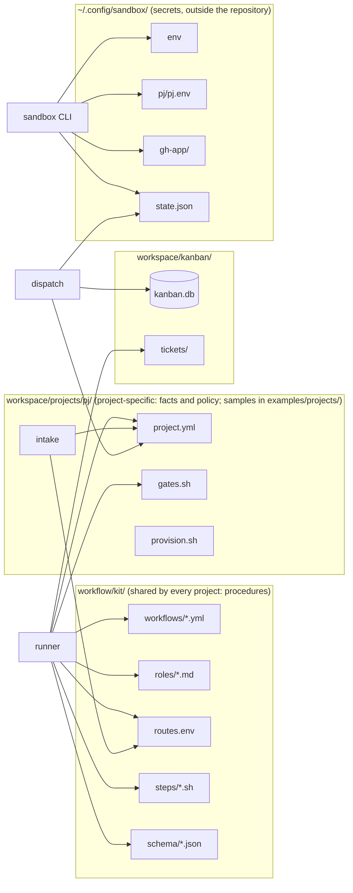

# Configuration

What this page tells you: which configuration file is read when, by whom, and what it decides. Plus a lookup table for "I want to change this — which file?".

## Overview

## Configuration files

| File | Read by | Decides | Change frequency |
|---|---|---|---|
| `workflow/kit/workflows/*.yml` | runner (schema-validated at start) | Step order, performer, inputs/outputs, branching and limits | Low. Affects every project |
| `workflow/kit/roles/_common.md` | runner → agent (prompt layer 1) | Rules shared by every role (no push, stay in scope, no secrets) | Low |
| `workflow/kit/roles/<role>.md` | runner → agent (layer 2) | The role's constitution: duties, prohibitions, output shape | Low |
| `workflow/kit/routes.env` | runner, intake | Class → model (judgment = Fable / research = Sonnet / coding = Opus) | Low. The maintainer's decision |
| `workflow/kit/steps/*.sh` | runner (code steps) | gates.sh (runs the project's gates in the VM), pr-create.sh, pr-merge.sh. `sync-base` (merging the latest base before the PR) is built into the runner and has no file | Low |
| `workflow/kit/schema/*.json` | runner | Validity of workflow yml and project.yml | Low |
| `workspace/projects/<pj>/project.yml` | runner (layer 4), dispatch (presence only), intake (project list), the console | The project's facts and policy. Falls back to `examples/projects/<pj>/` | Medium |
| `workspace/projects/<pj>/gates.sh` | kit/steps/gates.sh (in the VM) | The project's quality gates | Medium |
| `workspace/projects/<pj>/provision.sh` | proxmox/32-pj-template.sh | Template baking | Low, on template updates |
| Environment variable `AIFACTORY_WORKSPACE` or `~/.config/aifactory/workspace` (one line, a path) | kb, intake, dispatch, runner, the console | Where the workspace is (default `<repo>/workspace/`). The variable wins, then the file. The file also works for processes that do not go through a shell (an MCP server started by a GUI-launched Claude Code, launchd). `KB_ROOT` / `CONSOLE_JOBS` relocate only the ledger and the job records | Almost never |
| `~/.config/sandbox/env` | sandbox CLI, proxmox/run.sh | Proxmox host (`PVE_HOST`), gateway (`GW_SSH`), key, domain, ProxyJump, pool IPs / VMIDs (`SB_POOL_NET` / `SB_POOL_BASE`). **Outside the repository** | Almost never |
| `~/.config/sandbox/pj/<pj>.env` | sandbox CLI (take / reinject) | Per-project `CLAUDE_CODE_OAUTH_TOKEN` and `GH_REPO`. **Outside the repository** | On token renewal |
| `~/.config/sandbox/gh-app/` | sandbox CLI | GitHub App id and private key. **Outside the repository** | Almost never |
| `~/.config/sandbox/state.json` | sandbox CLI, runner, dispatch, other sessions | Which VM is lent to whom. **Outside the repository** | Every take / release |
| `workspace/kanban/kanban.db` + `tickets/` | kb, intake, dispatch, runner (bodies) | Ticket state and bodies | High |
| The prompt text inside `glue/bin/intake` | intake | Classification guidance, ticket shape | Low |

## Precedence (override rules)

| What | Weak → strong |
|---|---|
| Model | Role default class → the step's `model_class` → environment variable `CLAUDE_MODEL` (one-off) |
| PR target | `base_branch` in `project.yml` → `base_branch: hotfix_base` in the workflow → `workflow_overrides.<wf>.base_branch` in `project.yml` |
| Claude token | `~/.config/sandbox/env` (global default) → `pj/<pj>.env` (per project) → `SANDBOX_CLAUDE_TOKEN` (one-off). A `CLAUDE_CODE_OAUTH_TOKEN` exported in the shell is **ignored** |
| GitHub token | Static `GH_TOKEN` (fallback) → GitHub App installation token → `SANDBOX_GH_TOKEN` (one-off) |
| intake pj / kind | The LLM's decision → `pj:` / `kind:` lines at the top of the text → `--pj` / `--kind` |

## "I want to change this" lookup

| Goal | File | Scope |
|---|---|---|
| Bring a new project into the factory | `workspace/projects/<pj>/{provision.sh, project.yml, gates.sh}` (copy `examples/projects/kumitate/`) + template and pool on Proxmox + `sandbox token set` + GitHub App install | That project |
| Add / remove a gate | `workspace/projects/<pj>/gates.sh`. Already red on base: `known_red_gates` in `project.yml` | That project |
| A fact the agent must always know (how to run tests, known traps) | `facts` in `project.yml` | Every step of that project |
| What must not be done in this project / what the reviewer must always check | `forbidden` / `review_points` in `project.yml` | That project |
| The procedure itself (add a step, retry counts) | `workflow/kit/workflows/<wf>.yml` | Every project |
| A role's behaviour (how the reviewer looks, how the implementer works) | `workflow/kit/roles/<role>.md`; `_common.md` for every role | Every project |
| The model | `workflow/kit/routes.env` (per class). One step: `model_class` in the yml. One run: `CLAUDE_MODEL` | As specified |
| The PR target branch | `base_branch` / `hotfix_base` / `workflow_overrides` in `project.yml` | That project |
| intake's classification habits | The prompt text in `glue/bin/intake`, or a `kind:` line at the top of the request | At filing |
| Pool size (actual) | `sandbox/proxmox/40-pool.sh <pj> <count>` (what you create is the actual size) | That project's parallelism |
| Pool size (defined) | The `SANDBOX_POOL_PER_PJ` environment variable (default 3), read by `glue/bin/dispatch`, `sandbox status` and the console sandbox screen. A defined size larger than the actual one makes `take` fail with no free VM | Dispatch and display |
| Claude token renewal | `sandbox token set <pj>` (`sandbox reinject <id>` while lent) | That project |
| Proxmox host or address space | `~/.config/sandbox/env` (`PVE_HOST` / `GW_SSH` / `SB_POOL_NET` / `SB_POOL_BASE`); on the Proxmox side `SB_NODE` / `SB_NET` / `SB_GW_CT` / `SB_BASE_VMID` / `SB_POOL_BASE`. The naming rules in `sandbox/README.md` + an ADR | Everything |
| Where operational data lives | Environment variable `AIFACTORY_WORKSPACE` or `~/.config/aifactory/workspace` | Everything |

!!! warning "Easy to put in the wrong place"
    - "If you want to write something project-specific into a workflow yml, that is wrong." Project-specific content goes in `facts` / `forbidden` / `review_points` of `project.yml`
    - Conversely, "a rule that applies to every project every time" does not belong in `project.yml`. It goes in `roles/_common.md` or `roles/<role>.md`
    - Secrets (tokens, keys) never go into any repository file. They go in `~/.config/sandbox/`

## When changes take effect

| Changed | Takes effect |
|---|---|
| workflow yml / roles / routes.env / project.yml / gates.sh | **From the next run.** Running runs are unaffected (the runner reads them at start) |
| `sandbox/bin/sandbox` | After running `sandbox/bin/install.sh` (updates the copy on PATH) |
| Tokens | From the next take after `sandbox token set`. `reinject` while lent |
| `kb` / `intake` / `dispatch` | Immediately (called by repository path) |
| Proxmox scripts | After rerunning them |
