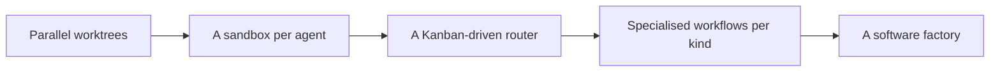

# Concepts

"What happens inside", arranged top-down. The [Guides](../guides/index.md) are enough for using the factory; read this section when you need to fix or grow it.

| Page | Question |
|---|---|
| [Architecture](architecture.md) | What are the four sections and how are they connected? |
| [Ticket lifecycle](ticket-lifecycle.md) | What does one ticket pass through from filing to merge? |
| [Workflow engine](workflow-engine.md) | How are steps and branches defined, and how does the runner execute them? |
| [Where the LLM runs](where-llm-runs.md) | Where do agents actually execute, and how is the model chosen? |
| [Inside the sandbox](sandbox-internals.md) | VM lending, rollback, networking, token injection |
| [Configuration](configuration.md) | Which config file is read when, and by whom? |
| [State and records](state-and-records.md) | What remains where, and who reads it? |
| [Security and secrets](security.md) | Isolation boundaries, secret lifetimes, what not to do |

## Three core ideas

1. **Keep code and agents apart.** There are only two kinds of step: agent steps and code steps. Judgement goes to agents; repetition and verification go to code
2. **Project-specific things live in exactly one place.** Procedures (workflows) are shared by every project in `workflow/kit/`. Project-specific content is only the three files under `$AIFACTORY_WORKSPACE/projects/<pj>/`
3. **Reality and files are the truth.** State lives in SQLite and JSON, records in Markdown and logs. Never rely on conversational memory

## Mapping to the talk

The talk that inspired this (Dan Isler, "FORGET Loop Engineering. Agentic Engineering is about THIS") describes the following progression.

In this factory, B is the sandbox section, C is kanban + glue, and D is the workflow section. A (git worktrees + cmux surfaces) was the predecessor, replaced by VMs exactly as the talk suggests: "worktrees are a good start but not the destination".
