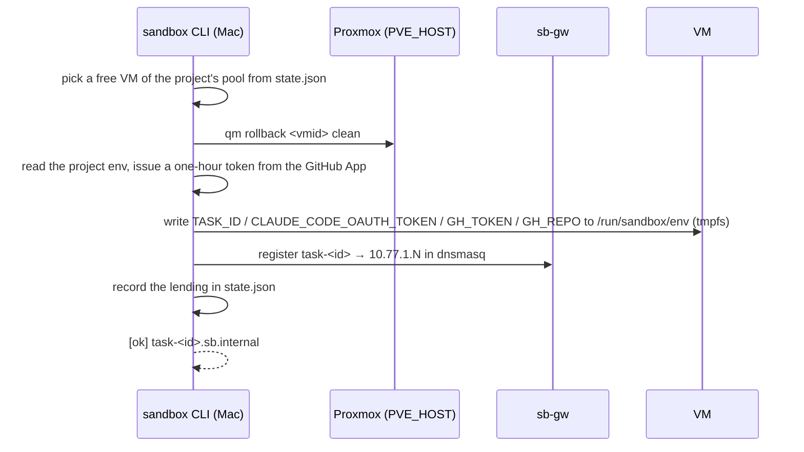
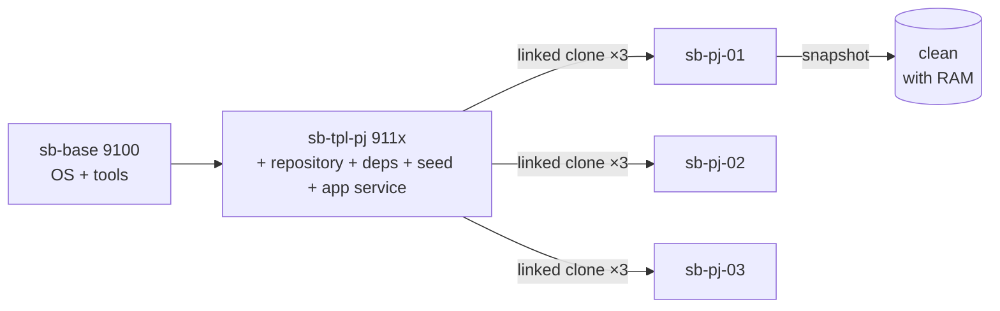

# Inside the sandbox

What this page tells you: what one `sandbox take` command does, how the VM pool and rollback work, the network, and the naming rules. Proxmox-level details are in `docs/sandbox-architecture.html` and `sandbox/README.md`.

## The five-operation contract

The sandbox is fully described by the five operations of the `sandbox` CLI. This is the interface between sections; Proxmox concerns stay behind it.

| Operation | Guarantee |
|---|---|
| `take <pj> <task-id>` | Reserves one clean VM reachable at `task-<id>.sb.internal`. Injects the task id and auth tokens into the VM. Starts the VM and waits for ssh if it was stopped to save power. Exits non-zero if none is free |
| `ssh <task-id> [cmd]` | Logs in as user `dev` (runs cmd and returns if given) |
| `url <task-id>` | The app URL: `http://task-<id>.sb.internal:3000` |
| `reset <task-id>` | Rolls the VM back to snapshot `clean`. Stays lent |
| `release <task-id>` | Resets, removes the name, and returns the VM to the pool |
| `ls` | Lending status |

Outputs (diffs, PRs, test results) are not the sandbox's responsibility. The workflow produces them inside the VM and gets them out via `ssh` or `git push`.

## What take does



| Stage | What | Time |
|---|---|---|
| Choose a free VM | From the lending table `~/.config/sandbox/state.json`, a free VM in the project's pool | instant |
| Roll back | `qm rollback` to the `clean` snapshot on Proxmox. RAM is included, so no boot wait | seconds |
| Inject tokens | The project's Claude token and a GitHub App installation token (repository-scoped, one hour) go into `/run/sandbox/env`. It is tmpfs, so rollback erases it | 1–2 s |
| Register DNS | Adds `task-<id>` to dnsmasq on sb-gw | instant |

About 10 seconds in total. The runner then fetches the base branch inside the VM, creates the work branch, and places the ticket at `~/work/<id>/ticket.md`.

## Pool and rollback



- **Reuse plus rollback** (ADR-0003). VMs are not created per task; they are lent from a standing pool and returned to `clean`. Because the app runs natively, the database is reset by the rollback too
- `clean` is taken with the app already listening on :3000 and the firewall configured, so the app opens in a browser right after take
- Templates have two layers: base (shared) and project (Ruby / Node versions, dependencies, seed). Versions differ per project, so templates are per project
- VMs run the app natively, without Docker (ADR-0002): Rails runs as is, with fewer surprises

### VMs nobody uses get stopped (idle-stop)

Left alone, a pool VM that is not lent out stays `running` and holds CPU and memory. A systemd timer on the control plane calls `sandbox idle-stop` every 15 minutes, stopping the pool VMs that are **not lent out and were last used more than 3 hours ago** (default, configurable; ADR-0033).

- Nothing was added to start them again. `rollback()` — which `take` / `reset` / `release` all go through — already starts a stopped VM and waits for ssh, so the next `take` brings it back. That costs an extra 30–60 seconds and logs `[start] vm <vmid>: 停止中だったので起動した（N 秒）`
- Last use is kept in a separate `last-used.json`. The lending ledger (`state.json`) drops the entry on return, so it cannot say how long a returned VM has been idle. With no record the VM's `uptime` stands in; if that is unavailable too, the VM is left running
- `state.json.lock` is held per VM from the verdict until the VM has actually stopped. Releasing it earlier would let `take` reserve the same VM while it is still `running` — it would skip the boot wait, then lose power under the run
- The control-plane `ctl` / `gw` are LXCs, so they are never in scope (the pool listing is qemu only)

## Network

```mermaid
flowchart LR
  MAC[Mac] -- tailnet --> GW[sb-gw LXC<br>eth0: LAN DHCP<br>eth1: 10.77.0.2]
  GW -- sbnet --> VM[VM 10.77.1.N]
  VM -- SNAT --> NET[(internet)]
  GW -. dnsmasq: *.sb.internal .-> MAC
  VM -. FORWARD DROP .-x LAN[LAN / other VMs / tailnet]
```

| Element | Decision | Reason |
|---|---|---|
| Address space | `10.77.0.0/16` (Proxmox SDN simple zone, SNAT; change with `SB_NET`) | A dedicated space separate from the LAN |
| Reach from the Mac | Only the gateway LXC joins the tailnet and advertises `10.77.0.0/16` as a subnet router (ADR-0004) | Tailscale inside VMs would duplicate node keys on rollback |
| Name resolution | dnsmasq on sb-gw answers `task-<id>.sb.internal`; Tailscale split DNS sends `sb.internal` to sb-gw | Browser: `http://task-<id>.sb.internal:3000`; work: `ssh task-<id>` |
| Egress limits | NEW connections from VMs reach only the internet and the DNS on sb-gw. LAN, host, neighbouring VMs and tailnet are dropped (ADR-0010) | Closes the path to neighbouring VMs and the host's SSH |
| CI | Not added; left to the CI the project already has (GitHub Actions) | Existing asset |

## Naming and numbering

| Item | Rule | Example |
|---|---|---|
| VMID | 9000 = gateway (`SB_GW_CT`), 9100 = base (`SB_BASE_VMID`), 911x = project templates, 92xx = pool (`SB_POOL_BASE`) | 9110 = kumitate template, 9204–9206 = kumitate pool |
| VM name | `sb-gw` / `sb-base` / `sb-tpl-{pj}` / `sb-{pj}-{NN}` | `sb-kumitate-01` |
| IP | Pool `SB_POOL_NET.(VMID−SB_POOL_BASE)`, by default `10.77.1.(VMID−9200)`. Unique across projects (ADR-0007) | 9204 → 10.77.1.4 |
| DNS | `task-{id}.sb.internal` (while lent), `sb-{pj}-{NN}.sb.internal` (permanent) | `task-204.sb.internal` |
| Snapshot | `clean` | |
| User in the VM | `dev` (sudo, no password) | |
| Size | Generic 4 GB / 2 vCPU, project pools 8 GB / 4 vCPU | |

Changing any of these deserves an ADR.

## Inside a VM

| Location | What |
|---|---|
| `/run/sandbox/env` | tmpfs. `TASK_ID` / `SANDBOX_PJ` / `SANDBOX_HOST` / `CLAUDE_CODE_OAUTH_TOKEN` / `GH_TOKEN` / `GH_REPO` / `GH_TOKEN_EXPIRES_AT`. Read at login by `/etc/profile.d/sandbox.sh` |
| `$SANDBOX_APP_DIR` (e.g. `/home/dev/app`) | The repository clone. Dependencies, database and seed come from the template. The runner creates the work branch |
| `~/work/<id>/` | Artifacts: `ticket.md` → `plan.md` → `report.md` … Collected to the Mac on release |
| `~/gates/<name>.log` | Gate logs |
| `~/.local/bin/claude` | Claude Code |
| `~/.local/share/mise/shims` | Ruby / Node |
| systemd `sandbox-app.service` | The app service (:3000) |

## Measured

Measured in the maintainer's environment (2026-09).

- About 10 seconds from take to `claude` starting
- Even a pool of around 20 VMs (projects × 3 + 3 generic) uses only a few percent of `local-lvm`, since they are linked clones
- The five operations were enough from the workflow's point of view; only `reinject` (token refresh) was added
