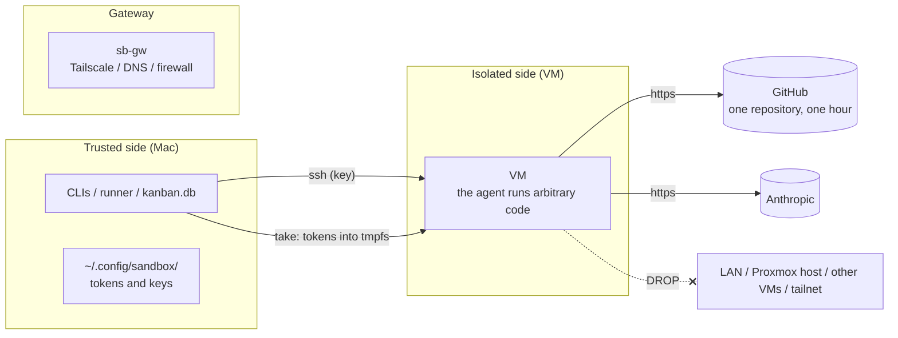

# Security and secrets

What this page tells you: the isolation boundary, where secrets live and how long they last, the rules imposed on agents, and what not to do.

## Windows worker protection

The service runs as LocalSystem inside a dedicated Windows VM; tasks use a separate ordinary account. ACLs prevent tasks from reading the service token, journal, and task-account password. Only project credentials are temporarily provided to tasks.

Apply network restrictions at Proxmox. Release deletes the run workspace and temporary profile, without rolling back the operating system. Use a dedicated VM for trusted projects under the same administrator. See [Windows worker setup and operations](../guides/windows-worker.md) for termination, artifact collection, and recovery.

The `clean` snapshot and tmpfs descriptions below apply to the existing Linux VM backend.

## Trust boundary

Inside the VM the agent runs arbitrary code (it runs tests, installs dependencies, writes files). The VM is therefore treated as untrusted and contained by three means.

1. **Network**: NEW connections from the VM reach only the internet and the DNS on sb-gw (ADR-0010). Not the LAN, the Proxmox host, other VMs or the tailnet
2. **Permissions**: the GitHub token is scoped to one repository and expires after an hour. Claude keys come only from the control plane's key pool, where each can be disabled or replaced on its own
3. **Lifetime**: the VM is rolled back to `clean` on release. Tokens live in tmpfs and vanish with the rollback

When the control plane runs in an LXC on Proxmox (ADR-0017), the "trusted side" moves from the Mac into that LXC. Towards Proxmox it holds only an **API token scoped to its own resource pool** (list, start, rollback), never the host's root. Each organization the factory is lent to gets its own network (a separate vnet and /16), pool and secrets; VMs and the control plane DROP all of RFC1918 and the tailnet range, so they cannot reach another organization's environment. The console refuses to bind outside 127.0.0.1 without a passphrase (`CONSOLE_TOKEN`). See [Tenants](../guides/tenants.md)

## Where secrets live and how long they last

| Secret | Location (source of truth) | How it reaches the VM | Lifetime |
|---|---|---|---|
| Claude Code long-lived token (`claude setup-token`) | The control plane's key pool `~/.config/sandbox/keys.json` (mode 600), one place for every project (ADR-0044 / ADR-0060). Never an env file | Into `/run/sandbox/env` (tmpfs) on every take, one key per model family. `reinject` swaps it while lent | Gone on rollback. The token's own expiry is set by Anthropic |
| GitHub push / PR permission | The private key of GitHub App `aifactory-sandbox` (Mac `~/.config/sandbox/gh-app/`, ADR-0008) | On every take an installation token scoped to that repository is issued and injected. Permissions are those the App holds (contents / pull_requests write, metadata / actions read) | One hour. launchd refreshes every 45 minutes; the runner refreshes before code steps |
| Clone token while baking templates | The Mac's `gh auth token` | Passed as an environment variable only during baking | Not left in the template |
| SSH key (Mac → VM / sb-gw) | Mac `~/.ssh/conf.d/aifactory/sb_ed25519` | Public key baked into the template via cloud-init | Until the template is updated |
| SSH to Proxmox root | The Mac's ssh config (the alias and key behind `PVE_HOST`) | Used by the CLI | |
| Tailscale API key | Mac (only when changing ACL / split DNS through the API) | Not used | |

None of them are written into the repository. `.gitignore` excludes `*.env` / `*.token` / `.env*`. `sandbox keys list` and the console's *Keys* screen show only the last 4 characters of a key; the value itself is never printed.

## Why these choices

| Decision | Reason |
|---|---|
| Claude auth is a setup-token injected on take (ADR-0005) | Baking ordinary OAuth into the template makes several VMs fight over the refresh token |
| Claude keys come only from the key pool (ADR-0044 / ADR-0060) | One place to add, disable, replace and remove keys; a key that is not on the *Keys* screen never reaches a VM, and a run with no matching key pauses instead of using a leftover |
| GitHub through one-hour App tokens (ADR-0008) | A static PAT covers every repository and never expires. An App scopes to "this repository, one hour" |
| No Tailscale inside VMs (ADR-0004) | Rollback would duplicate node keys. Only the gateway joins the tailnet |
| No egress from VMs to the LAN or other VMs (ADR-0010) | Measurements showed reach to neighbouring VMs' ports 22 / 3000 and the host's SSH. Closes what an agent could touch unintentionally (or through prompt injection) |

## Rules imposed on agents

The essentials of `workflow/kit/roles/_common.md`, pasted as prompt layer 1 every time.

- **Do not push.** Pushing and PRs are done by code (the runner)
- Do not commit directly to `main` / `develop`. Do not switch branches
- Do not `git add` untracked files (generated files, databases, logs). Never `git add -A`
- Do not write secrets (tokens, keys, real `.env` values) to files or logs
- Do not change anything outside the requested scope. Report problems outside the scope instead of fixing them
- Do not fill gaps with guesses. When a judgement is needed, write the options and a recommendation, and proceed on the safe side

The planner writes **STOP** at the top of the plan if the request is unclear, contradictory or dangerous (data loss, production impact, too large a scope). The reviewer looks for "tests weakened to pass", "deleted tests" and "non-backward-compatible migrations".

## What humans must not do

- Write tokens or keys into the repository (`.gitignore` does not catch a differently named file)
- Restart, roll back or rebuild a lent VM (it kills the running run)
- Retake the `clean` snapshot without the firewall settings (the VM regains access to the LAN)
- Install Tailscale in a VM, or remove a VM's firewall
- Run `gh auth login` in a VM (the token is injected; calling it is refused)
- Weaken gates to get green (`known_red_gates` is a temporary handling of "already red on base" and is removed once the fixing PR is merged)

## Remaining risks

| Risk | Status |
|---|---|
| The SSH public key and gh settings baked into templates survive rollback | Inherent to templates. Exposure is bounded by pool VM isolation |
| The Claude token is readable by processes inside the VM | Unavoidable: it is the agent's own credential. Mitigated by the short tmpfs lifetime and by the pool: disabling a key on the *Keys* screen reinjects another one into lent VMs |
| Physical power of the Proxmox host | Without a remote power-on path (WoL / IPMI), an outage means a trip to the machine |
| VM rebuilds by concurrent sessions | Handled by the rules in [Working with multiple sessions](../guides/multi-session.md) |

### Standalone Linux boundary

Worker credentials and journals remain root-only, while commands run as a separate ordinary user in systemd cgroups. Unverified shutdown retains the lease. Release removes the workspace without restoring OS or GUI state. Configure network restrictions with the instance firewall. See [scope and limits](../guides/linux-worker.md).
