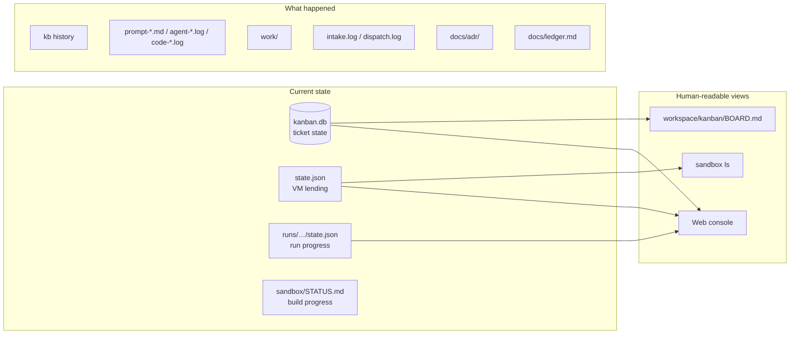

# State and records

What this page tells you: where the factory's "what is happening now" and "what happened" are kept, and who reads them. These locations let the next session pick up without relying on conversational memory.

## Overview

## Inventory

In the "git" column, **workspace** means it lives in `$AIFACTORY_WORKSPACE` (default `<repo>/workspace/`, not tracked by git) and **repo** means it is tracked in the repository.

| State / record | Location | Readers | git |
|---|---|---|---|
| Ticket state (todo / in_progress / review / blocked / done) | `workspace/kanban/kanban.db` | kb, dispatch, humans | workspace |
| Ticket history (what changed when) | Same (`kb history <id>`) | Humans | workspace |
| Ticket body | `workspace/kanban/tickets/<id>-<pj>-<slug>.md` | runner, humans | workspace |
| Board (readable view) | `workspace/kanban/BOARD.md` (regenerated by `kb`) | Humans, the Web console | workspace |
| Run progress (current step, loop counts, result, PR URL, elapsed seconds) | `workspace/runs/<date>-<pj>-<id>/state.json` | runner (`--resume`), `kb sync` | workspace |
| The prompt the agent saw | `prompt-<step>-<n>.md` in the same directory | Humans (diagnosis) | workspace |
| The agent's output (readable, streamed) | `agent-<step>-<n>.log` | Humans, the Web console | workspace |
| The agent's raw events (stream-json) | `agent-<step>-<n>.jsonl` | Whoever is debugging | workspace |
| The step that is running and its log name | `current` in `state.json` | The Web console, anyone running `tail -f` | workspace (null once done) |
| Output of CLIs the console started | `console/jobs/<id>/log` (relocate with `CONSOLE_JOBS`) | The Web console | outside |
| Code step output | `code-<step>-<n>.log` | Humans | workspace |
| Artifacts (plan.md / report.md / review.md / summary.md / gates.txt) | `~/work/<id>/` in the VM → `work/` in the same directory on release | The next step, the reviewer, humans | workspace |
| Excerpt of a red gate's log | `~/gates/<name>.log` in the VM → written to `~/work/<id>/gates/` by gates.sh → `work/gates/` in the same directory | The implementer (the excerpt goes into the prompt), the reviewer, humans | workspace |
| VM lending | `~/.config/sandbox/state.json` (`sandbox ls`) | sandbox CLI, dispatch, runner, other sessions | outside |
| Filing and dispatch logs | `workspace/logs/intake.log` / `workspace/logs/dispatch.log` | Humans | workspace |
| Build progress and real-machine checks | `sandbox/STATUS.md` | The next session | repo |
| Concept ledger: current position, open questions, history | `docs/ledger.md` | The next session, humans | repo |
| Reasons for design decisions | `docs/adr/NNNN-*.md` (append only) | The next session | repo |
| Notes about your own environment (hosts, power, token expiry, etc.) | `workspace/docs/` | Whoever builds | workspace |

Timestamps written into records are ISO 8601 with a UTC offset (`2026-09-08T00:21:00+00:00`), so that whoever reads them does not have to guess the time zone. Older records without an offset are read as the local time of the host that wrote them (the web console fills the offset in as it reads; the record itself is left alone). The decision is ADR-0026 ([Design decisions](../decisions/index.md)).

## Which one is the source of truth

| Subject | Source of truth | Derived |
|---|---|---|
| Ticket state | `kanban.db` | `BOARD.md` (generated; never edit by hand) |
| Ticket body | `tickets/*.md` | `ticket.md` in the run directory (a copy at start) |
| Run result | `workspace/runs/…/state.json` | status / pr / note / run in `kanban.db` (copied by `kb run` / `kb sync`; `run` holds the run directory name) |
| VM lending | `~/.config/sandbox/state.json` | The `sandbox ls` display |
| Build progress | The real machine | `sandbox/STATUS.md` (fix it to match reality when they disagree) |
| Design | Each section's `README.md` + ADRs | This site, `docs/*.html` |

## Naming

| Item | Shape | Example |
|---|---|---|
| task-id | Sequential, at least 3 digits (assigned by kanban) | `204` |
| Run directory | `workspace/runs/<date>-<pj>-<id>`. A same-day rerun moves the previous one to `-attemptN`. The kanban `run` column records only the directory name | `2026-09-06-kumitate-204` |
| Work branch | `sandbox/<id>-<wf>-<slug>` | `sandbox/204-bug-fix-seeds` |
| Preservation branch (on human) | `sandbox/<id>-<wf>-wip` | `sandbox/204-bug-wip` |
| Prompts / logs | `prompt-<step>-<n>.md` / `agent-<step>-<n>.log` / `code-<step>-<n>.log` (n is the step's sequence number) | `prompt-review-2.md` |

## What disappears

| Item | When |
|---|---|
| VM contents (working tree, database, logs, tokens) | On release / reset back to `clean`. Push what you want to keep, or write it to `~/work/<id>/` |
| `/run/sandbox/env` (tokens) | Erased by rollback (tmpfs) |
| GitHub App installation token | Expires after one hour |
| The `task-<id>.sb.internal` DNS entry | Removed on release |

## How the next session finds its position

1. "To the AI reading this repository" in the root README
2. The "current policy" table in `docs/ledger.md` for the state of the 4 sections
3. Run the "check the real machine" commands in `sandbox/STATUS.md` and compare
4. `workspace/kanban/BOARD.md` (or `kb list`) for current tickets
5. `sandbox ls` for lent VMs (is another session using one?)
6. `git log --oneline -10` and `git status` for recent changes and other people's work
