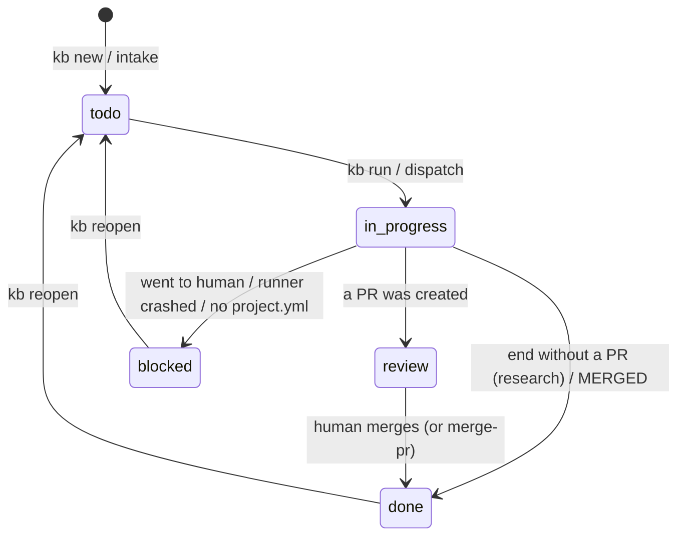
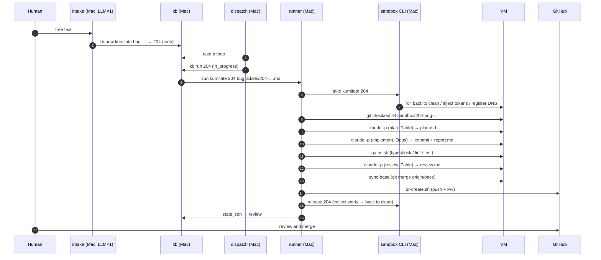

# Ticket lifecycle

What this page tells you: the 14 stages one ticket passes through from filing to PR and merge, and who acts at each stage.

The example is the kumitate request "the calendar tests break when the month changes" (kanban 204, bug workflow).

## State transitions

| State | Meaning | Next actor |
|---|---|---|
| `todo` | Filed, not yet run | dispatch / kb run |
| `in_progress` | The runner is executing | runner |
| `review` | A PR exists. Waiting for human review | Human (or a merge-pr ticket) |
| `blocked` | Waiting for a human. The note says why | Human |
| `done` | Finished (merged, or ended without a PR) | Nobody |

## The 14 stages

| # | Who | Does what | What remains |
|---|---|---|---|
| 1 | intake | Reads the free text and asks the LLM once for project, kind, title and completion criteria | `workspace/logs/intake.log` |
| 2 | kb new | Assigns `MAX(id)+1`. Validates pj / kind. Body to a file, state to the DB | `tickets/204-….md`, `kanban.db`, `BOARD.md` |
| 3 | dispatch | Looks at todo items oldest first. Checks only project.yml presence and pool availability | `workspace/logs/dispatch.log` |
| 4 | kb run | Sets `in_progress`. Records the run directory name | `kanban.db` |
| 5 | runner start | Reads workflow yml and project.yml, validates schemas. Decides the branch name | `workspace/runs/…/state.json`, `ticket.md` |
| 6 | take | Picks a free VM, rolls back to `clean`, injects tokens into tmpfs, registers DNS | `~/.config/sandbox/state.json` |
| 7 | runner | Fetches base inside the VM and creates the work branch. Places the ticket in `~/work/204/` | VM |
| 8 | plan (agent) | Assembles the prompt and runs `claude -p` in the VM. Reproduction, scope and verification go to `plan.md` | `prompt-plan-0.md`, `agent-plan-0.log` |
| 9 | implement (agent) | Writes a reproduction test first, confirms red, fixes to green, commits. `report.md` | `prompt-implement-0.md`, `agent-implement-0.log` |
| 10 | gates (code) | Runs the project's `gates.sh` in the VM. Red goes back to 9 (up to 2 times) | `code-gates-1.log`, `work/gates.txt` |
| 11 | review (agent) | Reads plan, report, gate results and the diff; PASS / FAIL. FAIL goes back to 9 (up to 1 time) | `prompt-review-2.md`, `work/review.md` |
| 12 | sync (code) | `git fetch origin <base>` and merges the latest base. A conflict goes back to `resolve` (implementer, up to 2 times) | `code-sync-3.log` |
| 13 | pr (code) | Pushes and opens the PR with plan / report / review / gates in the body | `code-pr-4.log`, `work/pr_url` |
| 14 | release | Collects `~/work/204/` to the control plane and rolls the VM back to `clean` | `workspace/runs/…/work/` |
| 15 | kb | Reads `state.json`; `review` if there is a PR | `kanban.db`, `BOARD.md` |

A human then reviews and merges the PR. Turning the merge into a `merge-pr` ticket runs conflict resolution → gates → review → merge unattended.

## Send-backs and limits

The result of a step decides the next one. Past the limit the run exits to `human`; the work is preserved on `origin/sandbox/<id>-<wf>-wip` before the VM is rolled back.

| Where | Back to | Limit |
|---|---|---|
| Gates red | implement | 2 |
| Review FAIL | implement | 1 |
| sync (base merge) conflicts | resolve (implementer) | 2 |
| A step without branching fails | human | immediately |

When sending back, the previous result (gate logs, review findings) is attached to the prompt as "Previous result (fix this)". If a red gate is already red on base, the runner downgrades it to INFO through `known_red_gates` and tells the agent "report, do not fix".

## Time budget

| Stage | Time |
|---|---|
| intake | 20 s |
| take | 10 s (the VM is already up; it resumes from a RAM-inclusive snapshot) |
| agent step | 1 to 10 min |
| gates | 6 to 60 min (depends on the project's tests) |
| pr / release | 10 to 20 s |

Most of the time goes to gates. The next improvement is incremental gate execution, which pays off before parallelism.
