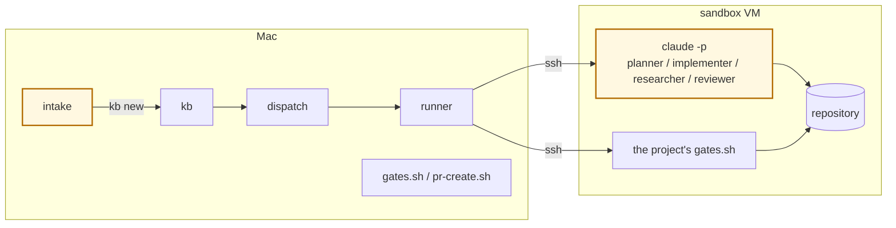
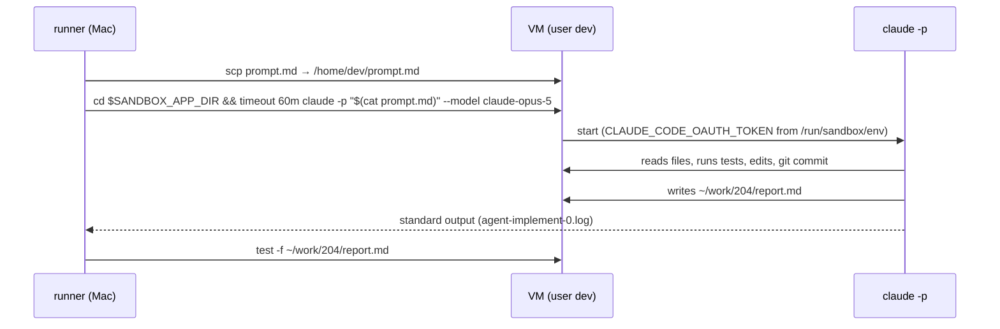

# Where the LLM runs

What this page tells you: the agent (LLM) actually executes in only two places, and the workflow is not one of them.

## The answer

**Not in the workflow. Inside the VM.** A workflow (YAML) is only a definition of "which step calls which role with which model class", and the runner that reads it is Python on the Mac. When the runner reaches an agent step it sshes into the VM, starts `claude -p`, and waits for it to finish.

Yellow marks where the LLM lives.

## The two places compared

| | LLM ①: intake | LLM ②: agent step |
|---|---|---|
| Caller | `glue/bin/intake` | `workflow/bin/run` |
| Where | The Mac. cwd is a temporary directory, no tools (`--tools ""`) | Inside the VM. cwd is `$SANDBOX_APP_DIR`, tools available (file I/O, running tests) |
| How often | Once per ticket | Once per agent step; more on send-backs |
| Model | judgment in `routes.env` (Fable) | The role's default class → `routes.env` |
| Auth | The Mac's Claude Code login | The per-project `setup-token` injected into the VM on take |
| Input | Free text plus the list of projects and kinds | The 8-layer prompt |
| Output | JSON (pj / kind / title / body / confidence) | Artifacts (plan.md etc.) and git commits |
| On failure | No JSON, error; nothing is filed | Missing outputs, step fails → transition |

## What does not call an LLM

| Component | Language | Job |
|---|---|---|
| `kb` | Python | Ids, state, history, BOARD generation |
| `dispatch` | Python | Takes a todo, checks project.yml and pool availability, calls `kb run` |
| The runner | Python | Validates definitions, assembles prompts, ssh, transitions, records |
| `gates.sh` / `pr-create.sh` / `pr-merge.sh` | bash | Runs tests, push, PR, merge |
| `sync-base` (built into the runner) | Python + git | Merges the latest base before the PR and checks `docs/adr/` for duplicate numbers |
| `sandbox` CLI | bash | VM lending, rollback, token injection, DNS |
| Proxmox scripts | bash | SDN, LXC, templates, pool, firewall |

These return the same result every time. Diagnosing a failure splits cleanly into "was the decision (LLM) bad?" or "did the execution (code) fail?", recorded in `agent-*.log` and `code-*.log` respectively.

## What happens inside the VM

- `claude -p` is non-interactive: the prompt is passed once and the runner waits for completion
- Tools (Bash / Read / Edit) run inside the VM. The Mac's files are out of reach
- The VM can only reach the internet (GitHub, Anthropic) and the DNS on sb-gw. Not the LAN, other VMs or the tailnet
- When done, the VM is rolled back to `clean`. Only what was pushed and the collected artifacts remain

## Aside: the Claude Code building the factory

The Claude Code the maintainer talks to on their own Mac is **outside** the factory. It builds, fixes and documents the factory; it does not process tickets. It can, however, use the factory by calling `kb` / `intake` / `dispatch`, or through MCP (`console/bin/mcp`).
