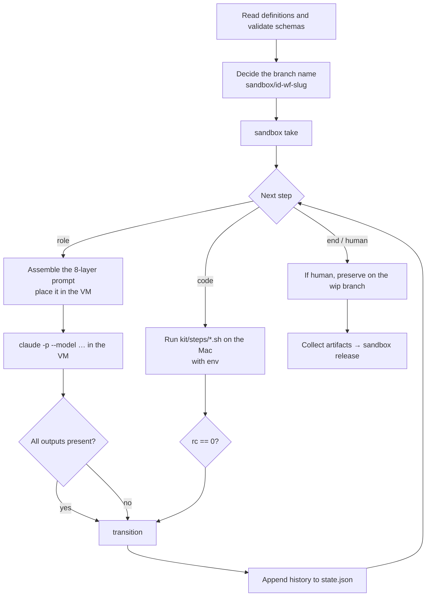
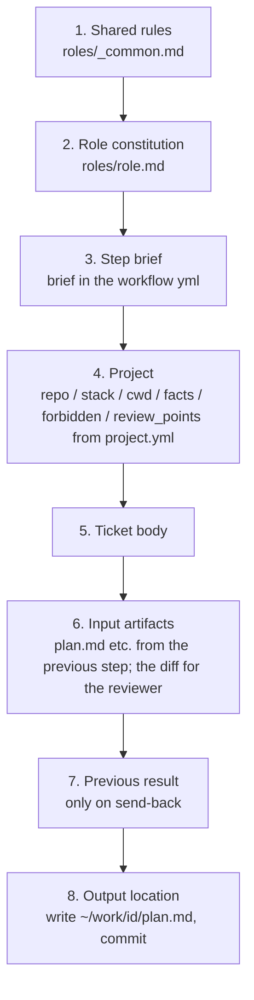

# Workflow engine

What this page tells you: the five words of the workflow vocabulary, the YAML format, how the runner executes it, and how prompts are assembled.

## Five words

| Word | Meaning | Location |
|---|---|---|
| **workflow** | The procedure for one ticket kind: the sequence of steps and the branching | `workflow/kit/workflows/<name>.yml` |
| **step** | One invocation. Performed by either a **role** (agent) or **code** (a script) | Inside a workflow |
| **role** | An agent's persona and permissions: model class, constitution, output shape | `workflow/kit/roles/<role>.md` |
| **artifact** | A step's input or output. **Always a file.** Placed in `~/work/<id>/` in the VM and collected into `workspace/runs/<run>/work/` at the end | `inputs` / `outputs` in the workflow |
| **transition** | Where to go next depending on the result, with a loop limit. `human` = hand over and stop | `next` / `on_pass` / `on_fail` on a step |

## The YAML format

The gates and review steps of `bug.yml`.

```yaml
name: bug
description: Bug fix. plan → reproduction test → fix → gates → review → PR
inputs: [ticket.md]
steps:
  - id: plan
    role: planner
    brief: |
      Pin down the reproduction first. Include in the plan where the reproduction test will be written.
    outputs: [plan.md]
    next: implement

  - id: implement
    role: implementer
    brief: |
      Write the reproduction test first and confirm it is red before fixing.
    inputs: [plan.md]
    outputs: [git, report.md]
    next: gates

  - id: gates
    code: gates.sh                 # code step: kit/steps/gates.sh runs the project's gates.sh inside the VM
    outputs: [gates.txt]
    on_pass: review
    on_fail: { goto: implement, max_loops: 2, else: human }

  - id: review
    role: reviewer
    inputs: [plan.md, report.md, gates.txt]
    outputs: [review.md]
    on_pass: sync
    on_fail: { goto: implement, max_loops: 1, else: human }

  - id: sync
    code: sync-base                # code step, built into the runner: merge the latest base before the PR
    on_pass: pr
    on_fail: { goto: resolve, max_loops: 2, else: human }

  - id: resolve
    role: implementer              # a conflict goes back to the implementer, not to a human
    outputs: [git, report.md]
    next: gates

  - id: pr
    code: pr-create.sh
    inputs: [plan.md, report.md, review.md, gates.txt]
    outputs: [pr_url]
    next: human
```

- Exactly one of `role` or `code`; never both
- `git` in `outputs` means "commit to the work branch", `pr_url` means "leave the PR URL"; neither is collected as a file
- `brief` is the step-specific extra instruction, appended after the role constitution (`roles/<role>.md`)
- `model_class` (judgment / research / coding) overrides the role's default class. `timeout_min` (default 60) caps the agent's time

Validity is checked against `workflow/kit/schema/workflow.schema.json`, and the runner always does so at start-up.

## What the runner does



| Moment | What the runner does |
|---|---|
| Start | Reads `kit/workflows/<wf>.yml` and the project's `project.yml` (`workspace/projects/<pj>/` → `examples/projects/<pj>/`), validates schemas. Branch `sandbox/<id>-<wf>-<slug>`. Creates `workspace/runs/<date>-<pj>-<id>/` (moving an existing one to `-attemptN`) |
| take | `sandbox take <pj> <id>`. Fetches base in the VM and creates the work branch. For merge-pr, checks out the PR head |
| agent step | Assembles the prompt, keeps a copy in `workspace/runs/`, places it at `/home/dev/prompt.md` in the VM, and runs `cd $SANDBOX_APP_DIR && timeout <N>m claude -p "$(cat prompt.md)" --model <model>`. Pass if every file in `outputs` exists afterwards |
| code step | Runs `kit/steps/<script>` on the control plane with env `PJ TASK RUN_DIR PROJECT_DIR GATES WORK APP_DIR BASE BRANCH WORKFLOW TITLE PR_NUMBER KNOWN_RED`. Pass on exit code 0 |
| transition | Looks at `next` / `on_pass` / `on_fail`. Counts `goto` loops in `loops` of `state.json`; past `max_loops` goes to `else` |
| send-back | Attaches the previous result (gate logs, review content) as "Previous result (fix this)" to the next prompt. States "report, do not fix" for gates already red on base |
| end | If `human`, pushes to `origin/sandbox/<id>-<wf>-wip` to preserve the work. Collects `~/work/<id>/` into `workspace/runs/…/work/`. `sandbox release` |
| before code steps | Reissues the GitHub App token (against the one-hour expiry) |

## The 8 prompt layers

The prompt an agent receives is assembled by the runner in this order every time. The result is kept as `workspace/runs/<run>/prompt-<step>-<n>.md`.



| Layer | Source | Change frequency |
|---|---|---|
| 1 | `workflow/kit/roles/_common.md` | Low. Affects every role |
| 2 | `workflow/kit/roles/<role>.md` | Low |
| 3 | `brief` in `workflow/kit/workflows/<wf>.yml` | Low |
| 4 | `workspace/projects/<pj>/project.yml` | Medium, as the project changes |
| 5 | `workspace/kanban/tickets/<id>-….md` | Every run |
| 6 | `~/work/<id>/` in the VM and `git diff origin/<base>...HEAD` | Every run |
| 7 | The previous step's result | On send-back |
| 8 | `outputs` in the workflow yml | Low |

## How the model is chosen

Each role has a default class, and classes resolve to model names in `workflow/kit/routes.env`.

| Role | Default class | Model |
|---|---|---|
| planner / reviewer | judgment | `claude-fable-5-1` |
| researcher | research | `claude-sonnet-5` |
| implementer | coding | `claude-opus-5` |

Three levels of override: the step's `model_class` > the environment variable `CLAUDE_MODEL` (one-off) > default. "Judgement on Fable, web research on Sonnet, implementation on Opus" is the maintainer's decision (2026-09-06). Change `routes.env` to use other models.

## The four code steps

| Script | What it does | Fails when |
|---|---|---|
| `gates.sh` | Copies the project's `gates.sh` to the VM and runs it. If anything is red, runs only those gates against base as well, and downgrades the ones red on base too — plus FAILs in `known_red_gates` — to INFO. Writes the result to `~/work/<id>/gates.txt` and an excerpt of each red gate's log to `~/work/<id>/gates/<name>.log` | Any FAIL that was not downgraded to INFO remains |
| `pr-create.sh` | Checks for commits → push → `gh pr create` with the artifacts as the body → writes the URL to `~/work/<id>/pr_url` | No commits, push failed |
| `pr-merge.sh` | Checks for leftover conflict markers → checks base is merged in → pushes to the head → posts gate and review results as a PR comment → `gh pr merge` | Markers left, base not merged in, merge failed |
| `sync-base` | **Built into the runner** (no file in `kit/steps/`). `git fetch origin <base>`, then `git merge` unless it is already merged in. On a conflict it records the conflicting file names and runs `git merge --abort`; afterwards it checks `docs/adr/` for duplicate numbers | A conflict, a duplicate ADR number, or a failed fetch |
