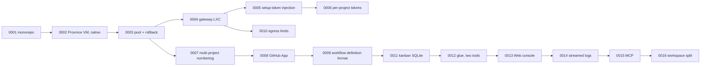

# Decisions (ADR)

Design decisions are recorded in `docs/adr/NNNN-slug.md`, one decision per file. **Existing ADRs are never rewritten**; to change a decision, write a new number that says "supersedes NNNN". Sections: situation / decision / reasons / consequences (trade-offs) / status.

This page is a list with summaries. Read the full text in `docs/adr/` in the repository (in Japanese).

## List

| No. | Decision | Essence | Status |
|---|---|---|---|
| 0001 | Start with one repository (monorepo) | Do not split before the contracts between sections are found | Accepted |
| 0002 | The sandbox is Proxmox VMs; apps run natively inside the VM | Run Rails as is. No Docker. VMs have fewer surprises | Accepted |
| 0003 | The pool is reused with snapshot rollback | Do not create a VM per task; lend from a standing pool and return to `clean`. The database is reset by the rollback too | Accepted |
| 0004 | Reach from the Mac goes through a gateway LXC acting as a Tailscale subnet router | Tailscale inside VMs would duplicate node keys on rollback. Only the gateway joins the tailnet | Accepted |
| 0005 | Claude Code auth is a setup-token injected into tmpfs on take | Baking in OAuth causes refresh-token contention | Accepted |
| 0006 | Tokens are per project, and swaps reach lent VMs (`token` / `reinject`) | A leak in one project stays there. Extends 0005 | Accepted |
| 0007 | Several projects side by side: templates 911x per project, VM IP derived from the VMID | IPs are unique across projects. IPs are not derived from the task id | Accepted |
| 0008 | GitHub push / PR permission is a GitHub App installation token issued on every take | A static PAT covers every repository and never expires. An App scopes to "this repository, one hour" | Accepted |
| 0009 | Workflow definitions are YAML + JSON Schema; procedures live once in the shared kit; projects hold only facts and policy | No per-project copies of procedures. Project specifics go in `facts` / `forbidden` / `review_points` of `project.yml` | Accepted |
| 0010 | Sandbox VMs may reach only the internet and the DNS on sb-gw, never the LAN, other VMs or the tailnet | Measurements showed reach to neighbouring VMs and the host's SSH. Proxmox firewall + FORWARD DROP on sb-gw | Accepted |
| 0011 | kanban is SQLite + a CLI (`kb`) inside the repository; external systems are added later as import paths | the maintainer's personal task ledger has colliding ids and a different granularity. termboard / Notion are separate systems | Accepted |
| 0012 | glue is two tools: intake (one LLM call) and dispatch (plain code); inter-step state stays in the runner | Keeping the router to one LLM call makes failures easy to isolate. State is not duplicated | Accepted |
| 0013 | The Web console is local to the Mac, built on the Python standard library, and changes state only through the existing CLIs | A UI with its own write path multiplies the collision points between concurrent sessions. Zero dependencies means nothing to break | Accepted |
| 0014 | Agent step output is the stream-json event stream rendered into a readable log as it arrives; raw events stay local | The middle of a 60-minute step becomes visible. Raw JSONL is large, so it stays out of git. `current` in `state.json` names the running step | Accepted |
| 0015 | Two operating surfaces, the Web console (HTTP) and MCP (stdio), over one source of reads and writes in `console/lib/core.py` | Duplicating the checks per surface opens holes. Job records are shared under a file lock. The MCP server is a minimal standard-library implementation | Accepted |
| 0016 | Separate the framework (this repository) from operational data (`AIFACTORY_WORKSPACE`); one place, `lib/aifactory_paths.py`, decides where data lives | Keeps private project data out of the public repository by construction. A reference project ships under `examples/projects/`, so tests do not depend on production data | Accepted |
| [0022](https://github.com/akkijp-oss/aifactory/blob/main/docs/adr/0022-windows-pull-worker.md) | Run a shared pull worker as a service inside a dedicated Windows VM | Integrate ordinary-user execution, Job Object process cleanup, and workspace release with the shared workflow | Accepted |

## How the decisions relate

## Open questions (no ADR yet)

Kept under "things we want" in `docs/ledger.md`. They become ADRs once work starts.

- A "race several sandboxes and take the fastest" pattern for hotfix. After the pool grows
- A pool spanning several Proxmox nodes. Without shared storage, either replicate templates to each node or use a VXLAN zone
- Parallel or incremental gate execution. Most of a run's time is gates
- Screen checks (collect screenshots to the Mac) and `url` inside workflows
- Per-project parallelism in dispatch

## Writing an ADR

1. Re-read `ls docs/adr/` for the highest number (another session may be writing one at the same time)
2. Write `docs/adr/NNNN-slug.md` with situation / decision / reasons / consequences (trade-offs) / status
3. Add a row to the table in `docs/adr/README.md`
4. Quote the number where it applies in `docs/ledger.md`
5. Add a row to the list on this site (Japanese and English)

- [ADR 0023: Computer use in dedicated VMs](https://github.com/akkijp-oss/aifactory/blob/main/docs/adr/0023-computer-use.md)

- [ADR 0024: Standalone Linux worker](https://github.com/akkijp-oss/aifactory/blob/main/docs/adr/0024-standalone-linux-worker.md)

- [ADR 0026: Timestamps carry a UTC offset](https://github.com/akkijp-oss/aifactory/blob/main/docs/adr/0026-timestamps-carry-utc-offset.md)

- [ADR 0029: Control-plane gh tokens come from the GitHub App; kind is the type, workflow is how it ran](https://github.com/akkijp-oss/aifactory/blob/main/docs/adr/0029-control-plane-gh-token-from-app.md)
