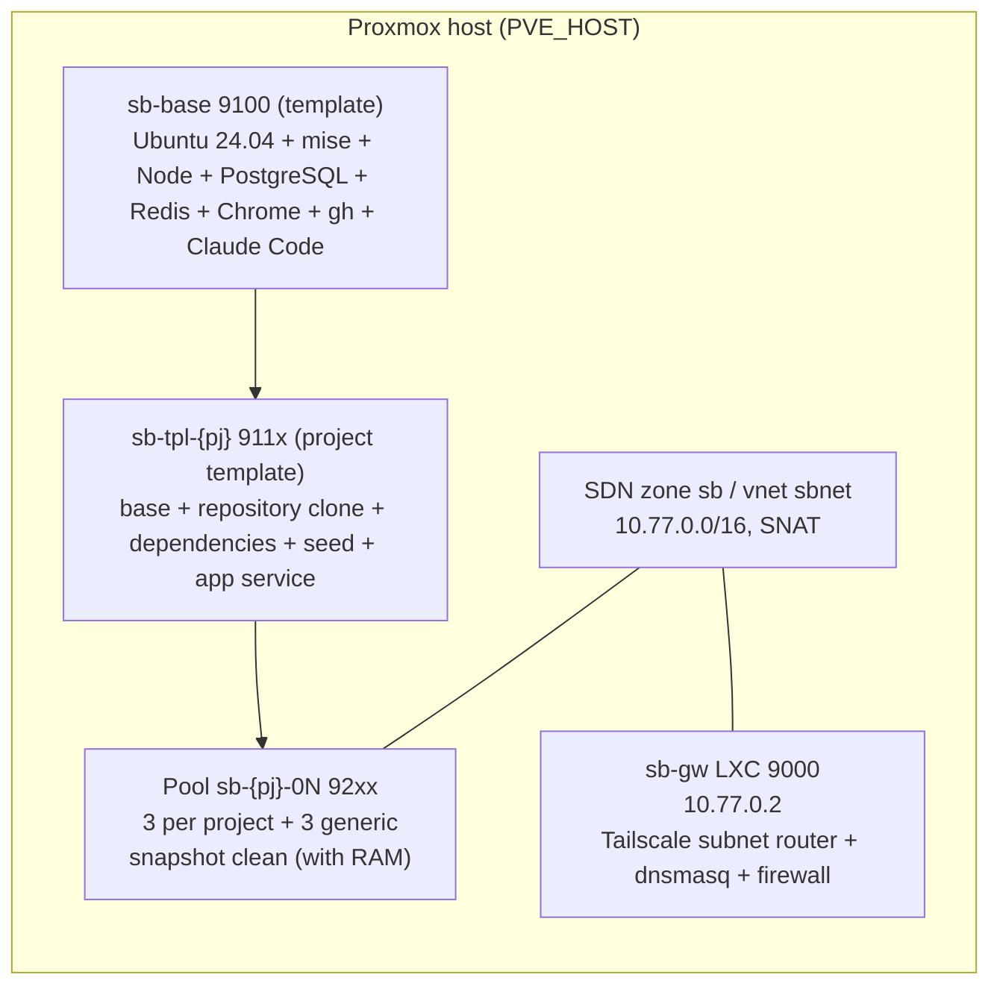

# Build the sandbox

What this page tells you: the meaning and order of the seven steps that create the VM pool on Proxmox. The authoritative commands are in `sandbox/BUILD.md`, which has a completion checklist for each step. Here each step is explained as "what it creates", "why it is needed" and "where a human acts".

!!! info "Taking over an environment that is already built"
    Progress is recorded in `sandbox/STATUS.md`. If you are taking over, run the commands in the "Check the real machine" section of STATUS and confirm the recorded progress matches reality before doing anything.

## The resulting layout



## Step list

| Step | Creates | Why | Who |
|---|---|---|---|
| 0 | Pre-checks, Mac-side keys and config, GitHub App | Never build on a broken state. Decide where secrets live first | 🤖 → 🧑 (creating and installing the App) |
| 1 | SDN `sb` / vnet `sbnet` (10.77.0.0/16, SNAT) | Give the VMs their own address space with NAT egress | 🤖 |
| 2 | Gateway LXC `sb-gw` (dnsmasq + Tailscale) | A named path from the Mac to the VMs, without Tailscale inside the VMs | 🤖 → 🧑 (Tailscale auth, route approval, split DNS) → 🤖 |
| 3 | Base template `sb-base` | OS, tools, databases and Claude Code shared by every project | 🤖 |
| 4 | Project templates `sb-tpl-{pj}` | Per-project Ruby / Node versions, dependencies, seed, app service | 🤖 (clone token comes from 🧑) |
| 5 | Pool (clone × 3) + snapshot `clean` + CLI | The VMs actually lent out. The rollback baseline | 🤖 |
| 5c | Egress limits (Proxmox firewall + FORWARD DROP on sb-gw) | Stop VMs reaching the LAN, other VMs and the tailnet (ADR-0010) | 🤖 |
| 6 | One lap with a minimal workflow | Feel whether the five-operation contract is enough from the workflow's point of view | 🤖 + 🧑 (PR review) |

## Key points per step

### Step 1. Network

Create the simple zone `sb` and vnet `sbnet` in Proxmox SDN with gateway `10.77.0.1` and SNAT on. VM addresses are fixed values derived from the VMID (pool 92xx → `10.77.1.(VMID−9200)`); DHCP is not used.

```bash
sandbox/proxmox/run.sh 10-sdn.sh
```

`run.sh` connects to `PVE_HOST` (required) over ssh and streams the script to it. The network design values can be changed through environment variables and fall back to defaults when unset: `SB_NODE` (the node that hosts the SDN zone; default: the host's hostname), `SB_NET` (the /16 prefix; default `10.77`), `SB_GW_CT` (the gateway's CT ID; default 9000), `SB_BASE_VMID` (default 9100), `SB_POOL_BASE` (default 9200). If you change them, set `SB_POOL_NET` / `SB_POOL_BASE` on the Mac side to match.

### Step 2. Gateway LXC

`sb-gw` (VMID 9000) has two interfaces: eth0 on the LAN (DHCP) and eth1 on `sbnet` (10.77.0.2). It runs dnsmasq (resolving `*.sb.internal`), tailscaled (a subnet router advertising `10.77.0.0/16`), and a firewall that drops forwarded connections originated by VMs.

```bash
sandbox/proxmox/run.sh 20-gateway-lxc.sh
```

🧑 Three human actions are needed here.

1. Open the `tailscale up` auth URL in a browser and approve
2. In the Tailscale admin console, **Approve** the route `10.77.0.0/16` on `sb-gw`
3. If the tailnet ACL uses grants that allow subnets individually, add `10.77.0.0/16` to a grant. Point split DNS for `sb.internal` at `10.77.0.2`

!!! warning "Approving the route alone is not enough"
    If the tailnet ACL has no grant, ping still fails after approval. If `journalctl -u tailscaled` shows `Drop: … no rules matched`, it is the ACL (it can be applied through the API with `TS_API_KEY`).

Until Tailscale works, set `SB_JUMP=<same value as PVE_HOST>` (for example `SB_JUMP=pve1`) in `~/.config/sandbox/env` and the CLI reaches the VMs through the Proxmox host (ProxyJump).

### Step 3. Base template

Create VM 9100 from the Ubuntu 24.04 cloud image, bake the shared layer with `31-provision-base.sh`, and turn it into a template with `qm template`. The contents are listed in `sandbox/templates/base/README.md` (mise, Node 22, PostgreSQL 16, Redis, Chrome, gh, Claude Code, the `/run/sandbox` tmpfs, and so on). Ruby is not included (the project layer installs it according to `.ruby-version`).

```bash
sandbox/proxmox/run.sh 30-base-template.sh create
```

### Step 4. Project templates

In a VM cloned from base, run the project's `provision.sh` (from `$AIFACTORY_WORKSPACE/projects/<pj>/`, or `examples/projects/<pj>/` if absent): clone the repository, `mise install`, dependencies, database creation and seed, and the app as a systemd service, then convert to a template.

```bash
GH_TOKEN="$(gh auth token)" TPL_VMID=9110 PJ=kumitate sandbox/proxmox/run.sh 32-pj-template.sh
```

The token used for cloning is not left in the template. The token VMs use to push is injected on every `take`.

### Step 5. Pool and CLI

Linked-clone each template three times and take a RAM-inclusive snapshot `clean` with the app running. This is the "baseline before lending"; `reset` and `release` return to it.

```bash
TPL_VMID=9110 sandbox/proxmox/run.sh 40-pool.sh kumitate 3
sandbox/bin/install.sh
sandbox take kumitate 001 && sandbox ssh 001 'claude --version' && sandbox release 001
```

### Step 5c. Egress limits

VMs may only reach the internet and the DNS on sb-gw; the LAN, the Proxmox host, neighbouring VMs and the tailnet are unreachable (ADR-0010). The Proxmox datacenter firewall attaches security group `sandbox` to every VM, and sb-gw drops forwarded NEW connections originated by VMs. The pool's `clean` snapshots are retaken with the firewall settings included.

```bash
LENT="$(jq -r '.[].vmid' ~/.config/sandbox/state.json | tr '\n' ' ')" sandbox/proxmox/run.sh 50-firewall.sh
```

`LENT` skips VMs that are currently lent out. Rebuilding a lent VM breaks the run using it ([Working with multiple sessions](../guides/multi-session.md)).

### Step 6. One lap

Go to [First run](first-run.md).

## Counts and sizes

| Kind | VMID | Count | Size |
|---|---|---|---|
| Generic | 9201–9203 | 3 | 4 GB / 2 vCPU |
| Project pools | 9204– (3 per project) | projects × 3 | 8 GB / 4 vCPU (for heavy test suites) |

Because the VMs are linked clones, `local-lvm` (thin) stays at a few percent of real usage. When growing the pool, watch `data%` in `lvs pve/data`.
