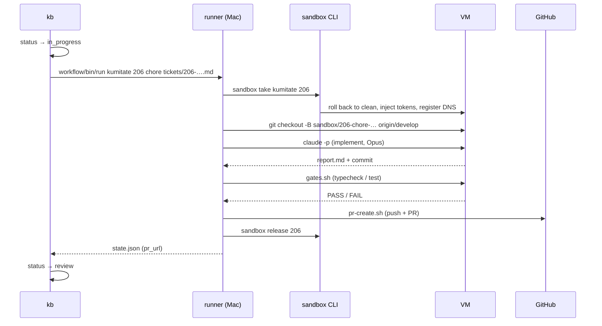

# First run

What this page tells you: creating one ticket, checking the definitions with a dry run that does not touch a VM, then running for real all the way to a PR. A dry run takes seconds; a real run takes 5 to 60 minutes depending on how heavy the gates are.

## 0. Pre-checks

```bash
sandbox ls                         # VMs are visible. A "-" in the TASK column means free
sandbox gh-app status              # the target project is OK
sandbox token show <pj>            # a Claude token is set
kanban/bin/kb list                 # the board can be read (empty is fine)
```

## 1. Create a ticket

There are two ways.

=== "From free text (intake)"

    ```bash
    cat > /tmp/memo.txt <<'EOF'
    The start command in kumitate's README is stale. It should be pnpm --filter @kumitate/web dev, not pnpm dev. Fix it.
    EOF
    glue/bin/intake /tmp/memo.txt
    ```

    The LLM decides the project (kumitate) and the kind (chore), adds a title and completion criteria, and files the ticket. To look at the decision before filing, add `--dry-run`.

=== "From a well-formed ticket.md (kb new)"

    ```bash
    kanban/bin/kb new kumitate chore "docs: update the start command in the README" --body - <<'EOF'
    The README still says `pnpm dev`; the real command is `pnpm --filter @kumitate/web dev`.

    ## Completion criteria
    - The README shows the current command
    - typecheck / test are green
    EOF
    ```

Both return an id (for example `206`) and place the body in `$AIFACTORY_WORKSPACE/kanban/tickets/206-kumitate-….md` (default `workspace/kanban/tickets/`).

## 2. Check the definitions with a dry run

```bash
kanban/bin/kb run 206 --dry-run
```

Without touching a VM, this validates the workflow yml and project.yml against their schemas, assembles the prompt for every step, and writes everything to `workspace/runs/<date>-kumitate-206-dry/`. Open `prompt-implement-0.md` to read what the agent would receive (shared rules, the role's constitution, project facts, the ticket). This is where you notice missing facts or forbidden items in the project definition.

## 3. Real run

```bash
kanban/bin/kb run 206
```

The flow is as follows.



The terminal shows progress per step.

```
[run kumitate/206 0s] workflow chore: implement → gates → pr  (branch sandbox/206-chore-readme → develop)
[run kumitate/206 0s] take
[run kumitate/206 9s] agent implement (implementer / coding → claude-opus-5)
[run kumitate/206 75s] implement: PASS → gates
[run kumitate/206 75s] code gates (gates.sh)
[run kumitate/206 960s] gates: PASS → pr
[run kumitate/206 960s] code pr (pr-create.sh)
[run kumitate/206 971s] result: human  PR: https://github.com/akkijp/kumitate/pull/300  run: …/workspace/runs/2026-09-06-kumitate-206
[kb]  206 review  kumitate   chore     #300   docs: update the start command in the README
```

## 4. Read the result

| What | Where |
|---|---|
| PR | `PR:` in the terminal, or `pr` in `kb show 206` |
| The prompt the agent saw and its output | `workspace/runs/<date>-kumitate-206/prompt-*.md` / `agent-*.log` |
| Gate results | `code-gates-*.log` and `work/gates.txt` in the same directory |
| Artifacts (report.md and so on) | `work/` in the same directory |
| State and history | `kb show 206` / `kb history 206` / `workspace/kanban/BOARD.md` |

Details in [Read the results](../guides/results.md).

## 5. The human's turn

Review and merge the PR. Merging can be automated too.

```bash
kanban/bin/kb new kumitate merge-pr "Merge PR #300 into develop" --pr 300 --body - <<'EOF'
Resolve conflicts keeping both intents, then merge if the gates are green and the review passes.
EOF
kanban/bin/kb run 207
```

## When it does not work

| Symptom | Where to look |
|---|---|
| `take` reports no free VM | `sandbox ls`. If a lent VM is left over, `sandbox release <id>` |
| The agent hits an authentication error | `sandbox token show <pj>` (it prints how many days ago the token was saved). If expired: `claude setup-token` → `sandbox token rotate` |
| Gates stay red, get sent back twice, and the run goes to `human` | `code-gates-*.log`. If it is already red on the base branch, add it to `known_red_gates` in `project.yml` |
| ssh to the VM was lost mid-run | Another session may have rebuilt the VM. See [Working with multiple sessions](../guides/multi-session.md) |

Everything else is in [Troubleshooting](../troubleshooting.md).
