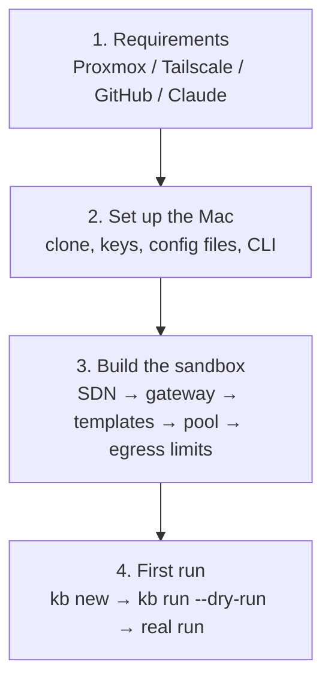

# Getting started

The path from nothing to a factory that has completed its first ticket. Expect half a day to a full day including the Proxmox build, or about 30 minutes if a sandbox already exists.

## The whole path

| Stage | Main work | Where a human is needed |
|---|---|---|
| [Requirements](requirements.md) | Check what you need | Accounts and hardware |
| [Set up the Mac](install-mac.md) | Clone the repository, place keys, config and the CLI | `claude setup-token`, creating and installing the GitHub App |
| [Build the sandbox](build-sandbox.md) | Create the VM pool on Proxmox | Approving the Tailscale route |
| [First run](first-run.md) | Run one ticket and read the result | Reviewing the PR |

!!! tip "Taking over an environment that is already built"
    If a sandbox already exists, treat [Build the sandbox](build-sandbox.md) as reading material, use the "Check" section of [Set up the Mac](install-mac.md) to confirm your machine matches the real infrastructure, and then go to [First run](first-run.md).

## Symbols

This site and the build guide (`sandbox/BUILD.md`) mark who performs each step.

| Symbol | Meaning |
|---|---|
| 🤖 | An AI session (Claude Code) or a script can do it |
| 🧑 | A human must act (approve in a browser, issue a token, and so on) |
