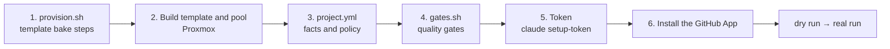

# Add a project

What this page tells you: the six pieces of work needed to bring a new repository into the factory, and how to write each file. Expect one to two hours including baking the template (10 to 40 minutes depending on the dependencies). Two references ship with the repository: `examples/projects/aifactory/` (this repository itself; public, so anyone can bake it and run a ticket end to end; the app on :3000 is `mkdocs serve`) and `examples/projects/kumitate/` ([akkijp/kumitate](https://github.com/akkijp/kumitate), a pnpm monorepo with Next.js and PostgreSQL, a reference for a larger app).

## The whole job



The factory's rule is that project-specific things exist only in the three files of the project definition directory (ADR-0009). Workflows are never duplicated.

| Location | Role |
|---|---|
| `$AIFACTORY_WORKSPACE/projects/<pj>/` | Your own project definitions. Not tracked by git (workspace) |
| `examples/projects/<pj>/` | Examples bundled with the repository. `kb` / `intake` / `dispatch`, the runner and the console look here for projects missing from the workspace |

## 0. Copy the example

```bash
mkdir -p "${AIFACTORY_WORKSPACE:-workspace}/projects"
cp -r examples/projects/kumitate "${AIFACTORY_WORKSPACE:-workspace}/projects/myapp"
ls "${AIFACTORY_WORKSPACE:-workspace}/projects/myapp"      # provision.sh  project.yml  gates.sh
```

From here on `myapp` is the slug of the new project (the name used in `sandbox take myapp …` and `kb new myapp …`).

## 1. Write provision.sh

`provision.sh` runs as the `dev` user inside a VM cloned from the base template and bakes in the repository clone, the runtime, dependencies, the database and the resident app. The skeleton is in `sandbox/templates/README.md`; the real example is `examples/projects/kumitate/provision.sh`.

```bash
#!/usr/bin/env bash
set -euo pipefail
export PATH="$HOME/.local/bin:$HOME/.local/share/mise/shims:$PATH"
: "${GH_TOKEN:?GH_TOKEN is required (bake time only; never left in the template)}"
REPO="owner/myapp"
APP="$HOME/app"

gh auth setup-git                      # so the GH_TOKEN injected at take time can push
gh repo clone "$REPO" "$APP" -- --branch develop
cd "$APP"
mise install && mise reshim            # follows .node-version / .ruby-version
corepack enable --install-directory ~/.local/bin && corepack prepare pnpm@10 --activate
pnpm install --frozen-lockfile         # dependencies
pnpm --filter @myapp/db db:migrate     # database (PostgreSQL role dev is trusted in base)
# keep the app running under systemd (the clean snapshot is taken with the app up)
sudo tee /etc/systemd/system/sandbox-app.service >/dev/null <<EOF
…
EOF
sudo systemctl daemon-reload && sudo systemctl enable --now sandbox-app
# clean up before baking
unset GH_TOKEN; gh auth logout --hostname github.com || true; rm -f ~/.config/gh/hosts.yml ~/.bash_history
```

Points:

- Pass the clone token through the environment and never leave it in the template (`GH_TOKEN="$(gh auth token)"`)
- Anything not in base (MySQL, pgvector, browser dependencies, and so on) is installed by provision. The kumitate example adds `postgresql-16-pgvector` with apt
- If the app is not at the repository root, write `SANDBOX_APP_DIR` to `/etc/sandbox/app.env` (kumitate uses `apps/kumitate/`)
- A broken seed shows up at this stage. The fix belongs to the project (file a ticket)

## 2. Build the template and the pool

```bash
GH_TOKEN="$(gh auth token)" TPL_VMID=9111 PJ=myapp sandbox/proxmox/run.sh 32-pj-template.sh
TPL_VMID=9111 sandbox/proxmox/run.sh 40-pool.sh myapp 3
sandbox/proxmox/run.sh 50-firewall.sh       # egress limits and retaking the snapshots
sandbox ls                                  # sb-myapp-01 to 03 appear
```

`32-pj-template.sh` looks for the `provision.sh` of `PJ` in the workspace first, then in `examples/`. The VMID and address rules are in "Naming, numbering and addresses" in `sandbox/README.md`. Project templates are 911x, pools are 92xx and the IP is `10.77.1.(VMID−9200)` (changeable with `SB_POOL_BASE` / `SB_POOL_NET`).

## 3. Write project.yml

`project.yml` is the "facts and policy" of the project that the runner pastes into prompts. Its shape is validated against `workflow/kit/schema/project.schema.json`. This is a shortened version of the real kumitate file (`examples/projects/kumitate/project.yml`).

```yaml
name: myapp
display_name: myapp
repo: owner/myapp
base_branch: develop          # where work branches start and where PRs go
hotfix_base: main             # target for hotfix (defaults to base_branch)
app_dir: /home/dev/app        # the app directory inside the VM (becomes cwd)
url: http://localhost:3000    # the app URL as seen from inside the VM
gates: gates.sh               # the gate script in the same directory
prepare: prepare.sh           # optional. Aligns the environment with base right after checkout
stack: "pnpm 10 monorepo / Node 22 / Next.js / PostgreSQL 16 / vitest"
facts:                        # facts told to the agent every time. One line per item
  - "Dependencies: `pnpm install --frozen-lockfile`. pnpm is pinned by packageManager"
  - "A single test: `pnpm --filter @myapp/web exec vitest run <file>`"
  - "Known issue (2026-09-06): two calendar title tests are time-dependent because of fixed fixtures"
review_points:                # what the reviewer always checks
  - "Does a schema change in packages/db come with a migration?"
forbidden:                    # what must not be done in this project
  - "Do not change .github/workflows"
  - "Do not commit real values into .env"
known_red_gates: []           # gates already red on base. Remove once the fixing PR is merged
```

| Field | Required | What to write |
|---|---|---|
| `name` / `repo` / `base_branch` / `app_dir` / `gates` | Required | Locations and targets |
| `stack` | Recommended | One line. Appears at the top of the prompt |
| `facts` | Recommended | How to run tests, where generated files go, known issues. **Do not write rules that apply to every project** (those go in `roles/_common.md`) |
| `review_points` / `forbidden` | Recommended | Project-specific checks and prohibitions |
| `prepare` | If needed | Setup script run right after checkout. Closes the gap between the VM template and base (dependencies, migrations) |
| `known_red_gates` | If needed | The runner downgrades those FAILs to INFO and does not send the agent back to "fix it" |
| `workflow_overrides` | Rare | Workflow name → `base_branch` override |

## 4. Write gates.sh {#gates-sh}

`gates.sh` runs inside the VM with `$SANDBOX_APP_DIR` as cwd, prints one line per gate (`PASS <name>` / `FAIL <name> (<log>)`) and exits 0 only if everything is green. Use **the same set as the project's CI**. The real kumitate file has this shape.

```bash
#!/usr/bin/env bash
set -uo pipefail
export PATH="$HOME/.local/bin:$HOME/.local/share/mise/shims:$PATH"
cd "${SANDBOX_APP_DIR:-$HOME/app}"
mkdir -p "$HOME/gates"; rc=0
SELECT="$*"   # with arguments, run only those gates (the runner uses this to check base)
gate() { local name=$1; shift
  if [ -n "$SELECT" ]; then case " $SELECT " in *" $name "*) ;; *) return 0 ;; esac; fi
  if "$@" > "$HOME/gates/$name.log" 2>&1; then echo "PASS $name"; else echo "FAIL $name (~/gates/$name.log)"; rc=1; fi
}
gate typecheck pnpm --filter @myapp/web typecheck
gate lint      pnpm --filter @myapp/web lint
gate test      pnpm --filter @myapp/web test
exit $rc
```

Anything you want treated as information (red does not stop the run) should print `INFO` instead of going through `gate`, or be listed in `known_red_gates`. Most of the run time is spent here, so start with "the same as CI" and think about incremental runs later if it is too slow. For Rails, line up `gate rubocop bundle exec rubocop` / `gate rspec bundle exec rspec` in the same way.

When a gate is red, the runner runs **only that gate** against base as well, and does not send it back to the implementer if it is red on base too. The `SELECT` line above is the contract that makes this possible (with no arguments everything runs, as before).

**Do not put dependency installs or migrations in the gates.** That is setup done before you measure quality, and a failure there belongs to a different audience (a red gate goes to the implementing agent, a failed setup goes to a human). Put setup in `prepare.sh` and name it in `project.yml` under `prepare`.

```bash
#!/usr/bin/env bash
set -euo pipefail
cd "${SANDBOX_APP_DIR:-$HOME/app}"
pnpm install --frozen-lockfile
pnpm --filter @myapp/db db:migrate
```

The VM rolls back to its template after every run while base moves on; `prepare` closes that gap. If it fails, the runner ends the run without starting any agent (`failure: prepare`).

## 5. Save the tokens 🧑

```bash
claude setup-token
sandbox token set myapp                  # Claude token
echo 'GH_REPO=owner/myapp' >> ~/.config/sandbox/pj/myapp.env
sandbox token show myapp
```

## 6. Install the GitHub App 🧑

Install the App on the repository's owner from the install link shown by `sandbox gh-app status` (the owner's admin rights are needed). Once `status` shows `myapp: owner/myapp OK`, a one-hour token is issued on every `take`.

## 7. Verify

```bash
sandbox take myapp 001 && sandbox ssh 001 'cd $SANDBOX_APP_DIR && git status && claude --version' && sandbox release 001
kanban/bin/kb new myapp chore "docs: smoke test" --body - <<< "Fix one typo in the README. ## Completion criteria
- gates green"
kanban/bin/kb run <id> --dry-run       # schema validation and the prompt
kanban/bin/kb run <id>                 # real run
```

Read `prompt-implement-0.md` from the dry run and check that nothing is missing from the facts (such as how to run tests) before the real run.

## Checklist

| Item | Check |
|---|---|
| provision.sh | `32-pj-template.sh` runs to the end and no token is left in the template |
| Template / pool | `sandbox ls` shows `sb-myapp-01` to `03` |
| project.yml | The schema validation in `kb run --dry-run` passes |
| gates.sh | The equivalent of `sandbox ssh <id> 'bash ~/work/gates.sh'` gives the same result as CI |
| Tokens | `sandbox token show myapp` |
| App | `sandbox gh-app status` shows `OK` |

A project without `project.yml` can still be filed, but dispatch marks it `blocked`.
