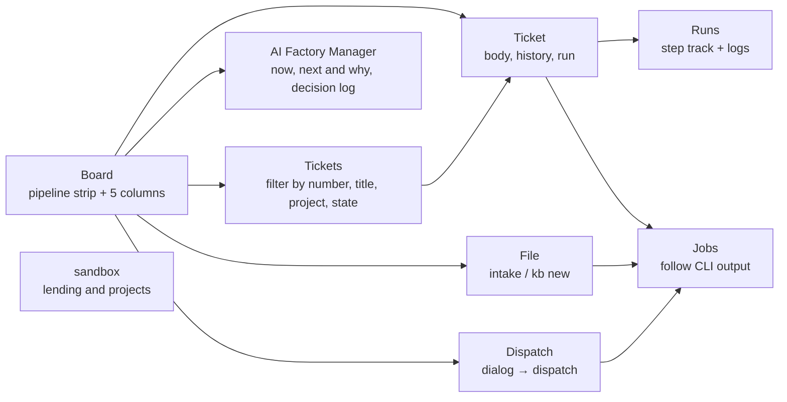

# Web console

What this page tells you: how to see where the factory is from a browser and do the same operations with buttons. Without memorising the CLI, the board, the logs of a running run, VM lending, filing and dispatch all fit on one screen.

## Start it

```bash
console/bin/console --open        # opens http://127.0.0.1:8765/ in the browser
console/bin/console --port 9000   # change the port
```

- Runs on the Python 3 standard library alone. No npm, no pip (use the same `python3` as the runner)
- By default it binds to 127.0.0.1 only, with no authentication. On an internal network address (10.x / 192.168.x / 100.64.x and other non-global addresses, such as the control-plane LXC) `--host <IP>` (or `CONSOLE_HOST`) is enough and no passphrase is needed; the tailnet and the firewall are the boundary. To require one anyway, set `CONSOLE_TOKEN` (one visit to `/?token=<passphrase>` sets a cookie). Binding to 0.0.0.0 or a global address requires the passphrase
- Stop it with ++ctrl+c++. Jobs it started (such as `kb run`) keep running, and reappear in the list the next time the console starts

To keep it running, register it with launchd. It starts at login and restarts if it dies.

```bash
console/bin/install.sh --launchd   # register; also creates ~/.local/bin/aifactory-console
console/bin/install.sh --remove    # unregister
launchctl kickstart -k gui/$(id -u)/com.aifactory.console   # restart after changing the code
```

launchd's PATH is minimal, so the installer writes the absolute path of the current shell's `python3` and the locations of `claude` / `gh` / `jq` / `sandbox` into the plist. The log is `~/Library/Logs/aifactory-console.log`.

## Screens



| Screen | What you see | What you can press |
|---|---|---|
| Board | The pipeline strip (todo → in progress → review → done, with "waiting for a human" to the side) and five columns of cards in the same order. A card for a ticket that is running shows the current step and its elapsed time (plus the time since the run started) under the title, and that line opens the run's record (pressing anywhere else on the card opens the ticket). The strip under "in progress" is about counts, plus the runs that have not started or were abandoned. The strip, the columns and the runs all follow the project filter, and the scope is stated above the strip | File a ticket (goes to File), dispatch (a dialog to pick project, count and dry run; it shows the ticket that will be picked before you confirm, and cannot be pressed when there is no todo), *Search the list* and the done column's *See all n more* (both go to Tickets) |
| AI Factory Manager | One page for what the AI Factory Manager (PM) is doing now, what it intends to run next, and why (it only reads `GET /api/pm`, every five seconds). From the top: *Now* (the state and the run it is based on), *Next* (the next ticket and the reason), *Decisions* (newest first: time, subject, what was decided and **why**), and *Board summary* (todo, in progress, review, waiting for a human, done, plus the tickets waiting for a human). **When the board cannot be read yet it does not say "there is no ticket to run"; it says the state could not be read** (a freshly installed console is normally in this state, so it is not shown as a danger). Counts that cannot be read are never written as zero. The decision log starts filling up once the AI Factory Manager makes decisions | Read only. Only the project filter does anything. *Switch mode*, *Pause* and *Run now* are placeholders: the page says they are not wired up yet, and pressing one repeats that |
| Tickets | Every ticket in one table, newest update first (number, project, kind, title, state, PR, updated). The board's done column only keeps the newest 15, so anything past that is found here. The filter lives in the URL, so it survives opening a ticket and coming back | Narrow by number (prefix), title (substring), project and state, all at once. Each result's number is a real link: Tab reaches it, Enter opens it, and open-in-a-new-tab works. Pressing the rest of the row opens the ticket too |
| Ticket | Top to bottom: the heading (number, title, state, project, kind, PR), the note, one line of run status when something is running (current step and elapsed time; pressing it opens the run's record), the artifacts panel (the way to the PR: the ticket's PR number and any PR left in a run record are reconciled into one, shown with where the number came from and an *Open PR #n* link. Even when the number has not been copied onto the ticket yet, a PR recorded by a run is one link away. When the two numbers disagree both are shown side by side. When there is no number anywhere it says the number is not registered yet — which does not mean there is no PR on GitHub), the body (Markdown, including the `## 完了条件` completion criteria at its end), and attachments. Everything you press sits after that (to the right on a wide screen) in one *Actions* panel, followed by runs, jobs and history. On a narrow screen and for a screen reader the order is the same, so the body still comes before the forms | `kb run` (a dialog shows project, workflow and expected duration first; picking another workflow, dry run, `--keep` and `--resume` are folded into *Run options*. On a done ticket the button is disabled and *Back to todo (redo)* sits beside it; when the project has no project.yml there is no run button at all, only a note on where to put the file), move the state (start / review / done / back to todo / waiting for a human; these only change the recorded state and never start the runner, so *Run* is the only strong button; no confirmation, the toast offers *Undo*; on a done ticket there are no buttons here, just a line pointing at *Back to todo (redo)* above; when no run button is shown above — the project has no project.yml, or a job such as a VM release is running — *Back to todo (redo)* stays here instead, so you can always move the state back), fix the kind, PR number and note (an unsaved edit is kept per ticket, so it survives a detour to the board and back, the browser's back button, a reload and the five-second auto-refresh; it lives in this tab only and is gone once you close it. It clears when the save succeeds or when you press *Discard draft* — and the toast's *Undo* brings a discarded one back. If the record changed underneath a pending edit, a warning shows the field and its current recorded value), sync the state from the run record (before it runs you see the target run and the state and note before and after; a warning if the ticket was updated after that run) |
| Runs | The list of `workspace/runs/` and, per run, the step track (pass / fail and duration per step, loops ↺, terminal end / human). File list and logs. Opening a run leads with an *Outcome* panel: one sentence each for the result, the step it stopped at with the failing gates, and the ticket's current state; when the record does not say, it says so. A run that ended at `human` with a wip branch left behind also gets one line with the command to continue it (`kb run <id> --from <step> --branch <branch>`). Once a human has closed the run out (opened a PR from the wip branch and merged it, or given up), it says so instead — who recorded it, when, and what they wrote — and the continue command is gone. A run the runner merged by itself reads "aifactory merged PR #n into develop (done).", and a run that did not meet the conditions still reads "a PR was created" with one more line saying why the automatic merge did not happen. Files are split into artifacts (report, plan, gate results), step logs, and everything else (collapsed). **A run whose runner is gone is listed as 中断 (abandoned), not as running**, together with the end time, state and exit code of the job that ended, and a note that waiting will not help. A run that failed while preparing the VM (`sandbox take`) shows a summary of the error. Gates that were downgraded to INFO because they are red on the base branch are listed on their own line as "gates that are also red on base (no need to fix them)", separate from the failing gates, and the wording distinguishes the ones the runner confirmed by running them on base from the ones project.yml already declared red (ADR-0038). A run that is merely missing records is no longer called a "v0 record": it says which times and steps are unknown | Read the reason, read the report (both open the file in place), open the job, open the ticket, see sandbox (with a note when the VM is still on loan), sync the state from the run record (only when the ledger's run is this run and the ticket is still in progress) |
| sandbox | Lent VMs (task, VM name, IP, project, time since lending, the pool key names chosen for it, app URL), the project list (whether project.yml exists, the *Claude key* column — the pool's state, the same for every project: *key pool* / *key pool (Fable only)* / *key pool (Opus/Sonnet only)* / *not registered (runs pause)*; env files are not consulted — and the pool as defined / actual / lent / free — actual being the count from the last successful `sandbox ls`, with its fetch time in the heading and, past 10 minutes, how long ago it was; a row whose actual size is below the defined one gets a note with how many VMs are missing and how to add them; when a project has gates that are red on base, they are shown on separate lines — the ones a human wrote into project.yml, and the ones the runner confirmed by running them on base, the latter carrying the run name and time that confirmed them. That time is the run's, since there is no per-gate confirmation time in the record), and the pool VM list (lent to, VM name, IP, project, power state, lent since). Lending and power are separate axes: returning a VM does not stop it right away, so running VMs are listed even when nothing is lent. A VM that has gone unused for the configured window (24 hours by default) is tagged *停止候補* (stop candidate); once candidates exceed the cutoff (10 by default) the oldest are stopped to save power and shown as *節電で停止中* with a note that the next lending starts it again (ADR-0033 / ADR-0035). The heading shows when the list was fetched and distinguishes fetching / failed (last lines of the reason plus a link to the job) / never fetched. When the same VM is lent to more than one ticket (the ledger holds two or more entries with the same vmid), leases and VMs are counted separately (*2 leases, 1 VM*), each shared VM gets a warning listing the tickets, and the rows are marked *shared*. Pool usage counts VMs, not leases. A VM without a `clean` snapshot cannot be seen in `sandbox ls`, so it still counts as free here and only shows up in the `take` error | `sandbox ls` (ssh to Proxmox, a few seconds), `sandbox release` (if a run is active on that VM, or the VM is shared with another ticket, you must type the ticket number first; for a shared VM the dialog first names the work that the rollback destroys and the ledger rows that stay behind) |
| File | The draft you are typing (request text, project, kind, title, body, PR number) and the mode you picked. It survives a detour to another screen, a reload, the browser's back button and switching modes (within the same tab only; closing the tab discards it). When a draft is restored, a line at the top of the screen says so | The screen runs in order: *1. Pick a mode* → *2. Fill it in* → *3. Check it and file it*. The two modes are *File from prose* (an LLM turns your prose into a title and completion criteria; the CLI behind it is `intake`) and *Write the title and criteria yourself* (filed as written; the CLI is `kb new`), and only the form for the mode you picked is shown. There is only one strong button. Either way filing only records the ticket — nothing runs yet, which the screen says at the bottom before pointing at a ticket's *Run* and the board's *Dispatch*. Picking a kind shows when to choose it right there, and the PR number field appears only for `merge-pr` (it is not sent for any other kind). The body field carries a `## 背景` (background) / `## 完了条件` (completion criteria) skeleton as a placeholder, and *Check how it looks* renders the Markdown before you send it. The prose mode puts *Judge it only* next to *Take it in*: it files nothing and just shows the judgment, and your request text stays so you can come back and file it as is. Dispatch lives on the board. *Discard the draft* clears it explicitly (the toast offers *Undo*). On a successful submit, only that mode's draft is cleared. Picking a project shows, right under the select, whether that project has a project.yml (a *Ready to run* / *Setup needed* badge plus an explanation; when setup is needed it names the file to write and links to the sandbox screen). Filing itself is never blocked |
| Jobs | The CLI processes this console started. Output is followed every 2 seconds. A finished job shows *What to do next* (open the created ticket, sync the state of a stopped run, and so on) plus one line with the job's end time and the ticket's current state. When the ticket has moved on since the job (done, or edited later), the wording is past tense and the primary button becomes *Open the ticket* | Stop (SIGTERM to the process group) |
| Stats | What each agent step consumed, taken from the raw run events (`usage` on the `result` event and the model name on `init` in `agent-<step>-<n>.jsonl`). Filter by period (today / 7 days / 30 days / all) and project. Tiles on top: steps, turns, cache reads, output, cost estimate, steps with thinking. Below: tables by model, by step (step × model), by day and by project (steps, average turns, average minutes, input, cache writes, cache reads, output with visible characters, thinking blocks and how many have visible text and how long, tool calls, cost estimate with its share, cost per step and the most expensive step), the 20 most expensive steps (linking to the run and the log), and how to read it. The cost estimate is the sum of the CLI's `total_cost_usd`, not the weight the subscription windows (5 hours / 7 days) use. Opus thinking blocks carry only a signature in the record, so only their count is known. Parsed results are cached in `stats-cache.json` next to the job records and only changed files are re-read (ticket 382). **The by-day table and the period filter count each step by its own timestamp, converted to the viewer's time zone** (a run directory name carries the date of the control plane, which runs on UTC, at the time `kb run` started, so some rows fall on a different day than their run name says; the table states which zone it counted in. ADR-0055) | Filter by period, project and whether to include dry runs. Open the run or the log from the top-20 rows |
| Keys | The Claude key pool (`keys.json` on the control plane): name, the *use for fable* / *use for everything else* flags, whether the key is used, the last 4 characters of the token, issue date, last launch, launch count (how many times the runner actually started `claude` with the key; the assignment count shows on hover), and the lent tickets holding it. The token value never appears Above the table, **Remaining quota**: for every key, the 5-hour window, the 7-day window (all models) and the 7-day Fable window, each with the remaining %, time to reset, window start → end, and a one-liner only when it matters ("at this pace, exhausted in about n", exhausted, warning, rejected, waiting for reset). 10 % or less is red, 25 % or less amber. The control plane's timer (`aifactory-keys-probe.timer`) queries every key with Fable every five minutes regardless of enabled or model-assignment flags, falling back to the cheap model for missing shared windows, and the screen says so when the last observation that could be read is older than 15 minutes (probing alone does not refresh it — if the reads keep failing, the screen says stale, because the numbers shown are from the last successful read). An expired key (authentication refused) shows up here before a run stops on it. The list's *remaining* column shows only the tightest window. Above the table, **Quota history and forecast** overlays all three windows for the selected key (past seven days and next seven days by default; solid observations, dashed forecasts; stale or insufficient data has no forecast) (ADR-0093) | Add a key (name, token, flags, note; the token is not shown again after it is sent), toggle the flags and *use*, replace the value, delete (danger dialog; typing the name is required while a ticket holds it). Turning a key off or deleting it starts a `sandbox reinject` job for every lease that holds it — a running `claude` is left alone and the next start uses another key. *Probe now* runs a probe as a job (never twice at once) |
| Logs | The intake and dispatch records in one table (time, action, project, ticket, result, reason; newest first), with column names and plain wording instead of `rc=` and unlabelled numbers. *Show the raw log* below the table keeps the original `workspace/logs/intake.log` / `workspace/logs/dispatch.log` text. The log format itself is unchanged; the console derives the columns (ADR-0026) | Narrow by ticket number, project and kind (intake / dispatch), all ANDed, with the filter kept in the URL. The ticket number is a link to that ticket |
| Settings | The workflow list (name, the path taken when everything goes well, and the steps that only run when something does not), the model routes (`routes.env`; each of the four lines has an input and can be changed here — pick a model by display name through the agent → model name pair, or type the ID in directly), `git status`. Workflow names and steps are real links; opening one shows the step detail (who runs it, its instruction, what it reads and writes, its limit, its branches, and the effective model). The step detail also has an editor holding **only that step's yml block**, which syncs both ways with the model fields inside the page | Open a workflow, open a step, read the raw definition, change a model route, change a step's definition (that step's yml block) — both show which steps they affect before saving |

## Reading the steps of a workflow

In Settings the workflow list is made of real links, for both names and steps. Tab reaches them, Enter opens them, and the
breadcrumb takes you back to the list.

The *Flow* column shows **the path taken when everything goes well**. Steps that only run when something does not — such as
`resolve` in `feature` — are listed separately below it (laying them out in definition order reads as if they always run).

Opening a workflow shows its description, the success path, the conditional steps, the list of steps, and the definition
(how the branch is made, where the PR goes, the workflow inputs, and where the yml lives). *Read the raw definition* opens the
yml itself.

Opening a step shows:

- **Who runs it**: a role (`planner` / `implementer` / `reviewer` / `researcher`), or a machine (the `code` script)
- **The instruction for this workflow** (`brief` in the yml), and the files it reads and writes (`inputs` / `outputs`)
- **The time limit** (`timeout_min`; when the definition does not set one, it says the schema default is being used)
- **Branches**: where it goes when it works and when it does not. A step it goes back to carries the maximum number of loops
  and where it goes once that is exceeded. The review step also notes that a minor finding can add one more loop (ADR-0053)
- **The model**: class (the role default, or the step's own `model_class`) → route (`MODEL_<class>` in `routes.env`) → model
  name. A `code` step says a machine runs it and that no model is used, and no model name is shown

The model is resolved **only as far as the configuration allows**. `CLAUDE_MODEL` can override it when a run starts, so the
model actually used cannot be known from the configuration. For what was actually used, see the Statistics screen (by model,
by step).

Workflows whose definition cannot be read, keys the schema does not know, and misspelled `role` values are not hidden either:
they are listed as unreadable items. Opening it starts no job, no runner, and changes no settings by itself. The only things
you can change here are the model routes (the four lines on the Settings page itself), the model of a step
(workflow → step → "Change model") and that step's definition (workflow → step → "This step's definition"); all of them show
which steps they affect before saving.
Every model field is picked in two steps — the agent (the CLI that runs it, only claude for now) → the model name (a display name) — and a model that is not in the table can be typed in as an ID (ADR-0072).

The "this step's definition" field holds **only that step's yml block** (the `- id: <step>` line down to just before the next
step), verbatim. Keys the model form does not have, such as `timeout_min` and the branches, can be changed there, and it syncs
both ways with the model fields inside the page. The whole file is never shown and can never be written, and a step's `id` and
who runs it (`role` / `code`) cannot be changed. Input the parser cannot read writes zero bytes: the reason appears under the
field and your text stays (ADR-0073).

## Following a running run

Below the step track, *Definition:* lists the steps of the workflow in order. Step ids are bare English words, so the *What each step does* fold under it explains every step: what it does, the workflow-specific instruction (the `brief` in the yml), the files it reads and writes, and where a failure sends it back to (and after how many loops it waits for a human). Hovering a step in the list shows the same explanation.

While a run is in progress its screen refreshes every 5 seconds and automatically opens **the log of the step that is running** (the `agent-*.log` / `code-*.log` named by `current` in `state.json`). For agent steps the runner turns the `claude -p` event stream into a readable log:

```
[+00:06] ▶ Read: /home/dev/app/hello.txt
  ↳
    1	hello, factory
[+00:14] ▶ Write: /home/dev/work/990/research.md
  ↳
    File created successfully at: …
[+00:18] result: success turns=5 duration=15s cost=$0.04
```

`▶` is a tool call, `↳` the first three lines of its result, and the timestamp is elapsed time since the step started. Once you pick a different file, that run stops switching automatically.

## Rules

- **State is only changed through the existing CLIs** (`kb` / `intake` / `dispatch` / `sandbox`). The console opens `kanban.db` read-only and never writes `state.json`. It follows the rules in [Working with multiple sessions](multi-session.md)
- **Long operations are jobs.** `kb run` can take more than an hour, so the console detaches it as a child process and streams its output to `console/jobs/<id>/log` (not tracked by git)
- **Duplicates are rejected.** A second `kb run` for the same ticket, a second `dispatch`, or a `release` for a task with a running job is refused inside a lock
- **Readable files are limited** to the workspace (`runs/`, `kanban/tickets/`, `logs/`, `projects/`), `examples/projects/`, `workflow/kit/` and `console/jobs/`. Token contents are never shown
- **Confirmation scales with risk.** Moving a ticket's state applies immediately and the toast offers *Undo*. Real runs and dispatch open a dialog that shows what will happen (the ticket to be picked, the project, the expected duration). Syncing the state overwrites the ticket, so the state and note before and after are shown first. Releasing a VM and stopping a job use a danger-styled dialog, and when a run is active on that VM you must type the ticket number
- **Dates and times are shown in the browser's time zone.** Records carry a UTC offset (`2026-09-08T00:21:00+00:00`), and an elapsed time is only the difference between the record and now, so it reads the same in any time zone and does not jump when a run finishes. The bottom of the navigation names the time zone being used for display and says so when the records are kept in a different one. A field with no recorded time reads 時刻の記録なし instead of being blank. The decision is ADR-0026 ([Design decisions](../decisions/index.md))
- **Navigation is split into three groups**: *tickets* (board / file), *operations* (AI Factory Manager / runs / jobs / logs / stats) and *administration* (sandbox / keys / settings). The group headings are labels, not links. Press ++g++ then a letter (++b++ board, ++i++ file, ++p++ AI Factory Manager, ++r++ runs, ++j++ jobs, ++l++ logs, ++t++ stats, ++s++ sandbox, ++k++ keys, ++c++ settings) to jump; ++question++ lists the shortcuts. The screen you are on is highlighted
- The rules for UI text (buttons are verbs, sentences are polite, one glossary) live in `console/UX.md` in the repository. The decision record is ADR-0019

## API

The JSON API the screens use can be called with `curl`. POST requires the `X-Console: 1` header (other sites in the browser cannot add it, which prevents accidental operations).

```bash
curl -s localhost:8765/api/overview
curl -s localhost:8765/api/tickets/204
curl -s -H 'Content-Type: application/json' -H 'X-Console: 1' -X POST localhost:8765/api/tickets/204/run -d '{"dry_run": true}'
```

| Method and path | What it does |
|---|---|
| `GET /api/overview[?pj=]` | Counts per state, running runs and jobs, number of lent VMs. `pj` narrows the run lists only, before the `limit` is applied (so a project's run is never dropped when seven or more are running; `runs_active_n` is the count after filtering). `counts` always covers every project |
| `GET /api/tickets[?pj=]` / `GET /api/tickets/<id>` | List / body, history, runs, jobs. The list also returns the project candidates (`pjs`) and whether each one has a project.yml (`pj_ready`) |
| `GET /api/next[?pj=]` | The preview shown before you press Dispatch. It returns the ticket re-picked **with the same judgement as `dispatch`** (`core.pm_pick_next`, ADR-0079): `next` (the runnable ticket, or `null`), `reason` (the PM's vocabulary: `picked_next` / `no_todo` / `blocked_by_dependency` / `blocked_by_pause`), `kb_next` (the raw id the thin `kb next` returned), `skipped_by_dependency` (skipped ticket → unfinished prerequisites) and `skipped_by_pause` (skipped ticket → the pause facts; `paused` is `quota` or `nokey`, `until` is when the limit resets, `hits_exceeded` means the quota was hit too many times in a row). The dispatch dialog prints one line per skipped ticket. Whatever depends on the environment at dispatch time (the project's project.yml, the pull worker, a free VM in the pool) is **not** checked here, and the screen says so |
| `GET /api/pm[?pj=]` | The AI Factory Manager's (PM's) state (`core.pm_status()`; read-only — it starts nothing. ADR-0074). `state` is one of `idle` / `waiting` / `landing` / `blocked`, derived every time from the existing records rather than stored. **"could not read it" and "zero of them" are different values**: the board carries `board.readable` and `board.reason` (`ok` / `no_db` / `kb_failed`), and the run records carry `runs.readable` and `runs.reason` (`ok` / `no_records` / `error`). `counts` is filled in only when the board's counts could be read (otherwise it is `null`); `kb_failed` covers both the case where the counts could be read and the case where they could not, so do not use the presence of `counts` in place of `board.readable` — read `board.readable` / `board.reason` to see whether the board could be read. `next` is always an object, and `next.reason` is one of `picked_next` / `no_todo` / `run_running` / `landing_observed` / `needs_human` / `board_unreadable` / `blocked_by_dependency` / `blocked_by_pause`. `next.reason` looks at whether the board could be read first, so it is `board_unreadable` even in `waiting` / `landing` when the board could not be read. `next.launchable` is true only for `picked_next`, and a `null` `next.ticket` does not mean "all good". Omitting `pj` covers every project at once: one running run anywhere makes it `waiting`, and one stuck recent run anywhere makes it `blocked`. `proposal` carries the next move (`core.pm_decide()`; no side effects): `{pj, ticket, run, state, action, reason_code, facts, mode}`, where `action` is one of `none` / `run` / `requeue` and `reason_code` only uses the same vocabulary as the decision log (ADR-0074, decision 5). **A `null` `proposal` does not mean "nothing to do"; it means the board or the run records could not be read.** When the AI Factory Manager decides a stopped run can be run again, `state` is `idle` rather than `blocked`, `next.reason` is `requeue_proposed` (a different value from both `picked_next` and `no_todo`), and `next.launchable` stays false — it is a proposal, not permission to start. When a ticket declares [prerequisites](../reference/cli-kb.md) (`depends_on`) that are not finished yet, the AI Factory Manager skips that ticket and picks the next todo. If every candidate is like that, `next.reason` and `proposal.reason_code` are `blocked_by_dependency`, `next.ticket` is `null`, and `state` stays `idle` — the board could be read, so being unable to pick is a **confirmed conclusion**, a different value from both `no_todo` and `board_unreadable`. The tickets that were skipped, and their unfinished prerequisites, are kept in `proposal.facts.skipped_by_dependency` (shaped like `{"538": {"537": "blocked"}}`; a number that is not in the DB shows as `null`) (ADR-0077). Tickets paused by a key quota or a missing key ([`kb resumable`](../reference/cli-kb.md)) are skipped the same way until they are released. If every candidate is like that the reason is `blocked_by_pause` and the skipped tickets are kept in `proposal.facts.skipped_by_pause` (ADR-0079). **This is not escalated to a human-waiting `blocked`, but it does not mean "a machine will clear it if you wait"**: there are three ways out of it, told apart by what is in `skipped_by_pause`. A quota pause (`paused: quota`, with the reset time in `until`) is continued by `dispatch --resume-paused` once that time comes. A ticket waiting for a key (`paused: nokey`, `until` is `null`) **stays paused until someone registers the key in the key pool** — time alone never changes it. A ticket whose quota was hit too many times in a row (`hits_exceeded`) is **not run automatically until someone checks the quota**. Neither of those last two enters the auto-resume queue, so when `blocked_by_pause` persists, read `paused` / `until` / `needed_keys` / `hits_exceeded` in `skipped_by_pause` |
| `POST /api/pm/tick` | One turn of the AI Factory Manager's loop (`core.pm_tick()`; ADR-0074, decisions 1 and 4). `{pj, dry}`. **This version only proposes**: it reads the state, decides the next move and the reason, writes one line to the decision log (`$AIFACTORY_WORKSPACE/logs/pm-decisions.jsonl`) and returns. It starts no run and merges nothing (runs are still started by `POST /api/tickets/<id>/run`). It does not wait — a run finishing is seen by the next turn. To keep two turns from overlapping it takes `jobs/.lock` without waiting, so a turn that overlaps another returns `{"ticked": false, "skipped": "locked"}` without writing anything. With `dry: true` it decides without writing. While the same decision holds, no new line is added (so a five-minute timer does not fill the log with identical lines) |
| `GET /api/tickets/<id>/sync-preview[?run=]` | A preview of the state sync (`kb sync --dry-run`): state and note before and after, and whether the ticket was updated after that run |
| `POST /api/tickets` | `kb new` |
| `POST /api/tickets/<id>/action` | `{action: start / review / done / reopen / block / set / sync, note, kind, pr, depends_on, related_issue, related_issue_access, related_ticket, dry_run}`. `sync` returns the before/after without writing unless you pass `dry_run: false` |
| `POST /api/tickets/<id>/run` | `kb run` as a job. `{dry_run, workflow, keep, resume, from_step, from_branch, wait}` (`from_step` redoes a run that ended at `human` on a new VM, continuing from where it stopped; an empty string leaves the step to the record) |
| `GET /api/runs` / `GET /api/runs/<name>` | Run records |
| `POST /api/runs/<name>/action` | Record a human closeout on a run (`kb run-note`). `{action: close / note, result: done / abandoned, pr, text}`. `close` records the outcome for the first time; `note` rewrites the text of an existing record |
| `POST /api/tickets/<id>/attach` | Add attachments. Send `files` as `multipart/form-data` (several at a time). JSON is not accepted |
| `POST /api/tickets/<id>/detach` | Remove one attachment named `{name}`. The file is deleted, so this cannot be undone |
| `GET /api/tickets/<id>/attachments/<name>` | Serve one attachment. Only images (png / jpg / gif / webp) are shown inline; everything else is always a download. Content sniffing is always off (`X-Content-Type-Options: nosniff`) |
| `GET /api/file?path=&tail=` | A file under one of the allowed roots |
| `GET /api/sandbox` / `POST /api/sandbox/ls` / `POST /api/sandbox/release` | Lending, refresh the list, release `{task}` |
| `POST /api/intake` / `POST /api/dispatch` | `{text, pj, kind, dry_run}` / `{pj, once, max, dry_run}` |
| `GET /api/jobs` / `GET /api/jobs/<id>?offset=` / `POST /api/jobs/<id>/stop` | Job list, follow output, stop |
| `GET /api/keys` / `POST /api/keys` | The Claude key pool (masked list; `keys[].quota` carries the remaining quota / `{action, name, …}` to add, change, replace or remove) |
| `GET /api/keys/history?hours=168&name=` / `POST /api/keys/probe` | Quota history and forecasts (`now`, `points`, `forecasts`; unavailable forecasts include a `reason`; synthesized `window_start` points are not plotted as observations) / start a probe job `{full}` (Fable included by default) |
| `GET /api/logs` / `GET /api/config` | intake / dispatch logs / workflows, routes and git |
| `POST /api/config/model` | change the model of a step or of a shared route `{target, workflow, step, key, value, dry_run, base_sha256}`. A preview by default (writes nothing). It writes only with an explicit `dry_run: false`, and `base_sha256` (the version you read) is required; if the file changed since, it answers 409 and writes nothing |
| `GET /api/stats?days=7&pj=&dry=&tz=` | per-step consumption statistics (`total` / `by_model` / `by_step` / `by_day` / `by_pj` / `top`). `tz` is the time zone the by-day table and the period are cut in (an offset such as `+09:00`, or an IANA name; the server's zone when omitted. An unreadable value falls back to the server's zone, and the `tz` field of the response says which zone was actually used) |

### Attaching a file from your own machine

Attachments can also be sent with `curl` (`multipart/form-data`, `files` repeated).

```bash
curl -s -H 'X-Console: 1' -F 'files=@screen.png' -F 'files=@spec.pdf' \
  localhost:8765/api/tickets/204/attach
```

`console/bin/attach` does the same thing in one line. Run it **on your own machine** (a checkout of the repository is all it needs; it uses only the Python 3 standard library).

```bash
console/bin/attach 204 ~/Desktop/screen.png spec.pdf
# {"id": 204, "added": ["screen.png", "spec.pdf"], "attachments": [ ... ]}
```

| Setting | Meaning |
|---|---|
| `AIFACTORY_CONSOLE_URL` | Where to send. Defaults to `http://127.0.0.1:8765`; with the control plane in an LXC on Proxmox, `http://ctl.<tenant>.sb.internal:8765` |
| `CONSOLE_TOKEN` | The shared secret, when the console runs with one. **Never taken as an argument**, so it does not show up in `ps` |

Both are read from the environment, falling back to `~/.config/aifactory/mcp-remote.env` (the same file as [the MCP connection settings](#using-it-from-an-ai-session-mcp)). `--url` overrides the environment.

- **The file contents never reach the AI session.** On success the only output is one line of JSON (`id` / `added` / `attachments`); the bytes, their base64 and the shared secret are not printed. The length of the output does not grow with the size of the file. On failure it prints one line of explanation on stderr and exits 1
- **MCP `ticket_attach(path=...)` cannot read files on your machine.** The MCP server runs inside the control plane (ctl), so `path` is a path over there. Use this CLI for local files
- **You need the ticket number first.** If the ticket does not exist yet, file it and then attach by number (`kb new` → `console/bin/attach <id> <file>`)
- The limits (20 MiB per file, 100 MiB per ticket) and the name normalisation stay on the server side. The CLI checks nothing locally, so a refusal carries the console's own wording. The names that were actually saved come back in `added`
- Sending the same file again adds a second attachment with `-2` appended rather than overwriting (same as `kb attach`)

The decision is recorded in ADR-0092 ([Design decisions](../decisions/index.md)).

## Using it from an AI session (MCP)

`.mcp.json` carries two servers: **`aifactory-local`** (the workspace on this machine) and **`aifactory-ctl`** (the control plane on Proxmox). With the control plane in an LXC on Proxmox ([Tenants](tenants.md)), use `aifactory-ctl`, or register it at user scope so it works from any directory (`claude mcp add --scope user aifactory -- <repo>/console/bin/mcp-remote`). Codex CLI: `codex mcp add aifactory -- <repo>/console/bin/mcp-remote`. Any client that speaks stdio MCP can use the same entry point. `console/bin/mcp-remote` starts the MCP server inside the LXC over ssh, so the AI session reads and writes the LXC's workspace and lending state directly. The target comes from `~/.config/aifactory/mcp-remote.env`: `AIFACTORY_CTL` (default `aifactory@ctl.main.sb.internal`; another tenant is `aifactory@ctl.<tenant>.sb.internal`) and, while the tailnet route is not yet approved, `AIFACTORY_CTL_JUMP=<ssh alias of the Proxmox host>`. Run `claude mcp reset-project-choices` once to approve the new server.

`console/bin/mcp` exposes the same reads and writes as MCP tools. It is registered in `.mcp.json` at the repository root, so opening Claude Code in this repository asks for approval once and then offers the tools as `mcp__aifactory__*`.

```bash
claude mcp list                    # aifactory appears (project scope)
claude mcp reset-project-choices   # approve again
```

| Tool | What it does |
|---|---|
| `overview` / `ticket_list` / `ticket_show` | Overview (`pj` narrows the run lists), list, one ticket (body, history, runs, jobs, the `attachments` listing; plus `sync_preview` when the ticket has a run) |
| `ticket_new` / `intake` | File a ticket (well-formed body / free text; intake is a job) |
| `ticket_attach` / `ticket_detach` | Add one attachment (pass the bytes in `content_base64`, or point at a file on the control host with `path` — one or the other) / remove one. `path` may only point under your home directory or `/tmp`, and may not contain a name starting with `.` (so config and key directories stay out of reach). **Files on the user's own machine cannot be reached with `path`** (this MCP server runs inside ctl); ask them to run [`console/bin/attach`](#attaching-a-file-from-your-own-machine) there instead |
| `ticket_action` | start / review / done / reopen / block (`done` and `set` with `pr` also transcribe the same thing as `run_action` onto the linked run when it is still waiting on a human) / set (an empty string clears `note`, `depends_on`, `related_issue` and `related_ticket`; clearing `related_issue` clears the access flag `related_issue_access` with it, so `related_issue_access` cannot be cleared on its own; the reference values are printed in the run's prompt) / append (append to the end of the body; `text` required, `section` optional) / sync (`sync` defaults to `dry_run: true` and only returns the before/after; it writes only when you pass `dry_run: false`) |
| `ticket_run` / `dispatch` | kb run (lends a VM and goes to a PR; `dry_run` available) / run todos in order. Both are jobs |
| `run_list` / `run_show` / `read_file` | Run records and files under the allowed roots (`agent-*.log`, ticket attachments and so on). Images come back as an image block, so you can see them (up to 4 MiB; open anything larger from the console). `run_show` also carries `progress`: the elapsed seconds for the run and for each step, the step running now, and the PASS / FAIL / INFO listing from `work/gates.txt`. When a file is not there, `read_file` also tells you the names that do exist in the same place (and says "directory not found" instead when the run itself is missing), so you can find the right name without asking `run_show` again |
| `run_wait` | Wait until the run moves to another step (`until: step`, the default) or until the run ends (`until: result`) — 60 s by default, 300 s at most. The moment something changes it returns `{changed, status, step, ok, next, result, pr_url, gate_fails, gates, reason, current, history}`. It never carries log text |
| `run_action` | Record that a human closed a run out — opened a PR from the wip branch and merged it, or gave up (`kb run-note`). `close` records the outcome (`done` / `abandoned`) and the PR number; `note` rewrites the text |
| `sandbox_status` / `sandbox_ls` / `sandbox_release` | Lending state (`leases[]` carries task, VM name, IP, since and power state) / live list (job) / release (job) |
| `project_show` / `project_read` | The project definition (`project.yml` / `gates.sh` / `provision.sh` / `prepare.sh`) as an overview and as a single file. `project_show` returns the text and the parsed form of `project.yml`, the schema check (`valid` / `errors[]`), the files in the directory (backups go to `backups[]`), which location it was read from (`source`), where writes go (`writable_dir`), and the sandbox readiness. Reads look at `$AIFACTORY_WORKSPACE/projects/<pj>/` first and fall back to `examples/projects/<pj>/` (`file` accepts only those four names; path separators are rejected) |
| `project_write` | Puts one project definition file in place (switching backend, appending `facts`, replacing `gates.sh` — no ssh, no scp). Writes only ever go to `$AIFACTORY_WORKSPACE/projects/<pj>/`; the bundled `examples/projects/` is read-only. There is no partial update, so read the whole file with `project_read` and pass the edited whole file as `content` (comments and key order are preserved). It validates before writing (`project.yml` against the schema, `*.sh` with `bash -n`) and writes nothing if that fails. The previous file is kept as `<file>.bak-<timestamp>`, and `*.sh` gets the executable bit (0755). If the project only exists under `examples/`, the files in that directory are copied to the workspace once before the write (`seeded_from` / `copied`). What you write takes effect from the next run (ADR-0052) |
| `pm_status` | The AI Factory Manager's (PM's) state; read-only and starts nothing (ADR-0074). Same content as `GET /api/pm` (both call `core.pm_status()`). `proposal` carries the next move |
| `pm_tick` | Runs one turn of the AI Factory Manager's loop (`core.pm_tick()`). **This version only proposes; it starts no run.** Same content as `POST /api/pm/tick`. Use it to take a turn right now instead of waiting for the timer (`aifactory-pm.timer`) |
| `job_list` / `job_show` / `job_wait` / `job_stop` | Job list, output, wait (60 s by default, 300 s at most), stop |
| `logs` / `config` | intake / dispatch logs / workflows, routes, projects, git |
| `stats` | per-step consumption statistics (the same aggregation as the Stats page; `days` / `pj` / `dry` / `tz`) |

`tools/list` returns `annotations` for every tool (`title` and `readOnlyHint`; `destructiveHint` for release and stop). Without them Claude Code treats a tool as "not safe to call in parallel" and serialises the calls in one turn, so you wait even though the server is asynchronous (ADR-0038).

### How to drive a run

1. `ticket_run(id)` returns a job (`kb run` takes 5 to 80 minutes).
2. Follow the steps with `run_wait(name)`. It waits for the next step transition and, the moment it happens, returns `step` / `ok` / `next` / `gate_fails` / `pr_url` / `result` as structured data. It never returns log text, so you do not have to grep the log to work out which step is running (the agent's own output contains strings like `result: success`, which makes deciding "it finished" from the log body error-prone). When `timeout_s` runs out it comes back with `changed: false`, so call it again. To watch the job side instead, use `job_show(id, tail=2000)` or `job_wait`. Both `job_wait` and `run_wait` wait 60 s by default and 300 s at most (Claude Code moves a tool call to the background at 120 s, so waiting any longer never reaches the caller in a usable shape — ADR-0028 / ADR-0051). Other tools stay responsive while either one waits, but a client that ignores annotations serialises the calls on its side; if it looks stuck, use a shorter `timeout_s`.
3. When it is over, read `outcome` and `progress` from `run_show(name)` and `sync_preview` from `ticket_show(id)`, then go deeper with `read_file(path)` into `agent-*.log` / `code-*.log` / `work/*.md`. `progress.history[].elapsed_s` is the elapsed seconds per step, `progress.current.elapsed_s` the elapsed seconds of the step running now, and `progress.gates` the PASS / FAIL / INFO listing from the latest gate run. Elapsed seconds are measured from the moment the previous step ended, so a run restarted with `--from` or one that waited for a free VM mixes time spent outside the step into that number (the records hold no boundary for it, so we do not correct it; when it cannot be derived it is `null`). If a gate was red, `work/gates/<gate>.log` holds what it printed (error lines and the tail), so you do not have to ssh into the VM to find out why.
4. For free VMs, call `sandbox_status`. When the `sandbox ls` values are older than 600 s it starts a refresh job in the background and returns the old values with `ls_refreshing: true` and `ls_refresh_job` (the next call carries a fresh `pool_actual` / `free`; if it cannot start one, `ls_refresh_error` says why). The task, VM name, IP, lease start and power state of every lent VM are in `leases[]`, so you no longer have to read `state.json` over ssh.

Resources: `aifactory://board` (the board), `aifactory://ledger` (the ledger) and `aifactory://ticket/<id>` (a ticket body).

The console and the MCP server are separate processes, but the reads and writes live once in `console/lib/core.py` and the job records are shared. A run an AI starts over MCP shows up in the browser's job list, and the other way round. The decision record is ADR-0015.

## Tests

```bash
python3 -m unittest discover -s console/tests -v     # API and job management
python3 -m unittest discover -s workflow/tests -v    # the runner's streamed logs
```

The tests copy the ledger into a temporary directory (`KB_ROOT` / `CONSOLE_JOBS`), so they never touch the real database or job records. CI (`.github/workflows/ci.yml`) runs the same tests.

The decision record is ADR-0013 ([Decisions](../decisions/index.md)).
