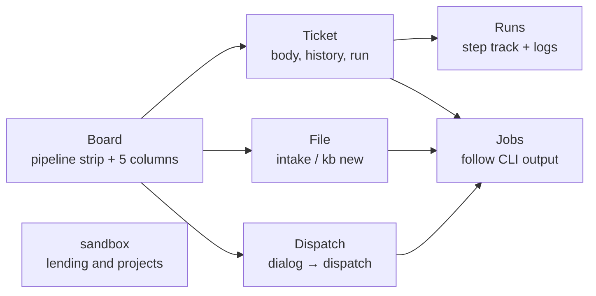

# Web console

What this page tells you: how to see where the factory is from a browser and do the same operations with buttons. Without memorising the CLI, the board, the logs of a running run, VM lending, filing and dispatch all fit on one screen.

## Start it

```bash
console/bin/console --open        # opens http://127.0.0.1:8765/ in the browser
console/bin/console --port 9000   # change the port
```

- Runs on the Python 3 standard library alone. No npm, no pip (use the same `python3` as the runner)
- By default it binds to 127.0.0.1 only, with no authentication. On an internal network address (10.x / 192.168.x / 100.64.x and other non-global addresses, such as the control-plane LXC) `--host <IP>` (or `CONSOLE_HOST`) is enough and no passphrase is needed; the tailnet and the firewall are the boundary. To require one anyway, set `CONSOLE_TOKEN` (one visit to `/?token=<passphrase>` sets a cookie). Binding to 0.0.0.0 or a global address requires the passphrase
- Stop it with ++ctrl+c++. Jobs it started (such as `kb run`) keep running, and reappear in the list the next time the console starts

To keep it running, register it with launchd. It starts at login and restarts if it dies.

```bash
console/bin/install.sh --launchd   # register; also creates ~/.local/bin/aifactory-console
console/bin/install.sh --remove    # unregister
launchctl kickstart -k gui/$(id -u)/com.aifactory.console   # restart after changing the code
```

launchd's PATH is minimal, so the installer writes the absolute path of the current shell's `python3` and the locations of `claude` / `gh` / `jq` / `sandbox` into the plist. The log is `~/Library/Logs/aifactory-console.log`.

## Screens



| Screen | What you see | What you can press |
|---|---|---|
| Board | The pipeline strip (todo → in progress → review → done, with "waiting for a human" to the side) and five columns of cards in the same order. Running runs appear under "in progress" with the current step and elapsed time. The strip, the columns and the runs all follow the project filter, and the scope is stated above the strip | File a ticket (goes to File), dispatch (a dialog to pick project, count and dry run; it shows the ticket that will be picked before you confirm, and cannot be pressed when there is no todo) |
| Ticket | Body (Markdown), state history, related runs and jobs | `kb run` (a dialog shows project, workflow and expected duration first; dry run / `--keep` / `--resume`), move the state (start / review / done / back to todo / waiting for a human; no confirmation, the toast offers *Undo*), fix the kind, PR number and note, sync the state from the run record (before it runs you see the target run and the state and note before and after; a warning if the ticket was updated after that run) |
| Runs | The list of `workspace/runs/` and, per run, the step track (pass / fail and duration per step, loops ↺, terminal end / human). File list and logs | — |
| sandbox | Lent VMs (task, VM name, IP, project, time since lending, app URL) and the project list (whether project.yml and the token file exist, pool usage) | `sandbox ls` (ssh to Proxmox, a few seconds), `sandbox release` (if a run is active on that VM you must type the ticket number first) |
| File | — | Free text → `intake`, a well-formed body → `kb new`. Dispatch lives on the board |
| Jobs | The CLI processes this console started. Output is followed every 2 seconds. A finished job shows *What to do next* (open the created ticket, sync the state of a stopped run, and so on) plus one line with the job's end time and the ticket's current state. When the ticket has moved on since the job (done, or edited later), the wording is past tense and the primary button becomes *Open the ticket* | Stop (SIGTERM to the process group) |
| Logs | `workspace/logs/intake.log` / `workspace/logs/dispatch.log` | — |
| Settings | Workflow steps, the model routes (`routes.env`), `git status` | — |

## Following a running run

While a run is in progress its screen refreshes every 5 seconds and automatically opens **the log of the step that is running** (the `agent-*.log` / `code-*.log` named by `current` in `state.json`). For agent steps the runner turns the `claude -p` event stream into a readable log:

```
[+00:06] ▶ Read: /home/dev/app/hello.txt
  ↳
    1	hello, factory
[+00:14] ▶ Write: /home/dev/work/990/research.md
  ↳
    File created successfully at: …
[+00:18] result: success turns=5 duration=15s cost=$0.04
```

`▶` is a tool call, `↳` the first three lines of its result, and the timestamp is elapsed time since the step started. Once you pick a different file, that run stops switching automatically.

## Rules

- **State is only changed through the existing CLIs** (`kb` / `intake` / `dispatch` / `sandbox`). The console opens `kanban.db` read-only and never writes `state.json`. It follows the rules in [Working with multiple sessions](multi-session.md)
- **Long operations are jobs.** `kb run` can take more than an hour, so the console detaches it as a child process and streams its output to `console/jobs/<id>/log` (not tracked by git)
- **Duplicates are rejected.** A second `kb run` for the same ticket, a second `dispatch`, or a `release` for a task with a running job is refused inside a lock
- **Readable files are limited** to the workspace (`runs/`, `kanban/tickets/`, `logs/`, `projects/`), `examples/projects/`, `workflow/kit/` and `console/jobs/`. Token contents are never shown
- **Confirmation scales with risk.** Moving a ticket's state applies immediately and the toast offers *Undo*. Real runs and dispatch open a dialog that shows what will happen (the ticket to be picked, the project, the expected duration). Syncing the state overwrites the ticket, so the state and note before and after are shown first. Releasing a VM and stopping a job use a danger-styled dialog, and when a run is active on that VM you must type the ticket number
- Navigation is ordered by how often each screen is used (board / file / runs / jobs / sandbox / logs / settings). Press ++g++ then a letter (++b++ board, ++i++ file, ++r++ runs, ++j++ jobs, ++s++ sandbox, ++l++ logs, ++c++ settings) to jump; ++question++ lists the shortcuts
- The rules for UI text (buttons are verbs, sentences are polite, one glossary) live in `console/UX.md` in the repository. The decision record is ADR-0019

## API

The JSON API the screens use can be called with `curl`. POST requires the `X-Console: 1` header (other sites in the browser cannot add it, which prevents accidental operations).

```bash
curl -s localhost:8765/api/overview
curl -s localhost:8765/api/tickets/204
curl -s -H 'Content-Type: application/json' -H 'X-Console: 1' -X POST localhost:8765/api/tickets/204/run -d '{"dry_run": true}'
```

| Method and path | What it does |
|---|---|
| `GET /api/overview` | Counts per state, running runs and jobs, number of lent VMs |
| `GET /api/tickets[?pj=]` / `GET /api/tickets/<id>` | List / body, history, runs, jobs |
| `GET /api/next[?pj=]` | The todo `kb next` would pick for dispatch, or `null` |
| `GET /api/tickets/<id>/sync-preview[?run=]` | A preview of the state sync (`kb sync --dry-run`): state and note before and after, and whether the ticket was updated after that run |
| `POST /api/tickets` | `kb new` |
| `POST /api/tickets/<id>/action` | `{action: start / review / done / reopen / block / set / sync, note, kind, pr}` |
| `POST /api/tickets/<id>/run` | `kb run` as a job. `{dry_run, workflow, keep, resume}` |
| `GET /api/runs` / `GET /api/runs/<name>` | Run records |
| `GET /api/file?path=&tail=` | A file under one of the allowed roots |
| `GET /api/sandbox` / `POST /api/sandbox/ls` / `POST /api/sandbox/release` | Lending, refresh the list, release `{task}` |
| `POST /api/intake` / `POST /api/dispatch` | `{text, pj, kind, dry_run}` / `{pj, once, max, dry_run}` |
| `GET /api/jobs` / `GET /api/jobs/<id>?offset=` / `POST /api/jobs/<id>/stop` | Job list, follow output, stop |
| `GET /api/logs` / `GET /api/config` | intake / dispatch logs / workflows, routes and git |

## Using it from an AI session (MCP)

`.mcp.json` carries two servers: **`aifactory-local`** (the workspace on this machine) and **`aifactory-ctl`** (the control plane on Proxmox). With the control plane in an LXC on Proxmox ([Tenants](tenants.md)), use `aifactory-ctl`, or register it at user scope so it works from any directory (`claude mcp add --scope user aifactory -- <repo>/console/bin/mcp-remote`). Codex CLI: `codex mcp add aifactory -- <repo>/console/bin/mcp-remote`. Any client that speaks stdio MCP can use the same entry point. `console/bin/mcp-remote` starts the MCP server inside the LXC over ssh, so the AI session reads and writes the LXC's workspace and lending state directly. The target comes from `~/.config/aifactory/mcp-remote.env`: `AIFACTORY_CTL` (default `aifactory@ctl.main.sb.internal`; another tenant is `aifactory@ctl.<tenant>.sb.internal`) and, while the tailnet route is not yet approved, `AIFACTORY_CTL_JUMP=<ssh alias of the Proxmox host>`. Run `claude mcp reset-project-choices` once to approve the new server.

`console/bin/mcp` exposes the same reads and writes as MCP tools. It is registered in `.mcp.json` at the repository root, so opening Claude Code in this repository asks for approval once and then offers the tools as `mcp__aifactory__*`.

```bash
claude mcp list                    # aifactory appears (project scope)
claude mcp reset-project-choices   # approve again
```

| Tool | What it does |
|---|---|
| `overview` / `ticket_list` / `ticket_show` | Overview, list, one ticket (body, history, runs, jobs) |
| `ticket_new` / `intake` | File a ticket (well-formed body / free text; intake is a job) |
| `ticket_action` | start / review / done / reopen / block / set / sync |
| `ticket_run` / `dispatch` | kb run (lends a VM and goes to a PR; `dry_run` available) / run todos in order. Both are jobs |
| `run_list` / `run_show` / `read_file` | Run records and files under the allowed roots (`agent-*.log` and so on) |
| `sandbox_status` / `sandbox_ls` / `sandbox_release` | Lending state / live list (job) / release (job) |
| `job_list` / `job_show` / `job_wait` / `job_stop` | Job list, output, wait (up to 570 s), stop |
| `logs` / `config` | intake / dispatch logs / workflows, routes, projects, git |

Resources: `aifactory://board` (the board), `aifactory://ledger` (the ledger) and `aifactory://ticket/<id>` (a ticket body).

The console and the MCP server are separate processes, but the reads and writes live once in `console/lib/core.py` and the job records are shared. A run an AI starts over MCP shows up in the browser's job list, and the other way round. The decision record is ADR-0015.

## Tests

```bash
python3 -m unittest discover -s console/tests -v     # API and job management
python3 -m unittest discover -s workflow/tests -v    # the runner's streamed logs
```

The tests copy the ledger into a temporary directory (`KB_ROOT` / `CONSOLE_JOBS`), so they never touch the real database or job records. CI (`.github/workflows/ci.yml`) runs the same tests.

The decision record is ADR-0013 ([Decisions](../decisions/index.md)).
