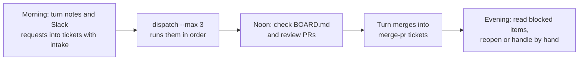

# Guides

Everyday operations, ordered by what you want to do. Every command option is in the [Reference](../reference/index.md).

| I want to… | Page |
|---|---|
| Run tickets in a macOS VM on a Mac; set up, monitor, and recover the worker | [Mac worker setup and operations](macos-worker.md) |
| Turn a request into a ticket (from free text / from a well-formed body) | [Create tickets](tickets.md) |
| Run tickets (one at a time / in bulk / dry run) | [Run work](running.md) |
| Read PRs, logs, artifacts and state | [Read the results](results.md) |
| Watch and operate from a browser | [Web console](console.md) |
| Bring a new repository into the factory | [Add a project](add-project.md) |
| Choose between hotfix / bug / feature / chore / research / merge-pr | [Choose a workflow](workflows.md) |
| Refresh tokens, manage the pool, update templates, handle failures | [Day-to-day operations](operations.md) |
| Work alongside other AI sessions or people | [Working with multiple sessions](multi-session.md) |
| Lend the factory to another organization: separate network, VMs, permissions and secrets, console and docs on Proxmox itself | [Tenants (per-organization environments)](tenants.md) |

## A typical day

- Filing a ticket takes seconds; running one takes 5 to 60 minutes. You can do other things while it runs
- State is always visible in `workspace/kanban/BOARD.md`, and `kb list` shows the same. In a browser, use the [Web console](console.md)
- Humans only touch PR reviews and items that became `blocked` (waiting for a human)
