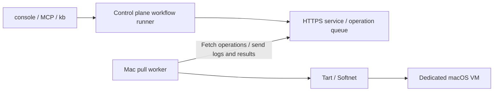

# Mac worker setup and operations

2026-09-07: verified on hardware through a documentation task, PR creation, and VM cleanup.

aifactory can run tickets in a macOS VM on an Apple Silicon Mac. The control plane stays on Proxmox; a Go worker on the Mac fetches operations over HTTPS. Users submit work through the usual MCP `ticket_run` or `kb run` interface.

This is the current operations guide. The [study](https://github.com/akkijp-oss/aifactory/blob/main/docs/macos-worker-study.md) records the earlier investigation. [ADR-0018](https://github.com/akkijp-oss/aifactory/blob/main/docs/adr/0018-macos-pull-worker.md) covers the transport, and [ADR-0020](https://github.com/akkijp-oss/aifactory/blob/main/docs/adr/0020-macos-workflow-backend.md) covers workflow integration.

## Architecture and execution



1. The runner checks worker readiness and acquires a lease for the run.
2. The Mac clones a stopped base VM and starts a dedicated guest.
3. It runs the project's `provision.sh` inside the guest, injects credentials, and clones the repository.
4. Planning, implementation, gates, and review run in the same guest. The `docs` workflow can return to implementation for corrections before creating a PR.
5. Artifacts return to the control plane for checksum verification. The guest is stopped and deleted, and the lease is released. The PR awaits human review.

The control plane owns the ticket ledger and run records. It does not initiate SSH connections to the Mac for execution. The Mac uses `tart exec` for guest operations. Administrator SSH access for host setup and recovery is a separate route.

## Initial setup

### 1. Prepare the control plane

Follow the [worker control plane instructions](https://github.com/akkijp-oss/aifactory/blob/main/workers/README.md#制御系) to configure the HTTPS service, SQLite database, TLS certificate, and per-worker token. Allow the Mac to reach the endpoint, normally TCP 8766. Worker authentication is separate from console authentication; keep TLS verification enabled.

The service and runner must use the same operation database. The runner reads `AIFACTORY_WORKER_DB`, defaulting to `$AIFACTORY_WORKSPACE/workers/queue.sqlite3`. Enroll workers through the control plane's local administrator CLI and distribute tokens and any required CA certificate through a trusted management channel.

### 2. Prepare the Mac host and base VM

- Install Tart and Softnet on an Apple Silicon Mac. The worker binary itself does not need Go or Python installed on the host.
- Prepare a stopped macOS base VM with Tart Guest Agent and Python 3. Host installations of Xcode and agent CLIs are not inherited by the guest.
- Keep personal accounts, signing keys, and execution tokens out of the base image. Use an unused name for the dedicated guest.
- Record the image source, version, digest, and guest OS. A `latest` tag alone is not reproducible. Store machine-specific records in the untracked `$AIFACTORY_WORKSPACE/docs/` directory.

Configuration examples and worker build instructions are in [workers/README.md](https://github.com/akkijp-oss/aifactory/blob/main/workers/README.md). `base_vm` names the local base VM; `guest_vm` names the dedicated task guest. Current capacity is one concurrent run per worker, with a fixed guest allocation of 4 CPUs and 8 GiB.

An administrator must set root ownership and SUID on Softnet. For a Homebrew installation, inspect and configure the target:

```bash
softnet_binary="$(/opt/homebrew/bin/brew --prefix softnet)/bin/softnet"
sudo chown root:wheel "$softnet_binary"
sudo chmod u+s "$softnet_binary"
stat -f '%Su %Sg %Sp %N' "$softnet_binary"
```

Check for owner `root`, group `wheel`, and `s` in the owner's execute position. The initial readiness check supports this SUID setup. Check again after updating Softnet.

### 3. Run the worker as a service

In the [LaunchAgent template](https://github.com/akkijp-oss/aifactory/blob/main/workers/templates/com.aifactory.worker.plist), replace `@BINARY@`, `@CONFIG@`, and `@LOGDIR@` with absolute paths. Create the log directory, escape XML special characters, and save the plist as `~/Library/LaunchAgents/com.aifactory.worker.plist`.

```bash
launchctl bootstrap "gui/$(id -u)" "$HOME/Library/LaunchAgents/com.aifactory.worker.plist"
launchctl print "gui/$(id -u)/com.aifactory.worker"
```

An absolute path to Tart does not supply the PATH Tart needs to find Softnet. The template includes `/opt/homebrew/bin`. To reload a changed plist, first confirm that no operation is running, then use `launchctl bootout "gui/$(id -u)/com.aifactory.worker"` followed by bootstrap. Keep backup plists outside LaunchAgents.

A LaunchAgent does not guarantee operation before login. Account for host sleep, login after reboot, and available memory and disk space.

### 4. Register a project

Minimal `$AIFACTORY_WORKSPACE/projects/<pj>/project.yml` on the control plane:

```yaml
name: example-mac
repo: example-org/example-app
base_branch: main
backend: macos-pull
worker: mac-worker-01
app_dir: /Users/admin/app
gates: gates.sh
```

Match `worker` to an enrolled ID and `app_dir` to the guest account. Add project-specific `gates.sh` and, if needed, `provision.sh` in the same directory. Gates must run checks appropriate to the product and change, returning nonzero on failure.

The guest needs runner tools including `gh`, the Claude CLI, and GNU `timeout`. Provisioning runs before credential injection and prepares tools; the runner clones the repository. Make provisioning repeatable, including avoiding unnecessary downloads of tools already installed. Do not reuse Linux paths or package commands unchanged.

Configure the sandbox project's GitHub App settings and Claude OAuth token on the control plane. Verify the App installation covers the target repository and grants the permissions required to create PRs. Keep credential values out of project definitions, tickets, and logs.

## Submit and monitor work

Run these commands from the repository root on the control plane, with `AIFACTORY_WORKSPACE` set to its operational directory:

```bash
python3 workers/bin/control --db "$AIFACTORY_WORKSPACE/workers/queue.sqlite3" list
kanban/bin/kb new example-mac docs 'Update the README to match the implementation' --body /path/to/ticket.md
kanban/bin/kb run <issued-ID> --dry-run
kanban/bin/kb run <issued-ID>
```

Through MCP, call `ticket_run` for the ticket and monitor the returned job ID with `job_wait` / `job_show`. Use `run_show` to locate the actual run and logs, then `read_file` to inspect them. Do not start duplicate runs while a long operation is in progress. A dry run checks prompts and configuration; it does not validate VM execution.

Check `online`, `lifecycle` / `base_ready` / `network_ready` under `info`, and the lease. A directly started run can wait up to six hours for an online worker's base VM or Softnet setup, configurable with `AIFACTORY_MAC_PREPARE_WAIT_S`. No VM or lease is allocated while waiting. Dispatch skips unready, offline, or leased workers.

## Artifacts and completion

Records are under `$AIFACTORY_WORKSPACE/runs/<run>/`:

| Record | What to inspect |
|---|---|
| `state.json` | Step history, PR URL, backend, worker, lease, `artifacts_received`, and `released` |
| `agent-*.log` / `code-*.log` | Execution, gate and review verdicts, evidence such as guest OS |
| `worker-operations.log` | Operation IDs to inspect with the administrator CLI's `show` command |
| `work/` | Plan, report, review, gate results, PR URL, and other workflow files |
| `artifacts.json` | SHA-256 hashes of collected files |

After PR creation, `result: human` means human review is pending. It alone does not indicate failure; inspect the history and PR. Normal cleanup removes the guest from Tart's list and clears the control plane lease. `--keep` retains both after artifact collection.

Collection accepts regular files directly under the guest working directory, up to 4 MiB total. Each transferred input is limited to 350,000 bytes. Directories and symlinks are not collected; credential file `runtime.env` is excluded. Large build artifacts and `.xcresult` bundles do not fit this transfer mechanism.

## Recovery

| Symptom | Check or action |
|---|---|
| `network_ready` is false | Check LaunchAgent PATH and Softnet root ownership / SUID |
| `base_ready` is false | Verify the configured local base VM exists and image download completed |
| CLI installation takes a long time | Inspect provisioning logs for progress or repeated downloads. An existing download is not sufficient grounds to install an unverified binary |
| GitHub token minting fails | Check project settings and App installation permissions. The runner uses the sandbox CLI in its own repository. Never log the token |
| Resuming after the date changed | Use `kb run <id> --resume`; it uses the run recorded on the ticket |
| An operation is `uncertain` | Have an administrator verify guest shutdown and operation state. Do not delete the journal and rerun |
| Artifact collection or guest deletion fails | Keep the lease and establish artifact and guest state before recovery |

`--resume` requires ownership of the run's lease. A provisioning failure can be retried in the same running guest if credentials, repository, and step history have not been created. A partially created repository or stopped guest is not automatically recreated.

`control cancel` requests a stop; it does not confirm it. Use `resolve <operation-id> --confirmed-stopped` only after an administrator verifies shutdown. Resolving an operation is separate from releasing the run's lease: `control release-lease` requires a successful `guest-release` operation. See the [worker recovery reference](https://github.com/akkijp-oss/aifactory/blob/main/workers/README.md#操作と復旧) for arguments and disconnection behavior.

## Hardware verification and limitations

A documentation task was run on 2026-09-07 using an M1 Mac mini with 16 GB RAM, host macOS 26.5.2, Tart 2.32.1, Softnet 0.19.0, and guest macOS 26.6.2 (25G83). This is an observed configuration, not a minimum requirement or a guarantee for every version.

- MCP execution, VM cloning and startup, provisioning, credential injection, cloning, planning, writing, gates, review, return to implementation, and PR creation completed.
- Review identified three incorrect claims. Corrections passed the second review. Checksums matched for ten artifacts; guest deletion and lease release were verified.
- Public HTTPS connectivity and blocked SSH probes to four gateway/private IPv4 destinations were checked. This was not an exhaustive test of all protocols or destinations.
- The task only changed documentation. Product builds and tests, application installation, GUI interaction, signing, Keychain operations, and PR merge were not performed.

The guest does not share host directories, clipboard, or audio. Softnet blocks private IPv4, link-local, and tailnet destinations. The worker configures public DNS on the guest's `Ethernet` service and disables IPv6. That service name and working guest sudo access are prerequisites.

Supported code steps are currently `gates.sh` and `pr-create.sh`. `merge-pr`, switching OS between steps, GUI streaming, and automatic resource adjustment are unsupported. Logs are limited to 16 MiB per operation; total record storage has no automatic capacity management. Measure initial image download and CLI installation separately from workflow processing time.
