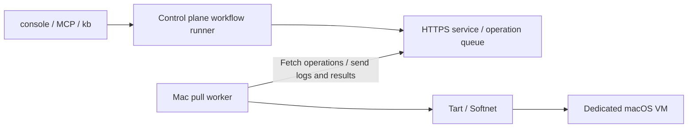

# Mac worker setup and operations

For initial setup, see [Install with one command](worker-install.md).

2026-09-07: verified on hardware through a documentation task, PR creation, and VM cleanup.

aifactory can run tickets in a macOS VM on an Apple Silicon Mac. The control plane stays on Proxmox; a Go worker on the Mac fetches operations over HTTPS. Users submit work through the usual MCP `ticket_run` or `kb run` interface.

This is the current operations guide. The [study](https://github.com/akkijp-oss/aifactory/blob/main/docs/macos-worker-study.md) records the earlier investigation. [ADR-0018](https://github.com/akkijp-oss/aifactory/blob/main/docs/adr/0018-macos-pull-worker.md) covers the transport, and [ADR-0020](https://github.com/akkijp-oss/aifactory/blob/main/docs/adr/0020-macos-workflow-backend.md) covers workflow integration.

## Architecture and execution



1. The runner checks worker readiness and acquires a lease for the run.
2. The Mac clones a stopped base VM and starts a dedicated guest.
3. It runs the project's `provision.sh` inside the guest, injects credentials, and clones the repository.
4. Planning, implementation, gates, and review run in the same guest. The `docs` workflow can return to implementation for corrections before creating a PR.
5. Artifacts return to the control plane for checksum verification. The guest is stopped and deleted, and the lease is released. The PR awaits human review.

The control plane owns the ticket ledger and run records. It does not initiate SSH connections to the Mac for execution. The Mac uses `tart exec` for guest operations. Administrator SSH access for host setup and recovery is a separate route.

## Initial setup

### 1. Prepare the control plane

Follow the [worker control plane instructions](https://github.com/akkijp-oss/aifactory/blob/main/workers/README.md#制御系) to configure the HTTPS service, SQLite database, TLS certificate, and per-worker token. Allow the Mac to reach the endpoint, normally TCP 8766. Worker authentication is separate from console authentication; keep TLS verification enabled.

The service and runner must use the same operation database. The runner reads `AIFACTORY_WORKER_DB`, defaulting to `$AIFACTORY_WORKSPACE/workers/queue.sqlite3`. Enroll workers through the control plane's local administrator CLI and distribute tokens and any required CA certificate through a trusted management channel.

### 2. Prepare the Mac host and base VM

- Install Tart and Softnet on an Apple Silicon Mac. The worker binary itself does not need Go or Python installed on the host.
- Prepare a stopped macOS base VM with Tart Guest Agent and Python 3. Host installations of Xcode and agent CLIs are not inherited by the guest.
- Keep personal accounts, signing keys, and execution tokens out of the base image. Use an unused name for the dedicated guest.
- Record the image source, version, digest, and guest OS. A `latest` tag alone is not reproducible. Store machine-specific records in the untracked `$AIFACTORY_WORKSPACE/docs/` directory.

Configuration examples and worker build instructions are in [workers/README.md](https://github.com/akkijp-oss/aifactory/blob/main/workers/README.md). `base_vm` names the local base VM; `guest_vm` names the dedicated task guest. Current capacity is one concurrent run per worker, with a fixed guest allocation of 4 CPUs and 8 GiB.

An administrator must set root ownership and SUID on Softnet. For a Homebrew installation, inspect and configure the target:

```bash
softnet_binary="$(/opt/homebrew/bin/brew --prefix softnet)/bin/softnet"
sudo chown root:wheel "$softnet_binary"
sudo chmod u+s "$softnet_binary"
stat -f '%Su %Sg %Sp %N' "$softnet_binary"
```

Check for owner `root`, group `wheel`, and `s` in the owner's execute position. The initial readiness check supports this SUID setup. Check again after updating Softnet.

### 3. Run the worker as a service

In the [LaunchAgent template](https://github.com/akkijp-oss/aifactory/blob/main/workers/templates/com.aifactory.worker.plist), replace `@BINARY@`, `@CONFIG@`, and `@LOGDIR@` with absolute paths. Create the log directory, escape XML special characters, and save the plist as `~/Library/LaunchAgents/com.aifactory.worker.plist`.

```bash
launchctl bootstrap "gui/$(id -u)" "$HOME/Library/LaunchAgents/com.aifactory.worker.plist"
launchctl print "gui/$(id -u)/com.aifactory.worker"
```

An absolute path to Tart does not supply the PATH Tart needs to find Softnet. The template includes `/opt/homebrew/bin`. To reload a changed plist, first confirm that no operation is running, then use `launchctl bootout "gui/$(id -u)/com.aifactory.worker"` followed by bootstrap. Keep backup plists outside LaunchAgents.

A LaunchAgent does not guarantee operation before login. Account for host sleep, login after reboot, and available memory and disk space.

### 4. Register a project

Minimal `$AIFACTORY_WORKSPACE/projects/<pj>/project.yml` on the control plane:

```yaml
name: example-mac
repo: example-org/example-app
base_branch: main
backend: macos-pull
worker: mac-worker-01
app_dir: /Users/admin/app
gates: gates.sh
```

Match `worker` to an enrolled ID and `app_dir` to the guest account. Add project-specific `gates.sh` and, if needed, `provision.sh` in the same directory. Gates must run checks appropriate to the product and change, returning nonzero on failure.

The guest needs runner tools including `gh`, the Claude CLI, and GNU `timeout`. Provisioning runs before credential injection and prepares tools; the runner clones the repository. Make provisioning repeatable, including avoiding unnecessary downloads of tools already installed. Do not reuse Linux paths or package commands unchanged. Read "[What the base image already contains](#what-the-base-image-already-contains)" first to see what is already installed, and start from the template [workers/templates/provision.macos.sh](https://github.com/akkijp-oss/aifactory/blob/main/workers/templates/provision.macos.sh).

Configure the sandbox project's GitHub App settings and Claude OAuth token on the control plane. Verify the App installation covers the target repository and grants the permissions required to create PRs. Keep credential values out of project definitions, tickets, and logs.

Where keys come from: **the control-plane key pool (`~/.config/sandbox/keys.json`) is the source of truth for Claude keys**. The runner calls `sandbox keys pick` once per step and writes the per-family keys it chose into the guest's `runtime.env` (ADR-0044 / ADR-0046). Disabling a key moves the next step to another one. Only an empty pool falls back to `pj/<pj>.env` and `env` for compatibility; if neither holds a key the run **never falls back to whatever is left in the runner's process** and pauses with `鍵なし` until a key is registered. Jobs started from the console and MCP take their keys from `~/.config/aifactory/ctl.env`, re-read for every job.

## What the base image already contains

Before writing `provision.sh`, find out what is **already installed** in the dedicated guest. Reinstalling something that is already there breaks the guest. On 2026-09-09 a project's `provision.sh` ran `brew install gh coreutils node@24 pnpm` unconditionally; the existing `pnpm` collided with the `/opt/homebrew/bin/pn` link Homebrew tried to create, and provisioning exited non-zero.

### Three layers

Whether something may be reinstalled depends on which layer installed it.

| Layer | Who, and when | What it adds |
|---|---|---|
| 1. Upstream base image | The Tart images published by Cirrus Labs | Homebrew, Xcode Command Line Tools, gh, node@24, pnpm/yarn via `npm -g`, mise, rbenv, the Tart Guest Agent, and more. The Xcode line also has Xcode and Claude Code as a cask |
| 2. Dedicated base VM | An administrator, once, via [one-command install](worker-install.md) | `brew install python gh coreutils`, `claude` (if missing, from the official script), the desktop helper, and guest DNS/IPv6 settings (`workers/bootstrap/install.py`) |
| 3. Dedicated guest | The runner, once per run, through the project's `provision.sh` | Only what that project needs |

There are two image lines. Check on hardware which one is in use.

| Line | Image | Notes |
|---|---|---|
| Plain macOS | `ghcr.io/cirruslabs/macos-sequoia-base` | The installer default; override with `MAC_IMAGE` |
| With Xcode | `ghcr.io/cirruslabs/macos-tahoe-xcode` | The above plus Xcode, the Android SDK, and casks. Uses much more disk |

The name `latest` alone does not reproduce anything. Record the digest and the guest OS on every pull (see "Collect versions and the digest" below).

### How commands run in the guest

What `command -v` finds follows from this.

- The worker runs guest operations as `tart exec <guest> /bin/bash -lc '<command>'` (`workers/cmd/aifactory-worker/main.go`). That is a **login shell**, so it reads `~/.profile`. The upstream image makes `~/.profile` a symlink to `~/.zprofile`, so the PATH entries written there (`node@24`, `PNPM_HOME`, `openjdk@17`) apply too. Creating `~/.bash_profile` or `~/.bash_login` stops that symlink from being read, so provisioning must not create them.
- On top of that, the runner prefixes every command with a fixed PATH (`workflow/lib/macos.py`).

    ```
    /opt/homebrew/opt/coreutils/libexec/gnubin:/opt/homebrew/bin:$HOME/.local/bin:$HOME/.cargo/bin:$PATH
    ```

- `provision.sh` runs as `bash provision.sh` with that PATH inherited. As a child of the login shell it also sees what `~/.zprofile` added.

### What is installed

The table below is derived from the upstream image definitions (`templates/base.pkr.hcl` and `templates/xcode.pkr.hcl` in `cirruslabs/macos-image-templates`, read 2026-09-10) and from this repository's code. **It records no version numbers: the values collected on hardware are authoritative.**

| Tool | How it arrives | Location | Visible on the runner's PATH | Safe to install in provisioning |
|---|---|---|---|---|
| brew | The Homebrew install script | `/opt/homebrew/bin/brew` | Yes | No |
| git | Xcode Command Line Tools (installed with Homebrew) | `/usr/bin/git` | Yes | No |
| python3 | The same, plus `brew install python` at layer 2 | `/usr/bin/python3`, `/opt/homebrew/bin/python3` | Yes | No |
| gh | The brew formula `gh` (layers 1 and 2) | `/opt/homebrew/bin/gh` | Yes | Only when guarded by `command -v`; effectively a no-op |
| node | The brew formula `node@24`, which is **keg-only** and not linked into `/opt/homebrew/bin` | `/opt/homebrew/opt/node@24/bin/node` | Yes, via the PATH from `~/.zprofile` | No |
| npm | Ships with `node@24`. The formula writes `prefix = /opt/homebrew` into `npmrc`, so anything from `npm install -g` lands in `/opt/homebrew/bin` | `/opt/homebrew/opt/node@24/bin/npm` | Yes, as above | No |
| pnpm / yarn | `npm install --global yarn pnpm` (layer 1) | `/opt/homebrew/bin/pnpm`, `/opt/homebrew/bin/yarn` | Yes | **Never through brew** (see below) |
| Xcode | Installed with `xcodes` and already selected with `xcode-select` (Xcode line only) | `/Applications/Xcode_<version>.app` | Yes, `xcodebuild` through `/usr/bin` | No |
| claude | The `claude-code` cask (Xcode line) or the official script at layer 2 | `/opt/homebrew/bin/claude` or `$HOME/.local/bin/claude` | Yes | Install only if missing |
| timeout (GNU) | The brew formula `coreutils`. **Not in the upstream image**; added at layer 2 | `/opt/homebrew/opt/coreutils/libexec/gnubin/timeout` | Yes | Install only if missing |

The upstream image also carries mise, rbenv, git-lfs, jq, yq, awscli, wget, unzip, zip, cmake, gcc, gitlab-runner, and the Tart Guest Agent. The Xcode line adds openjdk@17, xcodes, the Android SDK, codex, and amazon-q.

### What must not be reinstalled

One rule decides it.

> **Rerunning `brew install` on something brew installed is harmless** (it stops at "already installed"). Installing a brew formula over files that something **other than brew** put in the same place (`npm -g`, a cask binary, `curl | bash`) fails on a link collision and exits non-zero.

- **`pnpm` / `yarn`**: the upstream image installs them with `npm install --global`, and because npm's prefix is `/opt/homebrew` the executables sit in `/opt/homebrew/bin`. Homebrew's `pnpm` formula places `pn`, `pnpx`, and `pnx` alongside `pnpm` in that same directory, so `brew install pnpm` collides while linking. This is what broke on 2026-09-09. If a project needs pnpm, use the one that is there; pin the version through the repository's `packageManager` and `corepack`
- **`node` / `node@24`**: keg-only means there is no `/opt/homebrew/bin/node`, not that node is missing. Adding another node puts it first on PATH and silently changes the version. If `command -v node` looks empty, first check that the command runs in a login shell and that nothing created `~/.bash_profile`
- **`gh`**: present from both layer 1 and layer 2. `brew install gh` will not fail, but it wastes time on every run
- **`claude`**: on the Xcode line it may already be at `/opt/homebrew/bin/claude` from the cask. The official script installs to `$HOME/.local/bin/claude`, which the runner's PATH searches after `/opt/homebrew/bin`. Guard with `command -v` so two copies cannot drift apart

### How to guard existing tools

```bash
command -v gh      >/dev/null || brew install gh
command -v timeout >/dev/null || brew install coreutils
command -v claude  >/dev/null || curl -fsSL https://claude.ai/install.sh | bash
```

To make sure a keg-only tool is used, extend PATH instead of reinstalling it.

```bash
[ -d /opt/homebrew/opt/node@24/bin ] && export PATH="/opt/homebrew/opt/node@24/bin:$PATH"
```

The template is [workers/templates/provision.macos.sh](https://github.com/akkijp-oss/aifactory/blob/main/workers/templates/provision.macos.sh); it contains the network isolation probe and those three tools only. Add project-specific steps below the marked point.

### Collect versions and the digest

Versions and digests differ per environment, so no numbers are recorded here. Collect them on hardware and paste them, dated, into the untracked `$AIFACTORY_WORKSPACE/docs/STATUS.md`.

```bash
db="$AIFACTORY_WORKSPACE/workers/queue.sqlite3"
python3 workers/bin/control --db "$db" submit <worker> guest-exec --lease auto --wait 120 \
  --command 'sw_vers; brew --version; brew list --versions; which -a node npm pnpm yarn python3 gh git brew claude timeout; xcodebuild -version'
```

`guest-exec` only goes through while the dedicated guest is up and a lease exists (see "[Recovering from `uncertain`](#recovering-from-uncertain)"); use the lease of a run held open with `kb run <id> --keep`. On an image without Xcode only the trailing `xcodebuild -version` fails, and the earlier output is still collected.

Check the digest of the source image on the Mac that pulled it.

```bash
image=cirruslabs/macos-tahoe-xcode
token=$(curl -sS "https://ghcr.io/token?scope=repository:$image:pull" | python3 -c 'import sys,json; print(json.load(sys.stdin)["token"])')
curl -sS -o /dev/null -D - -H "Authorization: Bearer $token" \
  -H 'Accept: application/vnd.oci.image.index.v1+json' \
  "https://ghcr.io/v2/$image/manifests/latest" | grep -i docker-content-digest
```

**When the base image is updated, update this section and the collected output in `$AIFACTORY_WORKSPACE/docs/STATUS.md` on the same day.**

## Submit and monitor work

Run these commands from the repository root on the control plane, with `AIFACTORY_WORKSPACE` set to its operational directory:

```bash
python3 workers/bin/control --db "$AIFACTORY_WORKSPACE/workers/queue.sqlite3" list
kanban/bin/kb new example-mac docs 'Update the README to match the implementation' --body /path/to/ticket.md
kanban/bin/kb run <issued-ID> --dry-run
kanban/bin/kb run <issued-ID>
```

Through MCP, call `ticket_run` for the ticket and monitor the returned job ID with `job_wait` / `job_show`. Use `run_show` to locate the actual run and logs, then `read_file` to inspect them. Do not start duplicate runs while a long operation is in progress. A dry run checks prompts and configuration; it does not validate VM execution.

Check `online`, `lifecycle` / `base_ready` / `network_ready` under `info`, and the lease. A directly started run can wait up to six hours for an online worker's base VM or Softnet setup, configurable with `AIFACTORY_MAC_PREPARE_WAIT_S`. No VM or lease is allocated while waiting. Dispatch skips unready, offline, or leased workers.

A worker is a single machine shared across projects (several projects may name the same worker id in `project.yml`). While another run holds the lease, `kb run <ID> --wait <minutes>` waits up to that many minutes for the lease to be released before starting. While waiting, `current` in `state.json` is `wait-vm` and the console shows "waiting for a free VM"; no VM or lease is allocated. A run that reaches the limit, and a run started without `--wait`, leave the ticket in `todo` instead of `blocked` and record which run has held the worker since when, in `wait_reason` in `state.json` and in the ticket note. Dispatch picks the ticket up once the worker is free, so no manual resubmission is needed. Offline workers and workers without lifecycle support are returned to a human immediately rather than waited on (ADR-0049).

## Artifacts and completion

Records are under `$AIFACTORY_WORKSPACE/runs/<run>/`:

| Record | What to inspect |
|---|---|
| `state.json` | Step history, PR URL, backend, worker, lease, `artifacts_received`, `released`, and `wip_branch` |
| `agent-*.log` / `code-*.log` | Execution, gate and review verdicts, evidence such as guest OS |
| `worker-operations.log` | Operation IDs to inspect with the administrator CLI's `show` command |
| `work/` | Plan, report, review, gate results, PR URL, and other workflow files |
| `artifacts.json` | SHA-256 hashes of collected files |

After PR creation, `result: human` means human review is pending. It alone does not indicate failure; inspect the history and PR. Normal cleanup removes the guest from Tart's list and clears the control plane lease. `--keep` retains both after artifact collection.

A run that reaches `human` before a PR exists (gate retries exhausted, a failed step) force-pushes the work branch HEAD to `sandbox/<ticket>-<workflow>-wip` before artifact collection and records that branch name in `wip_branch` in `state.json`, so a person can pick the work up from there. If the push fails, `wip_branch` stays empty and the diff is left in the run directory as `wip.patch`, which `git am` applies. Artifact collection and guest deletion continue whether or not the preservation succeeds.

Collection accepts regular files directly under the guest working directory, up to 4 MiB total. Each transferred input is limited to 350,000 bytes; credential file `runtime.env` is excluded. Directories, symlinks, and anything beyond the 4 MiB total are skipped rather than collected, and their names and reasons are recorded in `artifacts_skipped` in `state.json`. Skipped entries do not stop the run, and the VM is still released. Large build artifacts and `.xcresult` bundles do not fit this transfer mechanism.

## Recovery

| Symptom | Check or action |
|---|---|
| `network_ready` is false | Check LaunchAgent PATH and Softnet root ownership / SUID |
| `base_ready` is false | Verify the configured local base VM exists and image download completed |
| CLI installation takes a long time | Inspect provisioning logs for progress or repeated downloads. An existing download is not sufficient grounds to install an unverified binary |
| GitHub token minting fails | Check project settings and App installation permissions. The runner uses the sandbox CLI in its own repository. Never log the token |
| Resuming after the date changed | Use `kb run <id> --resume`; it uses the run recorded on the ticket |
| An operation is `uncertain` | Have an administrator verify guest shutdown and operation state. The procedure is under "[Recovering from `uncertain`](#recovering-from-uncertain)" |
| The log stops partway | The 16 MiB per-operation limit was reached. A truncation line is recorded and the result carries `truncated`. The operation itself ran to completion, so judge it by the exit code and the artifacts |
| Artifact collection or guest deletion fails | Keep the lease and establish artifact and guest state before recovery |

`--resume` requires ownership of the run's lease. A provisioning failure can be retried in the same running guest if credentials, repository, and step history have not been created. A partially created repository or stopped guest is not automatically recreated.

Which step it restarts from is decided from the step history (`history`) in `state.json`: from the first step of the workflow when the history is empty (provisioning failed before any step ran), and from the last step that ran when it is not. It never carries over `next: human` and releases the guest without running a single step. A run with nothing left to continue (the PR is already out, or `next: end`) stops before the guest is touched (ADR-0047).

`control cancel` requests a stop; it does not confirm it. The procedure for bringing back an operation that went `uncertain` is in the next section, "[Recovering from `uncertain`](#recovering-from-uncertain)". See the [worker recovery reference](https://github.com/akkijp-oss/aifactory/blob/main/workers/README.md#操作と復旧) for the full argument list and disconnection behavior.

## Recovering from `uncertain`

`uncertain` means the control plane tried to stop an operation and could not confirm that it stopped. It never clears the reservation on its own; it waits for a person to establish the real state. Reaching the 16 MiB log limit is not a cause of this. Run the commands below from the control plane repository root.

**1. Look at the state.**

```bash
db="$AIFACTORY_WORKSPACE/workers/queue.sqlite3"
python3 workers/bin/control --db "$db" list
python3 workers/bin/control --db "$db" show '<operation-id>'
```

For each worker, `list` prints `online`, `info` (`lifecycle`, `base_ready`, `network_ready`), the one unfinished `operation` if any (`queued`, `running`, or `uncertain`, with its ID), and the held `lease`. That is where the `uncertain` operation ID comes from; match it against `$AIFACTORY_WORKSPACE/runs/<run>/worker-operations.log` to find the run. `show` prints that operation's state, exit code, and logs.

**2. Check whether the guest is alive.** Diagnostics go through the same operation queue. `--lease auto` reads the lease the worker currently holds from the database and puts it in the payload.

```bash
python3 workers/bin/control --db "$db" submit <worker> guest-exec \
  --lease auto --command 'pgrep -fl claude; pgrep -fl bash; uptime' --wait 60
```

**Without the lease in the payload the operation is refused.** While a worker holds a lease, the control plane rejects any operation whose payload lease does not match it with HTTP 409 and `operation does not own worker lease` (`workers/lib/pull.py`). `--lease auto` adds nothing when no lease is held, and a lifecycle worker such as the Mac then reports `lifecycle worker requires a lease` instead. A `lease` in a payload file wins over `auto`, and an explicit `--lease <id>` overrides the payload. Payloads are stored in the database, so never put secrets in a diagnostic command.

On the Mac host, an administrator checks `tart list` over SSH. If the guest is not listed, it has already stopped.

**3. When `resolve` is allowed.** `resolve` only moves the operation from `uncertain` to `resolved`. It does not stop the guest and it does not release the run's lease (that is step 4). On an operation that is not `uncertain` it returns `operation is not uncertain`. Use it only when all of the following hold.

- An administrator confirmed the guest's real state on the Mac (absent from `tart list`, or stopped with `tart stop`)
- You did not stop at sending `cancel`. `cancel` requests a stop; it does not confirm one
- You did not delete the journal. Never delete it and then rerun the same unfinished operation: that is the record that keeps an already-started command from running twice

```bash
python3 workers/bin/control --db "$db" resolve '<operation-id>' --confirmed-stopped
```

`--confirmed-stopped` is required. Earlier results and logs are kept.

**4. Releasing the lease is a separate operation.** Marking an operation `resolved` leaves the run's reservation in place. To release it, submit a `guest-release` carrying that lease, let it **succeed**, and pass its operation ID. The control plane accepts nothing else: it requires a succeeded `guest-release` whose payload lease matches.

```bash
python3 workers/bin/control --db "$db" submit <worker> guest-release --lease <lease> --wait 300
python3 workers/bin/control --db "$db" release-lease <worker> <lease> --operation '<the successful guest-release operation ID>'
```

`guest-release` stops the guest, deletes it, and removes the worker-side lease record; if it cannot get that far it returns `uncertain`. If it keeps failing, clear the real state on the Mac first with `tart stop` / `tart delete`.

**5. Resume.** Once the lease is cleared, continue with `kb run <id> --resume`. Which step it resumes from, when resuming is refused, and the fact that `--resume` requires owning the lease are covered under "Recovery" and in [ADR-0047](https://github.com/akkijp-oss/aifactory/blob/main/docs/adr/0047-resume-start-step-from-history.md); this section does not repeat them.

## Hardware verification and limitations

A documentation task was run on 2026-09-07 using an M1 Mac mini with 16 GB RAM, host macOS 26.5.2, Tart 2.32.1, Softnet 0.19.0, and guest macOS 26.6.2 (25G83). This is an observed configuration, not a minimum requirement or a guarantee for every version.

- MCP execution, VM cloning and startup, provisioning, credential injection, cloning, planning, writing, gates, review, return to implementation, and PR creation completed.
- Review identified three incorrect claims. Corrections passed the second review. Checksums matched for ten artifacts; guest deletion and lease release were verified.
- Public HTTPS connectivity and blocked SSH probes to four gateway/private IPv4 destinations were checked. This was not an exhaustive test of all protocols or destinations.
- The task only changed documentation. Product builds and tests, application installation, GUI interaction, signing, Keychain operations, and PR merge were not performed.

The guest does not share host directories, clipboard, or audio. Softnet blocks private IPv4, link-local, and tailnet destinations. The worker configures public DNS on the guest's `Ethernet` service and disables IPv6. That service name and working guest sudo access are prerequisites.

Supported code steps are currently `gates.sh`, `pr-create.sh` and `sync-base` (merging the latest base right before the PR; built into the runner and using POSIX git only). `merge-pr`, switching OS between steps, GUI streaming, and automatic resource adjustment are unsupported. Logs are limited to 16 MiB per operation and anything beyond that is truncated (the operation still runs to completion and its exit code decides the result); image base64 is recorded as `[image N bytes]`. Total record storage has no automatic capacity management. Measure initial image download and CLI installation separately from workflow processing time.

See [Mac and Windows computer use](computer-use.md) to add desktop interaction.
