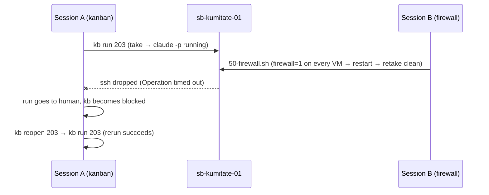

# Working with multiple sessions

What this page tells you: the rules for when a human and several AI sessions (Claude Code) touch the same repository and the same Proxmox at the same time, and a collision that actually happened.

## Assumption

This repository is written on the assumption that a human (the maintainer) and several AI sessions take turns, and sometimes work simultaneously. The entry point is "To the AI reading this repository" in the root README, which leads to the current position in this order.

1. Grasp the big picture (4 sections) from the README
2. Read the design and contract in the `README.md` of the section you are about to work on
3. Look at that section's `STATUS.md` for the progress table and the real-machine check commands, and confirm the recorded progress matches reality
4. If it matches, start from the next incomplete step. If not, fix `STATUS.md` to match reality first
5. If you change a decision, add one file to `docs/adr/` (never rewrite an existing ADR)

**Reality wins.** When documents and the real machine disagree, trust the machine and fix the documents.

## Rules for simultaneous work

A session building kanban and a session building the sandbox egress limits once ran at the same time and actually collided (2026-09-06). These rules came out of that.

| Rule | Why |
|---|---|
| Re-read `ls docs/adr/` for the highest number before adding an ADR | Trusting the number seen at the start of a conversation produced two ADRs numbered 0010 |
| Do not revert changes in `git status` that you did not make. Treat them as another session's work and commit only your own | Do not break the other session's working tree |
| Do not restart, roll back or rebuild lent VMs (those with a TASK in `sandbox ls`, or in `~/.config/sandbox/state.json`). Any job touching every VM must read the lending state right before and skip them | Firewall work restarted every VM and a running run died from a dropped ssh |
| Update ticket state through `kb`. When calling the runner directly, catch up with `kb sync <id> --run <dir>` | A PR merged through another path lost its provenance |
| Re-check GitHub / `state.json` before writing PR state or run results into the ledgers | Some records only become visible through the other session's commit |

## A collision and its recovery

Recovery is `kb reopen` → `kb run`. The runner moves the previous `runs/` directory to `-attemptN` on a same-day rerun, so the failure record survives.

## Splitting responsibilities

When running in parallel, splitting the areas you touch is the safe option.

| Area | Touches | Leaves alone |
|---|---|---|
| Running tickets | `workspace/kanban/`, `workspace/runs/`, `glue/` | Proxmox, templates, firewall |
| Growing the sandbox | `sandbox/proxmox/`, templates, firewall | Lent VMs |
| Growing definitions | `workflow/kit/`, `workspace/projects/<pj>/project.yml` | Running runs (changes apply from the next run) |

## Committing

- Select only your own changes with `git add`. Never `git add -A` (it picks up the other session's work)
- The other session may have committed your changes together with theirs. Check `git log --stat` and commit only what remains
- Run records (`workspace/runs/`) and the ledger (`workspace/kanban/kanban.db`) live in the workspace and are not tracked in the repository. Single-Mac assumption: never write the same DB from several machines
