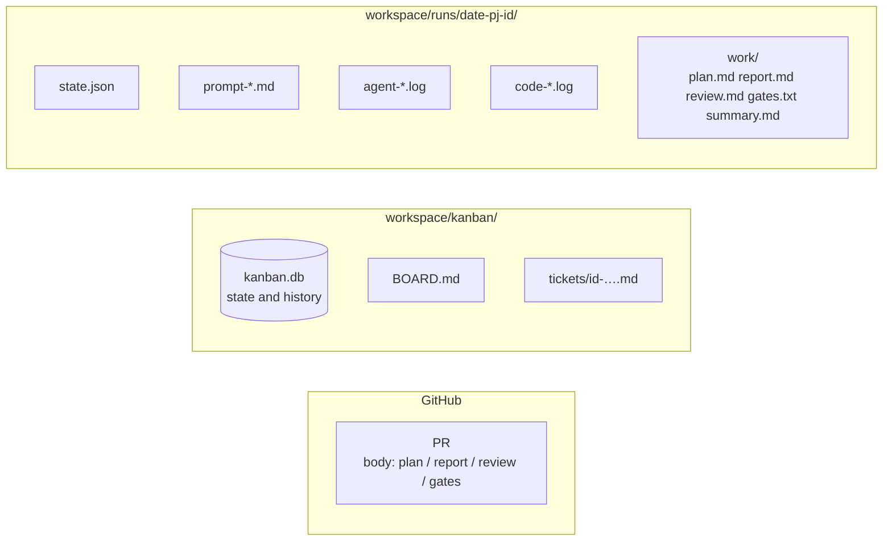
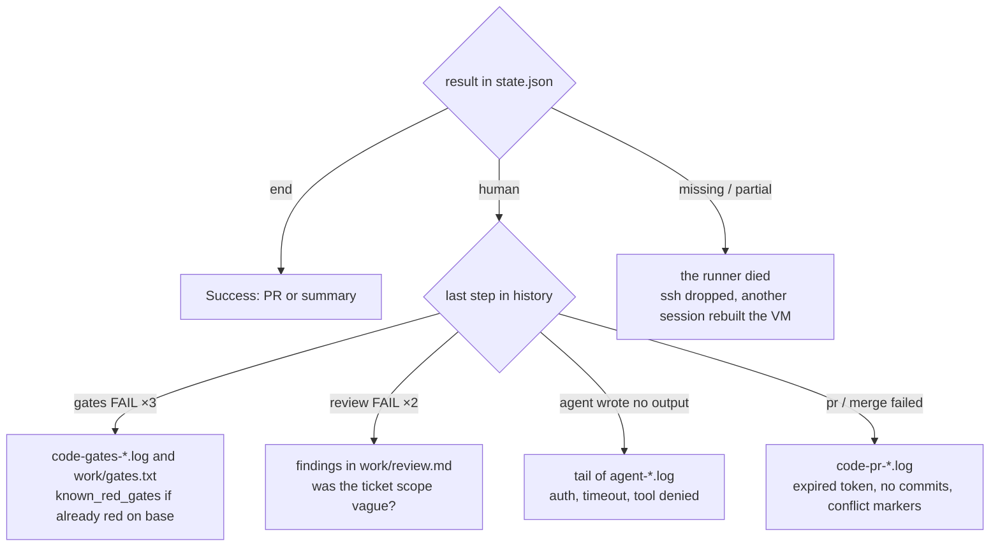

# Read the results

What this page tells you: what remains where after a run, how to read the PR, and how to narrow down a failure.

## Where everything lives



## Look here first

```bash
kanban/bin/kb show 204          # state, PR number, run directory, note
kanban/bin/kb history 204       # state transitions (when, what)
cat workspace/kanban/BOARD.md   # the whole board (workspace is $AIFACTORY_WORKSPACE)
```

If `status` is `review`, it is time to read the PR. If it is `blocked`, the note says why (handed to a human / runner crashed / no project.yml).

In a browser, the [Web console](console.md) takes you from the board to the run's step track (pass / fail and duration per step), its logs and its artifacts.

## Reading the PR

The PR body is assembled by `kit/steps/pr-create.sh`. From the top:

1. The boilerplate "Automated work by an aifactory sandbox agent. workflow: bug. A human decides whether to merge"
2. `plan.md` (the planner's plan: scope, verification, risks)
3. `report.md` (the implementer's report: what was done, test results, findings outside the scope)
4. `review.md` (the reviewer's verdict: PASS / FAIL with reasons, notes for humans)
5. `gates.txt` (gate results: `PASS typecheck` / `FAIL test (~/gates/test.log)`)

The reviewer looks at scope, correctness, safety, project-specific points and gates in that order and records the outcome in `review.md`, so start with the concerns raised there. The reviewer is required to put concerns outside the scope in a separate "notes for humans" section.

## Artifacts (work/)

| File | Written by | Contents |
|---|---|---|
| `plan.md` | planner | Reproduction, hypotheses, scope (per file), verification, risks. `STOP` at the top if dangerous |
| `research.md` | researcher | Conclusion (3 lines), findings per item with sources, unknowns, notes for the planner |
| `report.md` | implementer | What changed, tests run and results, findings outside the scope, judgement calls |
| `review.md` | reviewer | PASS / FAIL, reasons, what to fix, notes for humans |
| `gates.txt` | gates.sh | PASS / FAIL / INFO per gate and where the log is |
| `summary.md` | judge (research workflow) | The answer and what to do next |

## Narrowing down a failure



| Symptom | Read | Common cause |
|---|---|---|
| Gates red, went to `human` | `code-gates-<n>.log`, `~/gates/<name>.log` in the VM (in `work/` after collection) | Already red on base (add to `known_red_gates`), environment-dependent tests, missing dependencies |
| Review FAIL | `work/review.md` | Changes outside the scope, tests weakened to pass, migration not backward compatible |
| Agent wrote no artifact, step failed | Tail of `agent-<step>-<n>.log` | Expired token, `timeout_min` exceeded, output location in the prompt overlooked |
| `pr-create.sh` says "no commits" | `code-pr-<n>.log` | The implementer did not commit. `report.md` should say why |
| Merge failed | `code-merge-<n>.log` | GitHub App token expired (1 hour), leftover conflict markers, base not merged in |
| Ended early with ssh timeout | Terminal output | Another session restarted the VM. `kb reopen` → `kb run` |

## Reading the prompt

"Why did the agent do that?" is answered by `prompt-<step>-<n>.md`. It is assembled from 8 layers (shared rules → role constitution → step brief → project facts / forbidden / review points → ticket → input artifacts → previous result → output location), so missing facts or wrong prohibitions show up there. Where to fix them: [Configuration](../concepts/configuration.md).

## Keeping records

Run records (`workspace/runs/`) and the ledger (`workspace/kanban/`) live outside the repository, in the workspace, and never enter git. To keep them, back up the workspace as a whole or make the workspace a separate (private) repository. Agents work under the rule "do not print secrets in logs" and the `sandbox` CLI masks tokens, but before sharing a workspace check that no real values slipped into `agent-*.log`.
