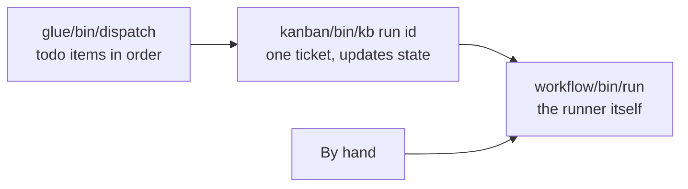

# Run work

What this page tells you: the three ways to run a ticket (`kb run` / `dispatch` / calling the runner directly), dry runs, what you can see while it runs, and how to stop and resume.

## Three entry points



| Entry point | When | State updates |
|---|---|---|
| `glue/bin/dispatch` | Run todo items unattended, in order. The everyday choice | Automatic via kb |
| `kanban/bin/kb run <id>` | Run a single ticket. Check definitions with a dry run | Automatic |
| `workflow/bin/run …` | Experiments that bypass kanban. Developing workflow definitions | None. Use `kb sync` afterwards |

## Running in bulk with dispatch

```bash
glue/bin/dispatch --once                 # the oldest todo, one ticket
glue/bin/dispatch --max 3                # up to 3
glue/bin/dispatch --pj kumitate          # restrict to a project
glue/bin/dispatch --dry-run              # assemble prompts only, no VM
glue/bin/dispatch --wait 60              # do not skip a full pool: wait up to 60 minutes for a free VM
```

dispatch makes no decisions. It checks only two things.

- The project has **no** `project.yml` (in `$AIFACTORY_WORKSPACE/projects/<pj>/`, or `examples/projects/<pj>/` as a fallback) → mark `blocked` (with the reason in the note) and move on
- **All** of the project's pool (3 VMs) is lent out → skip the project and look for the next project's todo

`--wait` drops the second check and lets `kb run --wait <minutes>` wait for a free VM instead. When you want to push more tickets through than the pool holds, nobody has to watch for runs to finish and start the next one by hand.

It is sequential. The next ticket does not start until the current one finishes. A run whose gates take 60 minutes makes the others wait.

## Running one ticket with kb run

```bash
kanban/bin/kb run 204                    # with the workflow matching the kind
kanban/bin/kb run 204 --workflow chore   # run once with a different workflow (the kind is left alone)
kanban/bin/kb run 204 --dry-run          # validate definitions and assemble prompts only
kanban/bin/kb run 204 --keep             # do not release the VM afterwards (to look inside)
kanban/bin/kb run 204 --resume           # continue from the next step in state.json on the VM already lent
kanban/bin/kb run 204 --from             # redo a run that ended at human, on a new VM, from where it stopped (below)
kanban/bin/kb run 204 --wait             # wait for a free VM when the pool is full (60 minutes; `--wait 30` for 30)
```

`kb run` sets the state to `in_progress`, calls the runner, then reads `state.json` when it finishes and advances the state.

| Runner result | kb state | Note |
|---|---|---|
| `merged` in `state.json` | `done` | The runner checked the conditions and merged it automatically (ADR-0042) |
| `pr_url` contains MERGED | `done` | Merged |
| `pr_url` present | `review` | A human reviews and merges |
| `end` without a PR (research etc.) | `done` | Finished without a PR |
| `human` without a PR | `blocked` | Handed to a human. Work is preserved on `origin/sandbox/<id>-<wf>-wip` |
| The runner crashed | `blocked` | Exit code and the next step |
| `--wait` ran out with no free VM | `todo` | Nothing to fix, so it goes back to todo and can be run again later (ADR-0031) |

While `--wait` waits, the ticket stays `in_progress`, and the console board and run record show "waiting for a free VM" with the elapsed time.

Setting [`auto_merge`](../reference/project-yml.md) in the project's `project.yml` adds an `automerge` step after `pr`. The runner merges the PR into `base_branch` only when the gates are green, the review is PASS, every CI check passed and GitHub reports `MERGEABLE`; the ticket then becomes `done`. If anything is missing it does not merge — the PR stays open and goes to a human, with the reason on one line in the note and the console. Projects without the setting behave exactly as before: a PR is created and waits for a human.

If the ticket has [attachments](tickets.md#attaching-images-and-files), the runner places them in `~/work/<id>/attachments/` on the VM and adds one line to every step prompt (the list of names, and "open images and PDFs with Read"). A copy also comes back in `work/attachments/` of the run record. With no attachments the prompt is unchanged. This works on the Proxmox backend only for now (ADR-0041).

## What you can see while it runs

The terminal prints `[run <pj>/<id> <elapsed s>] <step>: PASS/FAIL → <next>` per step. At the same time files accumulate in `$AIFACTORY_WORKSPACE/runs/<date>-<pj>-<id>/` (default `workspace/runs/`).

| File | When | What |
|---|---|---|
| `ticket.md` | At start | The ticket handed over |
| `state.json` | Every step | Where it is, loop counts, the result |
| `prompt-<step>-<n>.md` | Just before an agent step | The assembled prompt (8 layers) |
| `agent-<step>-<n>.log` | During an agent step (streamed) | The `claude -p` event stream in readable form (timestamps, tool calls ▶, the head of each result ↳, and the final result with cost) |
| `agent-<step>-<n>.jsonl` | During an agent step (streamed) | The same events as raw JSON (for debugging) |
| `code-<step>-<n>.log` | During a code step (streamed) | Output of gates / pr |
| `work/` | On release | Artifacts collected from the VM (ticket attachments under `work/attachments/`) |

`current` in `state.json` names the step that is running and its log file, so you can `tail -f` a log in the middle of a step. In a browser, the run screen of the [Web console](console.md) opens the same log automatically.

You can also look inside the VM from another terminal.

```bash
sandbox ls                                   # which VM is lent
sandbox ssh 204                              # log in (user dev)
sandbox ssh 204 'cd $SANDBOX_APP_DIR && git log --oneline -5'
sandbox url 204                              # the app URL (opens in a browser)
```

## Stopping and redoing

- **Stop**: Ctrl-C the runner process. The VM stays lent, so either return it with `sandbox release <id>` or continue with `--resume`
- **The run stopped at `gates` because base was red**: once someone has fixed base (`develop` / `main`), continue **from gates** with `kb run <id> --resume` while the VM is still lent, or with `kb run <id> --from gates` once it has been returned. The implementation is not redone. Where `--resume` restarts is decided from the step history in `state.json`, so a run whose history is empty (provisioning failed before any step ran) starts from the first step of the workflow (ADR-0047)
- **Failed for VM reasons** (ssh dropped, token expired, and so on): `kb reopen <id>` → `kb run <id>`. A rerun on the same day moves the previous `runs/` directory to `-attemptN` first
- **The agent's output was poor and the run went to `human`**: read `work/` and `agent-*.log`, fix the ticket, then `kb reopen` → `kb run`. The work is on `origin/sandbox/<id>-<wf>-wip` if you want to keep it. When the findings are small, continue from where it stopped with `kb run <id> --from` instead of starting over (below). Note that when the reviewer marked the FAIL `severity: minor`, the run itself goes back to implement **one more time** even after the loop limit is used up (ADR-0053)
- **You changed a definition** (project.yml / workflow yml / roles): it does not affect a running run. It applies from the next run

### Continuing a stopped run (`--from`)

A run that ended at `human` can be redone **on a new VM, from where it stopped**. Research and design do not run again.

```bash
kb run 204 --from                                   # from the step in the record (default)
kb run 204 --from implement                         # from a step you name
kb run 204 --from implement --branch sandbox/204-feature-wip   # and from a branch you name
```

The exact line to type is shown in the ticket's note, in the "Outcome" panel of the run page in the console, and in the runs list of `ticket_show`.

- The work continues from the recorded `wip_branch` (the branch the runner pushed when it stopped at `human`). `--branch` overrides it
- The previous `work/plan.md` and friends are copied to the new VM. The previous `review.md` goes into the first prompt as "what the last run produced (fix this)" **only when it was a FAIL** (for a run that stopped after the review passed, the one-line reason it stopped goes in instead)
- The previous run stays as it was, and the new run's `state.json` records `resumed_from`. The loop counters start over
- It is a different thing from `--resume` (continue on the **same** VM while it is still lent), and the two cannot be combined
- Do not resume the same ticket twice at once: the wip branch name is derived from the ticket and the workflow, so whichever finishes last overwrites the other. While a run is still going, `kb run --from` stops with an error; if that run is not running any more, `kb reopen <id>` puts the ticket back on the board and lets the resume through (`kb sync` does not), and add `--force` when you mean to go ahead anyway

## Calling the runner directly

```bash
workflow/bin/run <pj> <task-id> <workflow> <ticket.md> [--dry-run] [--keep] [--resume] [--from[=step]] [--branch=name]
workflow/bin/run kumitate 900 hotfix ticket.md --dry-run
```

Because kanban is bypassed, the state does not change. Afterwards run `kb sync <id> --run <run directory name>` (for example `2026-09-06-kumitate-206`) to catch up. Hand-assigned task ids collide with kanban's numbering, so use this only for experiments.
