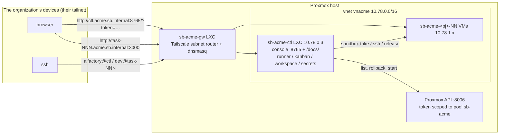

# Per-organization environments (tenants) and the control plane on Proxmox

What this page covers: how to **lend the factory to another organization**. Each organization gets its own network, VMs, permissions and secrets, and the console, docs and runner all live in an LXC on Proxmox, so nothing is needed on a Mac. The reasoning is in [ADR-0017](../decisions/index.md).

## What is separated

One tenant = one organization = one independent sandbox environment, selected with `SB_TENANT` (`[a-z0-9]{1,6}`). The first environment is a tenant like any other, with the slug `main`. **Naming rule: every name carries `sb` and the tenant slug** (DNS `<t>.sb.internal`, Proxmox zone `sb<t>`, vnet `vn<t>`, VMs / pools / groups `sb-<t>-…`).

| Thing | `main` (the first environment) | Tenant `acme` (example) |
|---|---|---|
| SDN zone / vnet | `sbmain` / `vnmain` | `sbacme` / `vnacme` |
| Network (/16) | `10.77.0.0/16` | `SB_NET.0.0/16` (for example `10.78`; **different per tenant**) |
| VMID range | 9000… | `SB_VMID_BASE`… (for example 8000; **a different block of 1000 per tenant**) |
| Names | `sb-main-gw` / `-ctl` / `-base` / `-tpl-<pj>` / `-<pj>-NN` | `sb-acme-gw` / `-ctl` / `-base` / `-tpl-<pj>` / `-<pj>-NN` |
| DNS | `*.main.sb.internal` | `*.acme.sb.internal` |
| Firewall groups | `sb-main` / `sb-main-ctl` | `sb-acme` / `sb-acme-ctl` |
| Proxmox resource pool / user | `sb-main` / `sb-main@pve` | `sb-acme` / `sb-acme@pve` |
| tailnet | the maintainer's | **the organization's own tailnet** (they run `tailscale up` on the gateway with their account) |

The derivation lives in one place, `sandbox/proxmox/_tenant.sh`. Override individual values with `SB_ZONE` / `SB_VNET` / `SB_PREFIX` / `SB_FW_GROUP` / `SB_POOL` / `SB_DOMAIN` when needed.

## Inside one tenant



- **Control-plane LXC `sb-acme-ctl`**: a checkout of aifactory, the workspace, the `sandbox` CLI, the web console, the documentation site (`/docs/`), the GitHub App token refresh timer, and the python3 / gh / claude / ssh the runner needs. Everything runs under systemd. It has no leg on the LAN; outbound traffic goes through the host's SNAT and inbound only through the gateway's subnet router
- **Permissions on Proxmox**: the control plane's `sandbox` CLI runs in **API mode** (`PVE_API_TOKEN`) and can only list, start, and roll back to `clean` the VMs in its own pool. It never holds the host's root
- **Three layers of isolation**: network (separate vnet; VMs and the control plane DROP all of RFC1918 and the tailnet range, so they cannot reach another tenant's network), permissions (the API token is scoped to the pool), and secrets (they live only inside the control plane)

## Building one (maintainer = host administrator)

On your Mac, create `~/.config/sandbox/tenants/acme.env`:

```bash
PVE_HOST=pve1          # ssh alias of the Proxmox host
SB_NET=10.78           # a /16 reserved for this tenant
SB_VMID_BASE=8000      # a VMID block reserved for this tenant
```

Then follow [Build the sandbox](../getting-started/build-sandbox.md) with `SB_TENANT=acme` in front of every command. Only two steps are new.

```bash
SB_TENANT=acme sandbox/proxmox/run.sh 05-tenant.sh          # Step 0c: pool, role, user, ACL
SB_TENANT=acme sandbox/proxmox/run.sh 10-sdn.sh             # Step 1
SB_TENANT=acme sandbox/proxmox/run.sh 20-gateway-lxc.sh     # Step 2a
SB_TENANT=acme sandbox/proxmox/run.sh 25-control-lxc.sh     # Step 2d: control-plane LXC (issues the API token and writes it inside)
#   Step 2b: the organization runs tailscale up on the gateway with its own account, approves the route, adjusts its ACL and adds split DNS (acme.sb.internal → gateway)
SB_TENANT=acme sandbox/proxmox/run.sh 30-base-template.sh create   # Steps 3 to 5c as before (templates are baked with the control plane's key)
…
SB_TENANT=acme sandbox/proxmox/run.sh 50-firewall.sh
```

`25-control-lxc.sh` can be re-run (it rotates the API token and rewrites it). `run.sh` picks up the control plane's ssh key and puts it into every template and gateway built afterwards, so **build the control plane before the base template**.

## Handing it over

| What | Where |
|---|---|
| ssh into the control plane | add the organization's public key to `/home/aifactory/.ssh/authorized_keys` on `sb-acme-ctl` |
| Console passphrase (optional) | The control plane is reachable only on the internal network (`10.x`), so by default the console opens without a passphrase (ADR-0021). To require one, put `CONSOLE_TOKEN=<passphrase>` in `~/.config/aifactory/ctl.env` inside the LXC and `sudo systemctl restart aifactory-console` |
| URLs | `http://ctl.acme.sb.internal:8765/` (with a passphrase, one visit to `/?token=<passphrase>` sets a cookie), docs at `/docs/` |

What you do not hand over: the host's root, anything from another tenant, your own tokens.

## Using it (the organization)

Secrets go into the control plane by the organization itself. The maintainer never holds them.

```bash
ssh aifactory@ctl.acme.sb.internal
sandbox token set <pj>                      # Claude Code long-lived token (output of claude setup-token)
~/aifactory/sandbox/bin/gh-app-setup        # GitHub App (do the browser part locally; put app.env and private-key.pem under ~/.config/sandbox/gh-app/)
vi ~/.config/aifactory/ctl.env              # CLAUDE_CODE_OAUTH_TOKEN (intake makes one LLM call on the control plane), GH_TOKEN (runner's gh pr view)
sudo systemctl restart aifactory-console
```

From there it is the same as [Create tickets](tickets.md) → [Run work](running.md) → [Read the results](results.md). Project definitions go under `~/workspace/projects/<pj>/` ([Add a project](add-project.md)).

## Operating notes

- Updating the code (inside the LXC): `cd ~/aifactory && git pull && sandbox/bin/install.sh && (cd website && .venv/bin/mkdocs build -q) && sudo systemctl restart aifactory-console`
- Rotating the API token: the maintainer re-runs `SB_TENANT=acme sandbox/proxmox/run.sh 25-control-lxc.sh`
- `sandbox ls` says `Proxmox API … failed`: from the LXC check `curl --cacert ~/.config/sandbox/pve-ca.pem --resolve <node>:8006:10.78.0.1 https://<node>:8006/api2/json/version` (the certificate's SAN carries the node name, so `PVE_API_RESOLVE` points it at the SDN-side IP), and that the OUT rules of firewall group `sb-acme-ctl` allow the tenant's own /16
- Open (ADR-0017): scripted tenant teardown, per-tenant RAM / disk limits, automatic updates of the control plane
