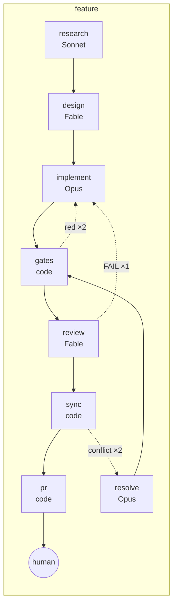
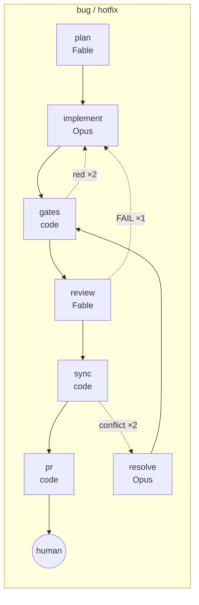
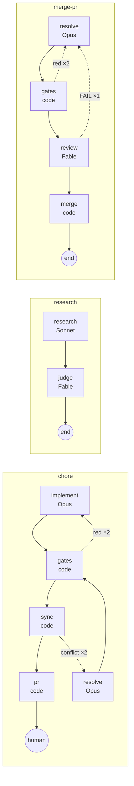
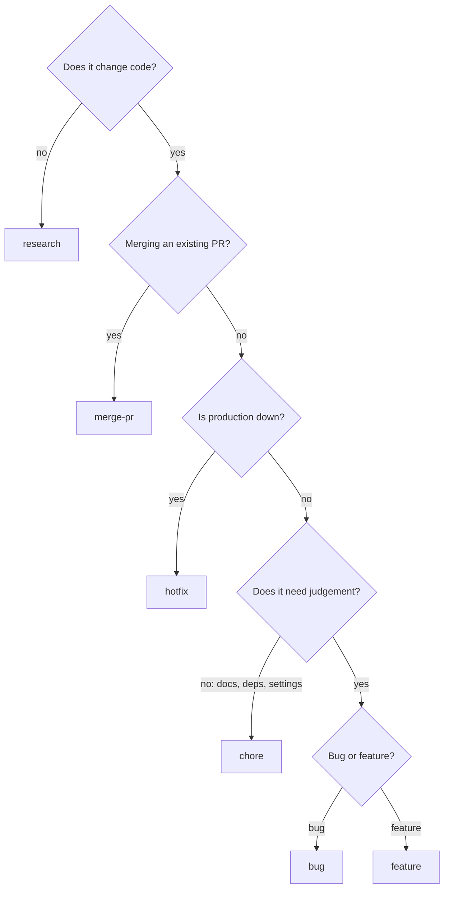

# Choose a workflow

What this page tells you: the flow of the six workflows, when to use each, which roles and models run, and the retry limits.

## Overview

| Workflow | Flow | When | Exit |
|---|---|---|---|
| **hotfix** | plan → implement → gates → review → sync → pr | Minimal fix for a production incident. Targets `hotfix_base` (usually `main`) | PR → human |
| **bug** | plan → implement (reproduction test first) → gates → review → sync → pr | Bug fixes | PR → human |
| **feature** | research → design → implement → gates → review → sync → pr | New functionality, with research and design steps | PR → human |
| **chore** | implement → gates → sync → pr | Docs, dependency updates, settings; no judgement needed. No plan, no review | PR → human |
| **research** | research → judge → end | Investigation only. No code changes. Collects `summary.md` | done (no PR) |
| **merge-pr** | resolve → gates → review → merge | Resolve conflicts on an existing PR and merge it. Target given by `pr: N` in the body | merged |

## Flow diagrams

Boxes with a model name are agent steps (`claude -p` inside the VM); `code` boxes are code steps (control-plane scripts executed against the VM). Dotted lines are send-backs; past the limit the run goes to `human`.

`sync` merges the latest base right before the PR is opened (built into the runner; ADR-0032), so a PR opened after a parallel run's PR was merged does not come out CONFLICTING. A conflict goes back to the implementer (`resolve`), not to a human; only after two failed resolutions does the run go to `human`.

## How to choose

intake follows this guidance. When in doubt, **bug** (which has a plan and a review) is the safe choice; keep chore for things where a mistake has little impact.

## Roles and models

| Role | Class | Model (`routes.env`) | Output |
|---|---|---|---|
| planner | judgment | Fable 5.1 | `plan.md` |
| researcher | research | Sonnet 5 | `research.md` / `summary.md` |
| implementer | coding | Opus 5 | git commits + `report.md` |
| reviewer | judgment | Fable 5.1 | `review.md` |

A step can override with `model_class`. For a one-off change use the environment variable `CLAUDE_MODEL`.

## Measured times

Measured in the maintainer's environment (2026-09).

| Run | Workflow | Agent | Gates | Result |
|---|---|---|---|---|
| Dependency update in a Node monorepo (a 3-line diff) | bug-like | 455 s | 6 min | PR |
| Fixing time-dependent Next.js tests (kumitate) | bug-like | 582 s | 16 min | PR, all 6 gates green |
| Investigating a Node project's CI gate | research | 232 s | none | summary.md |
| Merging an existing PR in a Rails + MySQL project | merge-pr | resolve 16 min + review 2 min | 57 min | merged |
| Investigating kumitate's CI | research | 433 s | none | summary.md |

Most of the time is spent in gates. Agents finish in minutes.

## Adding your own workflow

Adding one file `workflow/kit/workflows/<name>.yml` makes it available as a `kind` in `kb new`. The format is described in [workflow yml](../reference/workflow-yml.md). Steps use the four existing roles or the code steps (`gates.sh` / `pr-create.sh` / `pr-merge.sh`, plus the runner's built-in `sync-base`); a new role needs `workflow/kit/roles/<role>.md`.
