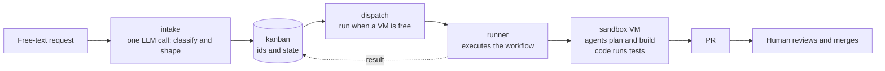

# aifactory

**A ticket goes in. Inside an isolated VM, agents plan and implement, code runs the tests, and humans only review at the end.** This repository builds that kind of "software factory" from scratch.

This site is written so that someone seeing the repository for the first time can read, in order, what it is, how to install it, how to use it, and what happens inside. The source of truth is the README / ADR / STATUS files in the repository; this site is a readable rendering of them.

## What it does

- Turn a **free-text request** such as "the calendar test in kumitate breaks when the month changes, fix it" into a ticket with one command
- Each ticket is processed in an **isolated VM** per project (on Proxmox, one task per VM, rolled back to a clean state when done)
- Inside the VM an **agent** (Claude Code) plans, implements and reviews, while **code** runs the gates (lint / typecheck / test) and sends red results back
- The result is a **PR** that a human reviews and merges. Merging itself can also be automated by a workflow
- State (todo → in progress → review → done) and records (prompts, logs, artifacts) are all kept in files
- The **Web console** (`console/bin/console`) shows the board, the logs of running runs and VM lending on one screen, with the same operations as buttons. AI sessions get the same reads and writes over **MCP** (`console/bin/mcp`)

## Three actors

The idea comes from Dan Isler's (IndieDevDan) talk "FORGET Loop Engineering. Agentic Engineering is about THIS". Its core point: separate the three actors that create value, and use each for what it is good at.

| Actor | Traits | Job in this factory |
|---|---|---|
| **Code** | Fast, deterministic, zero tokens, most reliable | Numbering, dispatching, VM lending, gates (lint / test), PR creation, merging, record keeping |
| **Agent** | Flexible but slow, expensive, and inconsistent | Planning (planner), implementation (implementer), research (researcher), review (reviewer) |
| **Engineer (human)** | Most expensive | Only the request at the start and the PR review / merge decision at the end |

The design principle is to **keep code and agents apart**. Instead of having the agent run lint, code runs lint and hands the result back to the agent.

## Four sections

| Section | Question | What it is | Default setup |
|---|---|---|---|
| [sandbox](concepts/sandbox-internals.md) | Where does it run? | Proxmox VM pool + Mac-side CLI | 3 VMs per project + 3 generic VMs |
| [kanban](reference/cli-kb.md) | What runs, and when? | SQLite + the `kb` CLI | 5 states, sequential ids |
| [workflow](concepts/workflow-engine.md) | How does it proceed? | YAML definitions + a Python runner | 6 workflows (hotfix / bug / feature / chore / research / merge-pr) |
| [glue](reference/cli-glue.md) | What connects them? | `intake` (import) + `dispatch` (scheduling) | The LLM is called once, in intake |

## Where to start

- :material-rocket-launch: **[Getting started](getting-started/index.md)**

    Requirements, Mac setup, building the sandbox, and the first run.

- :material-book-open-variant: **[Guides](guides/index.md)**

    Creating tickets, running, reading results, adding a project, daily operations.

- :material-cog: **[Concepts](concepts/index.md)**

    Architecture, ticket lifecycle, the workflow engine, where the LLM runs, where configuration comes from.

- :material-file-document: **[Reference](reference/index.md)**

    Every CLI command, `project.yml`, workflow yml, roles and models, glossary.

!!! note "Assumptions"
    This factory assumes Proxmox VE (the VM pool), Tailscale (the path from the Mac to the VMs), a GitHub App (push / PR permissions) and Claude Code (the agent). Operational data (project definitions, tickets, run records, logs) lives outside the repository in the **workspace** (`AIFACTORY_WORKSPACE`, default `<repo>/workspace/`); the repository holds only the machinery of the factory. To run it in your own environment, start with [Requirements](getting-started/requirements.md). The bundled example project definition is `examples/projects/kumitate/` ([akkijp/kumitate](https://github.com/akkijp/kumitate)). Licensed under Apache-2.0.
