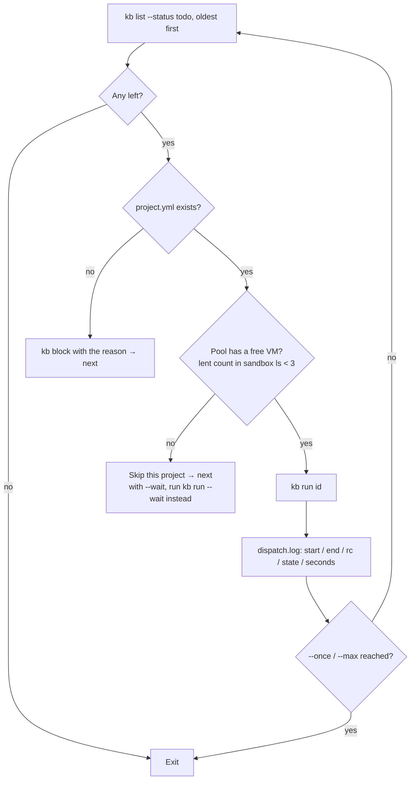

# intake / dispatch (glue)

`glue/bin/intake` (free text → ticket) and `glue/bin/dispatch` (todo → run). Both Python 3.

## intake

```
intake <text-file|-> [--pj P] [--kind K] [--model M] [--dry-run]
```

| Argument | Meaning |
|---|---|
| `text-file` | The free-text file. `-` for standard input |
| `--pj` / `--kind` | Deterministic override. Beats the LLM's decision |
| `--model` | Model to use. Default is `MODEL_judgment` from `workflow/kit/routes.env` |
| `--dry-run` | Print the decision JSON without filing |

### Behaviour

1. Picks up `pj:` / `kind:` lines from the first 5 lines of the input (deterministic) and removes them from the body
2. `--pj` / `--kind` take precedence. Specified values are validated for existence
3. Calls `claude -p` once on the Mac, with a temporary directory as cwd and no tools. It passes the project list (display_name / repo / stack from `project.yml`; projects without one are marked "no project.yml"), the kind list (descriptions from the workflow ymls), the decision guidance, the ticket shape, and the request
4. Extracts the JSON (`pj` / `kind` / `title` / `body` / `confidence` / `reason`) and overrides pj / kind with anything specified
5. Appends `(intake <time> / model <model> / confidence <value> / <reason>)` to the body and calls `kb new`. A `pr: N` at the top of the body becomes `--pr`
6. Writes one line to `workspace/logs/intake.log` (time / id / pj / kind / confidence / model / reason)

### Output

The output of `kb new` (id and body path). With `--dry-run`, the JSON.

```json
{
  "pj": "kumitate",
  "kind": "bug",
  "title": "fix: pin the calendar title tests to a fixed date to remove the time dependency",
  "body": "## Background\n…\n## Completion criteria\n- …",
  "confidence": 0.9,
  "reason": "About the apps/web tests in kumitate. A bug fix, so bug"
}
```

### Errors

| Message | Cause |
|---|---|
| `input is empty` | The file is empty |
| `pj=… is not one of […]` | The specified project / kind does not exist |
| `claude -p failed` | Claude Code authentication, network |
| `could not extract JSON` | The LLM did not produce JSON. The tail of the output is shown |
| `kb new failed` | The LLM's pj / kind does not exist, and so on. `kb`'s error is shown |

## dispatch

```
dispatch [--pj P] [--once] [--max N] [--dry-run] [--wait [minutes]]
```

| Argument | Meaning |
|---|---|
| `--pj` | Restrict to a project |
| `--once` | One ticket only |
| `--max N` | Up to N tickets (default unlimited) |
| `--dry-run` | `kb run --dry-run`. No VM, no state change |
| `--wait [minutes]` | Do not skip a project whose pool is full; let `kb run --wait <minutes>` wait for a free VM (minutes; 60 when the value is omitted) |

### Behaviour



- Sequential. The next ticket does not start until the current one finishes
- Makes no decisions. The kind is held by kanban
- Pool size is `POOL_PER_PJ = 3` (match the number created with `40-pool.sh`)
- `--dry-run` skips the pool check
- `--wait` skips it too. Waiting happens in one place, the runner (`kb run --wait` → `workflow/bin/run --wait`; ADR-0031). A ticket that runs out of time goes back to `todo`, so the next `dispatch` can pick it up again

### Output

The same lines on standard output and in `workspace/logs/dispatch.log`.

```
[dispatch] start 204 kumitate bug fix: pin the calendar title tests …
[kb] …/workflow/bin/run kumitate 204 bug …/tickets/204-….md
[run kumitate/204 …]
[dispatch] end   204 kumitate bug rc=0 status=review 1830s
[dispatch] 205 myapp bug: no project.yml → blocked
[dispatch] no todo left (or all skipped). exit
```

## Logs

| File | Shape |
|---|---|
| `workspace/logs/intake.log` | `<time>\t<id>\t<pj>\t<kind>\t<confidence>\t<model>\t<reason>` |
| `workspace/logs/dispatch.log` | `<time>\t<message>` |

Both live in the workspace (`$AIFACTORY_WORKSPACE/logs/`) and are not tracked by git. No secrets appear in them.
