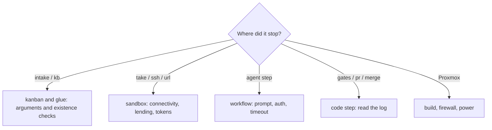

# Troubleshooting

Look up by symptom. First work out which section it happened in.

## intake / kb

| Symptom | Cause | Fix |
|---|---|---|
| `pj must be one of […]` | Wrong project name, or no project definition directory | `ls "$AIFACTORY_WORKSPACE/projects" examples/projects` |
| `kind must be one of […]` | Wrong kind name | chore / bug / feature / hotfix / research / merge-pr |
| intake says `could not extract JSON` | The LLM did not produce JSON | Read the tail of the output. Input too short, or `claude` not authenticated |
| intake says `claude -p failed` | Claude Code on the Mac is not authenticated | Start `claude` interactively once to authenticate |
| `kb run` says `no project.yml` | The project has no definition | Steps 3 and 4 of [Add a project](guides/add-project.md) |
| `kb run` says `done; use kb reopen` | A finished ticket | `kb reopen <id>` |
| dispatch skips everything | The whole pool is lent, or no project.yml | `sandbox ls`, `kb list --status blocked` |

## sandbox

| Symptom | Look at | Fix |
|---|---|---|
| `take` reports no free VM | `sandbox ls` | `release` lent VMs you do not need. Grow the pool if still short |
| `take` fails on the GitHub App | `sandbox gh-app status` | Install through the link if not installed. Check `GH_REPO` in `pj/<pj>.env` |
| `task-xxx.sb.internal` does not resolve | `dig sb-gw.sb.internal`, Tailscale split DNS | Has split DNS disappeared? `ssh root@10.77.0.2 systemctl status dnsmasq` |
| Cannot ping 10.77.0.2 | Route approval in the Tailscale console. `pct exec 9000 -- journalctl -u tailscaled -n 20` | `Drop: … no rules matched` means add a grant for `10.77.0.0/16` to the ACL. In a hurry, `SB_JUMP=<same value as PVE_HOST>` in `~/.config/sandbox/env` |
| Cannot ssh to a VM | `ssh $PVE_HOST qm status 92NN` | `qm start`. If up, `qm terminal 92NN` |
| ssh dies mid-run with `Operation timed out` | Another session restarted or rebuilt the VM | `kb reopen` → `kb run`. [Working with multiple sessions](guides/multi-session.md) |
| `reset` / `release` fails | Does `qm listsnapshot 92NN` show `clean`? | If not, `qm destroy` → `40-pool.sh`. The CLI waits and retries on rollback lock contention |
| VM cannot reach GitHub | `ssh $PVE_HOST 'iptables -t nat -S \| grep 10.77'` | Reapply SDN with `pvesh set /cluster/sdn` |
| Mac cannot reach a VM (after enabling the firewall) | `qm config <vmid> \| grep firewall`, `/etc/pve/firewall/<vmid>.fw` | Rerun `50-firewall.sh`. `clean` must include firewall=1 |
| The `sandbox` command behaves like an old version | `diff ~/.local/bin/sandbox sandbox/bin/sandbox` | Rerun `sandbox/bin/install.sh` |

## Agent steps

| Symptom | Look at | Fix |
|---|---|---|
| Authentication error | Tail of `agent-<step>-<n>.log`; `env \| grep CLAUDE_CODE_OAUTH_TOKEN` in the VM | On the control plane: `claude setup-token` → `sandbox token rotate` (every project, `ctl.env` and `reinject --all` in one command) |
| Missing `outputs`, step failed | Tail of the same log | The agent overlooked the output location ("Outputs (required)" in the prompt), timeout, or a tool was refused. Raise `timeout_min` or make the ticket smaller |
| Changes outside the scope | `work/report.md`, `review.md` | State the scope in the ticket. Gates already red on base go in `known_red_gates` |
| The planner wrote STOP | Top of `work/plan.md` | The request is unclear, contradictory or dangerous. Answer the questions and fix the ticket |
| The same step repeated until `human` | `loops` in `state.json` | The limit (gates 2 / review 1). Read the logs and fix the root cause |
| The prompt contains stale facts | The "Project" section of `prompt-<step>-<n>.md` | Fix `facts` in `project.yml` (takes effect from the next run) |

## Code steps

| Symptom | Look at | Fix |
|---|---|---|
| Gates red | `code-gates-<n>.log`, `work/gates.txt`, `~/gates/<name>.log` in the VM | Already red on base: `known_red_gates`. Environment-dependent (missing GLB, macOS-only baseline images): make informational |
| `pr-create.sh` says "no commits" | `code-pr-<n>.log`, `work/report.md` | The report should say why the implementer did not commit |
| push returns 403 | `code-pr-<n>.log` | GitHub App token expired (one hour) or not installed. The runner reissues before code steps; if it still fails, `sandbox gh-app status` |
| merge says "conflict markers remain" | `code-merge-<n>.log` | Back to resolve. Past the limit, a human resolves |
| merge says "base not merged in" | Same | `origin/<base>` moved. Rerun |

## Proxmox

| Symptom | Look at | Fix |
|---|---|---|
| Cannot ssh to the Proxmox host | `pvecm nodes` (from another node, if clustered) | Power on (WoL / IPMI / physical button). The pool has onboot=0, so `qm start` |
| `qm clone` / `snapshot` warns "Sum of all thin volume sizes exceeds…" | `data%` in `lvs pve/data` | A WARNING only (thin provisioning). Shrink the pool if real usage grows |
| The cluster is not quorate | `pvecm status` | Check the other nodes. Stop build work and fix this first |
| A build script died midway | The completion criteria in `sandbox/BUILD.md` | Check the criteria one by one and rerun from the failed step (the scripts are idempotent) |

## Record what you did

After fixing something, record the cause and the fix.

- A temporary workaround → `workspace/docs/` (notes on your own environment)
- A mistake in the procedure → `sandbox/BUILD.md` / `OPERATIONS.md`
- A design change → `docs/adr/`
- A runner or CLI trap → "traps and handling" in `workflow/README.md`

Write it so the next person with the same symptom can fix it in five minutes.
