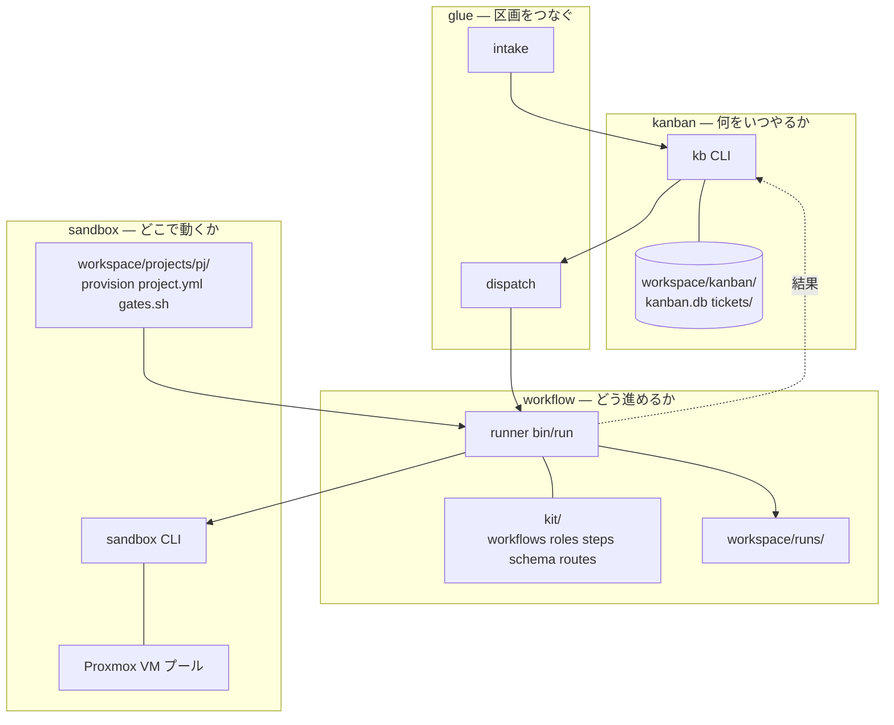
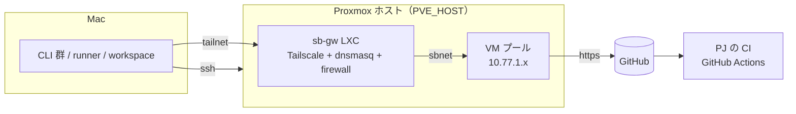

# 全体の構成

このページで分かること: 4 つの区画の役割と実体、区画間の契約、データの流れ。

## 4 つの区画

講演の構造を役割で切ると 3 つ（どこで・何を・どう）、議論で「つなぎ」を 1 つ足して 4 つです。

| 区画 | 問い | 実体 | エージェントは居るか |
|---|---|---|---|
| **sandbox** | どこで動くか | `sandbox/bin/sandbox`（Mac 側 CLI）、`sandbox/proxmox/`（構築スクリプト）、PJ 定義 `workspace/projects/<pj>/`（例は `examples/projects/`）、Proxmox 上の VM プール | VM の中で動く。貸出・巻き戻しはコード |
| **kanban** | 何をいつやるか | `kanban/bin/kb`、`workspace/kanban/kanban.db`（状態の正本）、`workspace/kanban/tickets/`（本文の正本）、`workspace/kanban/BOARD.md`（生成物） | 居ない |
| **workflow** | どう進めるか | `workflow/kit/`（定義）、`workflow/bin/run`（runner）、`workspace/runs/`（記録） | agent step で居る。分岐はコード |
| **glue** | 区画をつなぐ | `glue/bin/intake`、`glue/bin/dispatch`、`workspace/logs/{intake,dispatch}.log` | intake が 1 回だけ呼ぶ。dispatch は居ない |

## 区画間の契約

区画は互いの中身を知りません。知っているのは次のインターフェースだけです。

| 境界 | 契約 |
|---|---|
| glue → kanban | `kb new <pj> <kind> <title> --body` で起票、`kb list --status todo` / `kb next --json` で取り出し |
| kanban → workflow | `kb run <id>` が `workflow/bin/run <pj> <id> <workflow> <ticket.md>` を呼ぶ。結果は `workspace/runs/<run>/state.json` |
| workflow → sandbox | `sandbox take / ssh / url / reset / release / ls` の 5 操作 + ls。Proxmox の都合はこの内側 |
| workflow → PJ | `workspace/projects/<pj>/project.yml` と `gates.sh`（無ければ `examples/projects/<pj>/`）。PJ は「事実と方針」だけを提供する |
| sandbox → VM | `/run/sandbox/env`（トークンと task-id）、`$SANDBOX_APP_DIR`、`~/work/<id>/` |

sandbox の 5 操作が「workflow から見て足りるか」は、最初の 1 周（2026-09-06）で確かめました。足りなかった操作は `reinject`（トークン更新）だけで、これは契約外の運用補助として足しました。

## 物理配置

- 制御系（kanban / glue / runner）は Mac 上。軽いので専用サーバーは置かない
- 実行系（VM）は Proxmox ホスト 1 台。VM 1 台 8 GB なので、RAM に余裕があれば 20 台以上入る
- CI は PJ 側の既存のもの（GitHub Actions）に任せる。工場は CI を新設しない

## データの流れ

| 何が | どこから | どこへ |
|---|---|---|
| チケット本文 | intake / kb new | `workspace/kanban/tickets/` → runner が VM の `~/work/<id>/ticket.md` へ |
| 依頼文 | runner が 8 層で組み立て | VM の `/home/dev/prompt.md` → `claude -p` |
| 成果物（plan.md など） | agent が VM の `~/work/<id>/` に | release 時に `workspace/runs/<run>/work/` へ回収 |
| コード | agent が VM 内でコミット | `pr-create.sh` が push、PR 作成 |
| ゲート結果 | `gates.sh` が VM で実行 | `~/work/<id>/gates.txt` と runner の `code-gates-*.log` |
| 状態 | runner の `state.json` | `kb run` / `kb sync` が読んで `kanban.db` へ |
| トークン | Mac の `~/.config/sandbox/` | take のたびに VM の tmpfs へ。巻き戻しで消える |

## なぜ sandbox から作ったか

- チケットにも workflow の内容にも依存せず、汎用性が最も高い
- 前身（git worktree + ターミナル多重化）の次の一段。講演も「worktree は始めるには良いが終着点ではない」
- インフラとして一番難しい。難しいものを先に固めると、上に載る workflow が楽になる
- ただし sandbox 単体には価値が無いので、最小の workflow を 1 本並走させて要求を引き出した

詳しくは `docs/ledger.md`（構想台帳）と ADR-0001〜0004。
