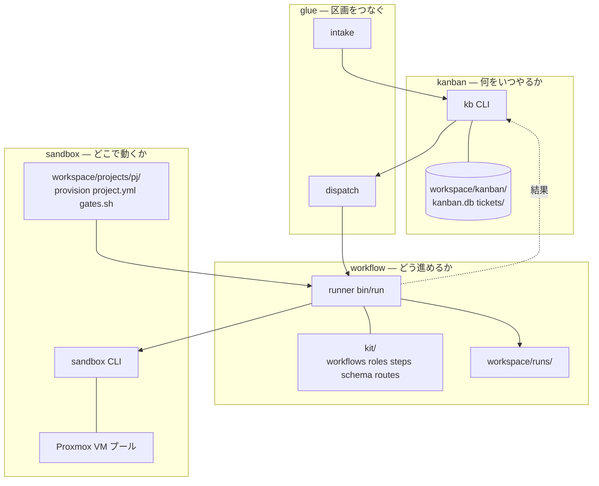
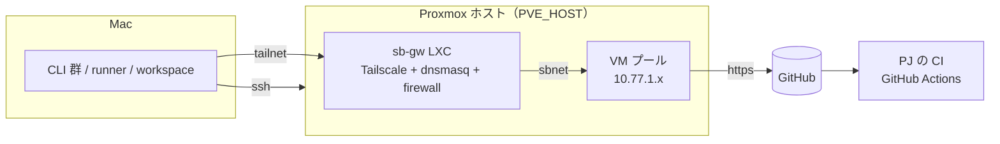

# 全体の構成

aifactory は、実行環境を管理する sandbox、チケットを管理する kanban、作業手順を実行するワークフロー、それらをつなぐ glue の 4 つで構成されています。それぞれの役割と、データを受け渡す方法を説明します。

## 4 つの構成要素

「どこで実行するか」「何をいつ実行するか」「どう進めるか」を別々の構成要素が担当します。さらに、それらを連携させる glue を加えた 4 つの構成にしています。

| 構成要素 | 役割 | 実装と保存先 | エージェントを使う処理 |
|---|---|---|---|
| **sandbox** | どこで動くか | `sandbox/bin/sandbox`（Mac 側 CLI）、`sandbox/proxmox/`（構築スクリプト）、プロジェクト定義 `workspace/projects/<pj>/`（例は `examples/projects/`）、Proxmox 上の VM プール | VM の中で動く。貸出・巻き戻しはコード |
| **kanban** | 何をいつやるか | `kanban/bin/kb`、`workspace/kanban/kanban.db`（状態の正本）、`workspace/kanban/tickets/`（本文の正本）、`workspace/kanban/BOARD.md`（生成物） | なし |
| **ワークフロー** | どう進めるか | `workflow/kit/`（定義）、`workflow/bin/run`（runner）、`workspace/runs/`（記録） | 計画・実装・調査・レビュー。工程間の分岐はコードが処理 |
| **glue** | 区画をつなぐ | `glue/bin/intake`、`glue/bin/dispatch`、`workspace/logs/{intake,dispatch}.log` | intake が 1 回だけ呼び出す。dispatch はスクリプトで処理 |

## 構成要素間のインターフェース

各構成要素は、次のコマンドやファイルを通じて連携します。相手の内部実装に依存せずに利用できるよう、受け渡しの方法を定めています。

| 境界 | 契約 |
|---|---|
| glue → kanban | `kb new <pj> <kind> <title> --body` でチケット作成、`kb list --status todo` / `kb next --json` で取り出し |
| kanban → ワークフロー | `kb run <id>` が `workflow/bin/run <pj> <id> <workflow> <ticket.md>` を呼ぶ。結果は `workspace/runs/<run>/state.json` |
| ワークフロー → sandbox | `sandbox take / ssh / url / reset / release / ls` の 5 操作 + ls。Proxmox の都合はこの内側 |
| ワークフロー → プロジェクト | `workspace/projects/<pj>/project.yml` と `gates.sh`（なければ `examples/projects/<pj>/`）。プロジェクトは「基本情報と作業ルール」だけを提供する |
| sandbox → VM | `/run/sandbox/env`（トークンと task-id）、`$SANDBOX_APP_DIR`、`~/work/<id>/` |

sandbox の 5 操作が「ワークフローから見て足りるか」は、最初のチケット実行（2026-09-06）で確かめました。足りなかった操作は `reinject`（トークン更新）だけで、これは契約外の運用補助として足しました。

## 物理配置

- 制御系（kanban / glue / runner / console）は Mac 上でも、**Proxmox 上の制御系 LXC（`sb-ctl`）** でもよい（ADR-0017）。LXC なら Mac は不要で、ブラウザと ssh だけで工場を使える。貸出先の組織ごとに網・VM プール・権限・秘密情報を分けた環境（テナント）を並べられる。[貸出先ごとの環境（テナント）](../guides/tenants.md)
- 実行系（VM）は Proxmox ホスト 1 台。VM 1 台 8 GB なので、RAM に余裕があれば 20 台以上入る
- CI はプロジェクト側の既存のもの（GitHub Actions）に任せる。工場は CI を新設しない

## データの流れ

| 何が | どこから | どこへ |
|---|---|---|
| チケット本文 | intake / kb new | `workspace/kanban/tickets/` → runner が VM の `~/work/<id>/ticket.md` へ |
| 依頼文 | runner が 8 層で組み立て | VM の `/home/dev/prompt.md` → `claude -p` |
| 成果物（plan.md など） | エージェントが VM の `~/work/<id>/` に | release 時に `workspace/runs/<run>/work/` へ回収 |
| コード | エージェントが VM 内でコミット | `pr-create.sh` が push、PR 作成 |
| ゲート結果 | `gates.sh` が VM で実行 | `~/work/<id>/gates.txt` と runner の `code-gates-*.log` |
| 状態 | runner の `state.json` | `kb run` / `kb sync` が読んで `kanban.db` へ |
| トークン | Mac の `~/.config/sandbox/` | take のたびに VM の tmpfs へ。巻き戻しで消える |

## なぜ sandbox から作ったか

- チケットにもワークフローの内容にも依存せず、汎用性が最も高い
- 前身（git worktree + ターミナル多重化）の次の一段。講演も「worktree は始めるには良いが終着点ではない」
- インフラとして一番難しい。難しいものを先に固めると、上に載るワークフローが楽になる
- ただし sandbox 単体には価値がないので、最小のワークフローを 1 本並走させて要求を引き出した

設計の経緯は `docs/ledger.md`（構想台帳）と ADR-0001〜0004 を参照してください。
