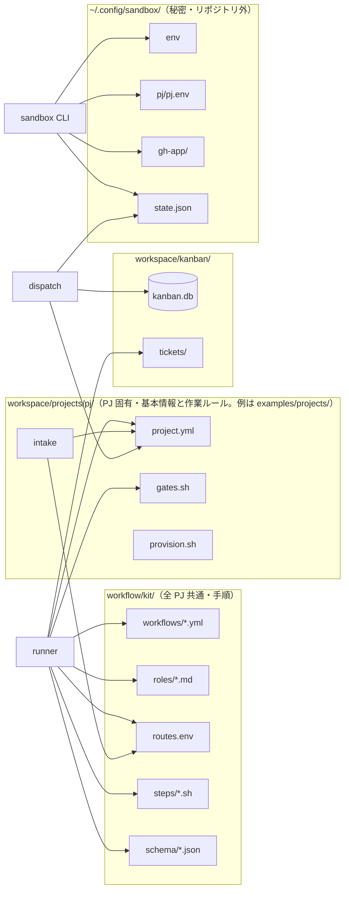

# 設定ファイルと優先順位

変更したい内容に応じて、どの設定ファイルを編集すればよいかをまとめています。各ファイルを読み込むプログラム、設定の優先順位、変更が反映されるタイミングも説明します。

## 全体図

## 設定ファイル一覧

| ファイル | 誰が読む | 何を決める | 変える頻度 |
|---|---|---|---|
| `workflow/kit/workflows/*.yml` | runner（起動時にスキーマ検証） | 工程の並び、担い手、入出力、分岐と上限 | 低。全プロジェクトに効く |
| `workflow/kit/roles/_common.md` | runner → エージェント（依頼文 1 層目） | 全役割共通の約束（push しない、範囲外を変えない、秘密を書かない） | 低 |
| `workflow/kit/roles/<role>.md` | runner → エージェント（2 層目） | 役割ごとの行動ルール。担当範囲・禁止事項・出力形式 | 低 |
| `workflow/kit/routes.env` | runner、intake | クラス → モデル（judgment = Fable / research = Sonnet / coding = Opus） | 低。メンテナの判断 |
| `workflow/kit/steps/*.sh` | runner（スクリプトが担当する工程） | gates.sh（プロジェクトのゲートを VM で実行）、pr-create.sh、pr-merge.sh | 低 |
| `workflow/kit/schema/*.json` | runner | ワークフローの YAML と project.yml の正しさ | 低 |
| `workspace/projects/<pj>/project.yml` | runner（4 層目）、dispatch（有無だけ）、intake（プロジェクト一覧）、コンソール | プロジェクトの基本情報と作業ルール。なければ `examples/projects/<pj>/` | 中 |
| `workspace/projects/<pj>/gates.sh` | kit/steps/gates.sh（VM 内で） | プロジェクトの品質ゲート | 中 |
| `workspace/projects/<pj>/provision.sh` | proxmox/32-pj-template.sh | テンプレートの作成 | 低。テンプレート更新時 |
| 環境変数 `AIFACTORY_WORKSPACE` か `~/.config/aifactory/workspace`（1 行のパス） | kb、intake、dispatch、runner、コンソール | workspace の場所（既定 `<repo>/workspace/`）。環境変数が優先、次に設定ファイル。設定ファイルはシェルを経由しない起動（GUI から開いた Claude Code の MCP、launchd）でも効く。`KB_ROOT` / `CONSOLE_JOBS` で台帳とジョブ記録だけ別に置ける | ほぼなし |
| `~/.config/sandbox/env` | sandbox CLI、proxmox/run.sh | Proxmox ホスト（`PVE_HOST`）、ゲートウェイ（`GW_SSH`）、鍵、ドメイン、ProxyJump、プールの IP / VMID（`SB_POOL_NET` / `SB_POOL_BASE`）。**リポジトリ外** | ほぼなし |
| `~/.config/sandbox/pj/<pj>.env` | sandbox CLI（take / reinject） | プロジェクトごとの `CLAUDE_CODE_OAUTH_TOKEN` と `GH_REPO`。**リポジトリ外** | トークン更新時 |
| `~/.config/sandbox/gh-app/` | sandbox CLI | GitHub App の ID と秘密鍵。**リポジトリ外** | ほぼなし |
| `~/.config/sandbox/state.json` | sandbox CLI、runner、dispatch、他セッション | どの VM を誰に貸しているか。**リポジトリ外** | take / release のたび |
| `workspace/kanban/kanban.db` + `tickets/` | kb、intake、dispatch、runner（本文） | チケットの状態と本文 | 高 |
| `glue/bin/intake` 内のプロンプト | intake | 分類の目安、チケットの形 | 低 |

## 優先順位（上書きの規則）

| 何 | 弱い → 強い |
|---|---|
| モデル | 役割の既定クラス → 工程の `model_class` → 環境変数 `CLAUDE_MODEL`（1 回限り） |
| PR の宛先 | `project.yml` の `base_branch` → ワークフローの `base_branch: hotfix_base` → `project.yml` の `workflow_overrides.<wf>.base_branch` |
| Claude トークン | `~/.config/sandbox/env`（全体既定）→ `pj/<pj>.env`（プロジェクト別）→ `SANDBOX_CLAUDE_TOKEN`（1 回限り）。シェルに export された `CLAUDE_CODE_OAUTH_TOKEN` は**無視** |
| GitHub トークン | 静的 `GH_TOKEN`（フォールバック）→ GitHub App の installation token → `SANDBOX_GH_TOKEN`（1 回限り） |
| intake の pj / kind | LLM の判定 → 本文先頭の `pj:` / `kind:` 行 → `--pj` / `--kind` |

## 「ここを変えたい」対応表

| やりたいこと | 触るファイル | 効く範囲 |
|---|---|---|
| 新しいプロジェクトを工場に入れる | `workspace/projects/<pj>/{provision.sh, project.yml, gates.sh}`（`examples/projects/kumitate/` を写す）+ Proxmox でテンプレとプール + `sandbox token set` + GitHub App インストール | そのプロジェクト |
| ゲートを足す / 外す | `workspace/projects/<pj>/gates.sh`。base で既に失敗しているものは `project.yml` の `known_red_gates` | そのプロジェクト |
| エージェントに毎回伝える事実（テストの実行方法、既知の注意点） | `project.yml` の `facts` | そのプロジェクトの全工程 |
| このプロジェクトでやってはいけないこと / reviewer が必ず見ること | `project.yml` の `forbidden` / `review_points` | そのプロジェクト |
| 手順そのもの（工程を足す、差し戻し回数） | `workflow/kit/workflows/<wf>.yml` | 全プロジェクト |
| 役割の振る舞い（reviewer の見方、implementer の作法） | `workflow/kit/roles/<role>.md`。全役割共通なら `_common.md` | 全プロジェクト |
| 使うモデル | `workflow/kit/routes.env`（クラス単位）。1 工程なら yml の `model_class`、1 回なら `CLAUDE_MODEL` | 指定した範囲 |
| PR の宛先ブランチ | `project.yml` の `base_branch` / `hotfix_base` / `workflow_overrides` | そのプロジェクト |
| チケットの分類基準 | `glue/bin/intake` のプロンプト、または依頼文の先頭に `kind:` 行 | チケット作成時 |
| プール台数（実体） | `sandbox/proxmox/40-pool.sh <pj> <台数>`（作った台数がそのまま実体） | そのプロジェクトの並列数 |
| プール台数（定義） | 環境変数 `SANDBOX_POOL_PER_PJ`（既定 3）。`glue/bin/dispatch`、`sandbox status`、コンソールの sandbox 画面が同じ値を読む。実体より多いと `take` が空きなしで落ちる | 配車と表示 |
| Claude トークンの更新 | `sandbox token set <pj>`（貸出中は `sandbox reinject <id>`） | そのプロジェクト |
| Proxmox ホストや IP 空間 | `~/.config/sandbox/env`（`PVE_HOST` / `GW_SSH` / `SB_POOL_NET` / `SB_POOL_BASE`）、Proxmox 側は `SB_NODE` / `SB_NET` / `SB_GW_CT` / `SB_BASE_VMID` / `SB_POOL_BASE`。`sandbox/README.md` の命名規則 + ADR | 全体 |
| 作業データの置き場 | 環境変数 `AIFACTORY_WORKSPACE` か `~/.config/aifactory/workspace` | 全体 |

!!! warning "置き場を間違えやすいもの"
    - プロジェクト固有の情報は `project.yml` の `facts` / `forbidden` / `review_points` に書きます
    - 全プロジェクトに共通するルールは `roles/_common.md` か `roles/<role>.md` に書きます
    - トークンや鍵は、リポジトリ外の `~/.config/sandbox/` に保存します

## 変更が効くタイミング

| 変えたもの | いつ効くか |
|---|---|
| ワークフローの YAML / roles / routes.env / project.yml / gates.sh | **次の run から**。実行中の run には効かない（runner は起動時に読む） |
| `sandbox/bin/sandbox` | `sandbox/bin/install.sh` を実行した後（PATH のコピーが更新される） |
| トークン | `sandbox token set` の後の take から。貸出中は `reinject` |
| `kb` / `intake` / `dispatch` | 即（リポジトリのパスを直接呼ぶ） |
| Proxmox 側スクリプト | 再実行した後 |
