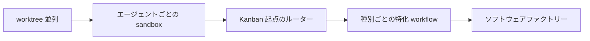

# 仕組み

「中で何が起きているか」を、上から下へ読める順に並べています。使うだけなら [使い方](../guides/index.md) で足りますが、直す・育てるならここを読んでください。

| ページ | 問い |
|---|---|
| [全体の構成](architecture.md) | 4 つの区画は何で、どう繋がっているか |
| [チケットの一生](ticket-lifecycle.md) | 1 枚のチケットは、起票からマージまで何を通るか |
| [workflow エンジン](workflow-engine.md) | step と分岐はどう定義され、runner はどう実行するか |
| [LLM はどこで動くか](where-llm-runs.md) | エージェントの実行場所とモデルの決まり方 |
| [sandbox の内側](sandbox-internals.md) | VM の貸出・巻き戻し・ネットワーク・トークン注入 |
| [設定の出どころ](configuration.md) | どの設定ファイルが、いつ、誰に読まれるか |
| [状態と記録](state-and-records.md) | 何がどこに残り、誰が読むか |
| [安全と秘密情報](security.md) | 隔離の境界、秘密の寿命、やってはいけないこと |

## 設計の芯（3 つ）

1. **コードとエージェントを分離する。** step は agent step と code step の 2 種類しかない。判断はエージェント、繰り返しと検証はコード
2. **PJ 固有のものは 1 箇所にしか置かない。** 手順（workflow）は全 PJ 共通で `workflow/kit/` に 1 つ。PJ 固有は `$AIFACTORY_WORKSPACE/projects/<pj>/` の 3 ファイルだけ
3. **実機とファイルが正。** 状態は SQLite と JSON、記録は Markdown とログ。会話の記憶に頼らない

## 動画との対応

着想の講演（Dan Isler "FORGET Loop Engineering. Agentic Engineering is about THIS"）は、次の発展形を描いています。

この工場では B が sandbox 区画、C が kanban + glue、D が workflow 区画に対応します。A（git worktree + cmux surface）はこの工場の前身で、「worktree は始めるには良いが終着点ではない」という動画の指摘どおり、VM に置き換えました。
