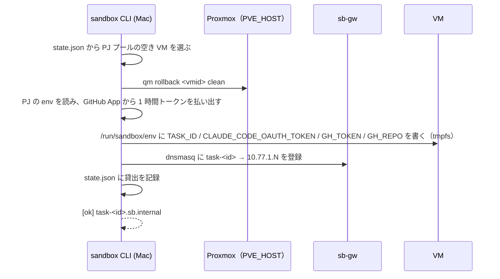
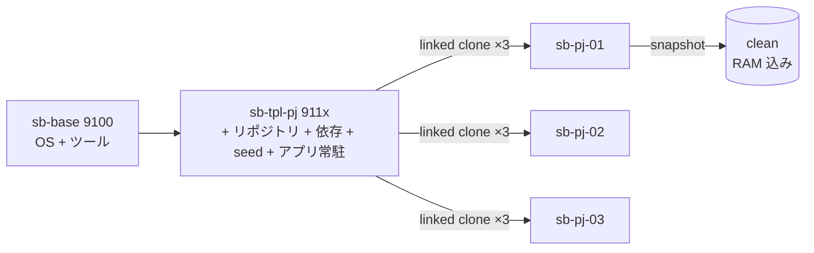

# sandbox の内側

`sandbox take` を実行すると、初期状態に戻した VM が 1 台割り当てられ、認証情報と接続先が設定されます。このページでは、その処理の流れと、VM プール、ネットワーク、命名規則を説明します。Proxmox 側の詳細は `docs/sandbox-architecture.html` と `sandbox/README.md` を参照してください。

## 5 つの基本操作

sandbox の基本機能は、`sandbox` CLI の 5 つの操作で利用できます。これに貸出状況を確認する `ls` を加えたものが、他の構成要素とのインターフェースです。Proxmox 固有の処理は CLI が担当します。

| 操作 | 保証すること |
|---|---|
| `take <pj> <task-id>` | クリーンな VM を 1 台確保し、`task-<id>.sb.internal` で到達できる状態にする。VM 内に task-id と認証トークンを注入する。空きがなければ非 0 で終了 |
| `ssh <task-id> [cmd]` | VM に `dev` ユーザーで入る（cmd があれば実行して抜ける） |
| `url <task-id>` | アプリの URL。`http://task-<id>.sb.internal:3000` |
| `reset <task-id>` | VM をスナップショット `clean` に巻き戻す。貸出は継続 |
| `release <task-id>` | reset して名前を外し、プールに返す |
| `ls` | 貸出状況 |

出力物（diff、PR、テスト結果）は sandbox の責務ではありません。VM の中でワークフローが作り、`ssh` か `git push` で外に出します。

## take で起こること



| 段階 | 何を | 所要 |
|---|---|---|
| 空き VM の選択 | `~/.config/sandbox/state.json` の貸出台帳から、そのプロジェクトのプールで空いている VM | 即 |
| 巻き戻し | Proxmox で `clean` スナップショットに `qm rollback`。RAM 込みなので起動待ちがない | 数秒 |
| トークン注入 | プロジェクトの Claude トークンと、GitHub App の installation token（そのリポジトリ限定・1 時間）を `/run/sandbox/env` に。tmpfs なので巻き戻しで消える | 1〜2 秒 |
| DNS 登録 | sb-gw の dnsmasq に `task-<id>` を追加 | 即 |

合計 10 秒程度です。runner はその後、VM 内で base ブランチを fetch して作業ブランチを切り、チケットを `~/work/<id>/ticket.md` に置きます。

## プールと巻き戻し



- **使い回し + 巻き戻し**（ADR-0003）。タスクごとに VM を作るのではなく、常駐プールから貸し出し、返却時に `clean` へ戻す。ネイティブ実行なので DB も巻き戻しで初期化される
- `clean` は「アプリが :3000 で起動済み」「ファイアウォール設定込み」の状態で取る。だから take 直後にブラウザで開ける
- テンプレートは 2 層。base（全プロジェクト共通）とプロジェクト層（Ruby / Node の版、依存、seed）。Ruby / Node の版がプロジェクトで違うのでテンプレートはプロジェクト単位
- VM は Docker を使わずネイティブ実行（ADR-0002）。Rails をそのまま動かし、事故を減らす

## ネットワーク

```mermaid
flowchart LR
  MAC[Mac] -- tailnet --> GW[sb-gw LXC<br>eth0: LAN DHCP<br>eth1: 10.77.0.2]
  GW -- sbnet --> VM[VM 10.77.1.N]
  VM -- SNAT --> NET[(インターネット)]
  GW -. dnsmasq: *.sb.internal .-> MAC
  VM -. FORWARD DROP .-x LAN[LAN / 他 VM / tailnet]
```

| 要素 | 決定 | 理由 |
|---|---|---|
| IP 空間 | `10.77.0.0/16`（Proxmox SDN simple zone、SNAT。`SB_NET` で変更可） | 専用空間で LAN と分ける |
| Mac からの到達 | ゲートウェイ LXC 1 台だけを tailnet に入れ、subnet router として `10.77.0.0/16` を広告（ADR-0004） | VM に Tailscale を入れると巻き戻しでノード鍵が重複する |
| 名前解決 | sb-gw の dnsmasq が `task-<id>.sb.internal` を返す。Tailscale の split DNS で `sb.internal` を sb-gw へ | ブラウザは `http://task-<id>.sb.internal:3000`、作業は `ssh task-<id>` |
| 通信制限 | VM 発の NEW 接続はインターネットと sb-gw の DNS だけ。LAN・ホスト・隣 VM・tailnet は DROP（ADR-0010） | 隣の VM やホストの SSH に届くのを塞ぐ |
| CI | 新設せず、プロジェクト側の既存の CI（GitHub Actions）に任せる | 既存資産 |

## 命名と採番

| 対象 | 規則 | 例 |
|---|---|---|
| VMID | 9000 = ゲートウェイ（`SB_GW_CT`）、9100 = base（`SB_BASE_VMID`）、911x = プロジェクトテンプレート、92xx = プール（`SB_POOL_BASE`） | 9110 = kumitate テンプレ、9204〜9206 = kumitate プール |
| VM 名 | `sb-gw` / `sb-base` / `sb-tpl-{pj}` / `sb-{pj}-{NN}` | `sb-kumitate-01` |
| IP | プール `SB_POOL_NET.(VMID−SB_POOL_BASE)`、既定 `10.77.1.(VMID−9200)`。プロジェクト横断で一意（ADR-0007） | 9204 → 10.77.1.4 |
| DNS | `task-{id}.sb.internal`（貸出中のみ）、`sb-{pj}-{NN}.sb.internal`（常設） | `task-204.sb.internal` |
| スナップショット | `clean` | |
| VM 内ユーザー | `dev`（sudo 可、パスワードなし） | |
| サイズ | 汎用 4 GB / 2 vCPU、プロジェクトプール 8 GB / 4 vCPU | |

変えるなら ADR を 1 枚足します。

## VM の中身

| 場所 | 何 |
|---|---|
| `/run/sandbox/env` | tmpfs。`TASK_ID` / `SANDBOX_PJ` / `SANDBOX_HOST` / `CLAUDE_CODE_OAUTH_TOKEN` / `GH_TOKEN` / `GH_REPO` / `GH_TOKEN_EXPIRES_AT`。`/etc/profile.d/sandbox.sh` がログイン時に読む |
| `$SANDBOX_APP_DIR`（`/home/dev/app` など） | リポジトリの clone。依存・DB・seed はテンプレート由来。runner が作業ブランチを切る |
| `~/work/<id>/` | 成果物置き場。`ticket.md` → `plan.md` → `report.md` … 。release 時に Mac へ回収 |
| `~/gates/<name>.log` | ゲートのログ |
| `~/.local/bin/claude` | Claude Code |
| `~/.local/share/mise/shims` | Ruby / Node |
| systemd `sandbox-app.service` | アプリの常駐（:3000） |

## 実績

メンテナの環境での実測（2026-09）です。

- take から `claude` 起動まで約 10 秒
- 20 台規模のプール（プロジェクト × 3 + 汎用 3）でも linked clone なので `local-lvm` の実使用は数 %
- 契約の 5 操作はワークフローから見て足りた。足したのは `reinject`（トークン更新）だけ
