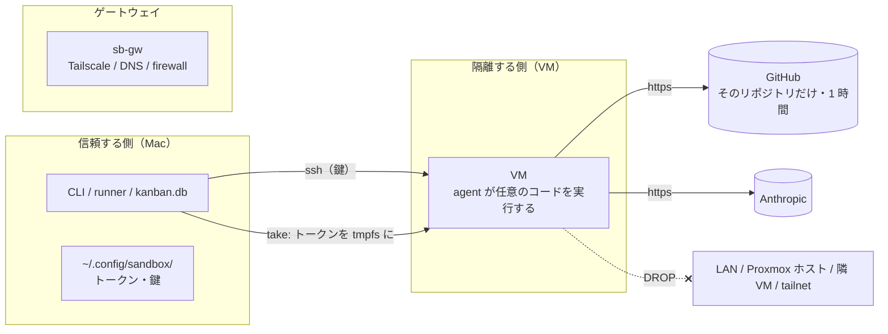

# 安全対策と認証情報の管理

VM の通信と権限をどのように制限し、トークンや鍵をどこに保存するかを説明します。エージェントと運用者が守るルール、現在の構成に残るリスクもまとめています。

## 信頼境界

VM の中ではエージェントが任意のコードを実行します（テストを実行し、依存を入れ、ファイルを書く）。だから VM は「信頼しない側」として扱い、次の 3 つで閉じ込めます。

1. **ネットワーク**: VM 発の NEW 接続はインターネットと sb-gw の DNS だけ（ADR-0010）。LAN、Proxmox ホスト、隣の VM、tailnet には届かない
2. **権限**: GitHub トークンはそのリポジトリだけに効き、1 時間で失効。Claude トークンはプロジェクトごと
3. **寿命**: VM は release で `clean` に巻き戻る。トークンは tmpfs にあり、巻き戻しで消える

## 秘密情報の置き場と寿命

| 秘密 | 置き場（正本） | VM への渡し方 | 寿命 |
|---|---|---|---|
| Claude Code の長期トークン（`claude setup-token`） | Mac `~/.config/sandbox/pj/<pj>.env`。プロジェクトごと（ADR-0006） | take のたびに `/run/sandbox/env`（tmpfs）へ。`reinject` で貸出中にも差し替え可 | 巻き戻しで消える。トークン自体の期限は Anthropic 側 |
| GitHub の push / PR 権限 | GitHub App `aifactory-sandbox` の秘密鍵（Mac `~/.config/sandbox/gh-app/`、ADR-0008） | take のたびに、そのリポジトリだけの installation token を払い出して注入。権限は App が持つもの（contents / pull_requests write、metadata / actions read） | 1 時間。launchd が 45 分ごと、runner がスクリプトの実行前に更新 |
| テンプレート作成時の clone 用トークン | Mac の `gh auth token` | テンプレート作成時だけ環境変数で渡す | テンプレートには残さない |
| SSH 鍵（Mac → VM / sb-gw） | Mac `~/.ssh/conf.d/aifactory/sb_ed25519` | 公開鍵を cloud-init でテンプレートに | テンプレート更新まで |
| Proxmox root への SSH | Mac の ssh 設定（`PVE_HOST` のエイリアスと鍵） | CLI が使う | |
| Tailscale の API キー | Mac（ACL / split DNS を API で変えるときだけ） | 使わない | |

リポジトリには**一切書きません**。`.gitignore` が `*.env` / `*.token` / `.env*` を弾きます。`sandbox token show` はマスク表示です。

## なぜそうしたか

| 判断 | 理由 |
|---|---|
| Claude の認証は setup-token を take 時に注入（ADR-0005） | 通常の OAuth をテンプレートに保存すると、複数 VM でリフレッシュトークンの取り合いが起きる |
| トークンはプロジェクトごと（ADR-0006） | 1 プロジェクトのトークンが漏れても他プロジェクトに及ばない。プロジェクトごとに差し替えられる |
| GitHub は App の 1 時間トークン（ADR-0008） | 静的な PAT は全リポジトリに効き、失効しない。App なら「そのリポジトリだけ・1 時間」に限定できる |
| VM に Tailscale を入れない（ADR-0004） | 巻き戻しでノード鍵が重複する。ゲートウェイ 1 台だけを tailnet に |
| VM から LAN・他 VM へ出さない（ADR-0010） | 実測で隣の VM の 22 / 3000 やホストの SSH に届いた。エージェントが意図せず（または依頼文の注入で）触れる面を塞ぐ |

## エージェントに課している約束

`workflow/kit/roles/_common.md` の要点です。依頼文の 1 層目として毎回貼られます。

- **push しない**。push と PR はコード（runner）がやる
- `main` / `develop` に直接コミットしない。ブランチを切り替えない
- 追跡外のファイル（生成物・DB・ログ）を `git add` しない。`git add -A` を使わない
- 秘密情報（トークン・鍵・`.env` の実値）をファイルに書かない、ログに出さない
- 依頼された範囲の外を変えない。範囲外の問題は直さずに報告書に書く
- 分からないことを推測で埋めない。判断が必要なら選択肢と推奨を書き、安全側で進める

planner は、依頼が不明確・矛盾・危険（データ消失、本番影響、範囲が大きすぎる）なら計画の先頭に **STOP** と書いて止まります。reviewer は「テストを弱めて成功させた跡」「消されたテスト」「migration の後方互換」を見ます。

## 人間がやってはいけないこと

- リポジトリにトークンや鍵を書く（`.gitignore` があっても、別名で書けば入る）
- 貸出中の VM を再起動・巻き戻し・作り替えする（実行中の run が壊れる）
- `clean` スナップショットをファイアウォール設定なしで取り直す（VM が LAN に出られるようになる）
- VM に Tailscale を入れる、VM のファイアウォールを外す
- `gh auth login` を VM でやる（トークンは注入されるので不要。呼ぶと拒否される）
- ゲートを弱めて成功させる（`known_red_gates` は「変更前のブランチでも失敗」の一時的な扱いで、直す PR がマージされたら消す）

## 残っているリスク

| リスク | 状況 |
|---|---|
| テンプレートに保存した SSH 公開鍵と gh の設定は巻き戻しでも残る | テンプレート由来なので当然。漏洩面はプール VM の隔離で担保する前提 |
| Claude トークンは VM 内のプロセスから読める | エージェント自身の認証なので不可避。プロジェクトごとに分け、tmpfs で寿命を短くしている |
| Proxmox ホストの物理電源 | 遠隔で起こす手段（WoL / IPMI）がない構成だと、落ちたときに現地へ行くしかない |
| 同時セッションによる VM の作り替え | [複数セッションで作業する](../guides/multi-session.md) の約束で運用 |
