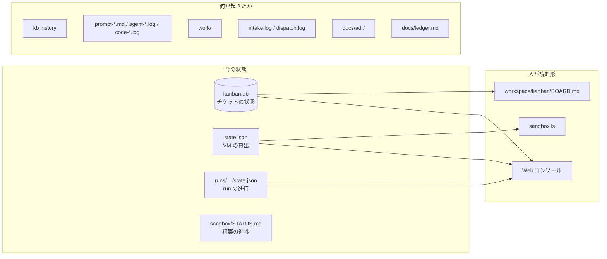

# 状態と記録

チケットの状態、VM の使用状況、実行履歴など、運用に必要な情報の保存先をまとめています。次に作業する人や AI セッションが、会話の履歴に頼らず状況を確認できるようにするための仕組みです。

## 全体図

## 一覧

「git」列の **workspace** は `$AIFACTORY_WORKSPACE`（既定 `<repo>/workspace/`、git 追跡外）にあるもの、**repo** はリポジトリで追跡するものです。

| 何の状態 / 記録 | 置き場 | 読む人 | git |
|---|---|---|---|
| チケットの状態（todo / in_progress / review / blocked / done） | `workspace/kanban/kanban.db` | kb、dispatch、人間 | workspace |
| チケットの履歴（いつ何が変わったか） | 同上（`kb history <id>`） | 人間 | workspace |
| チケット本文 | `workspace/kanban/tickets/<id>-<pj>-<slug>.md` | runner、人間 | workspace |
| ボード（見やすい形） | `workspace/kanban/BOARD.md`（`kb` が再生成） | 人間、Web コンソール | workspace |
| run の進行（今の工程、ループ回数、結果、PR URL、所要秒） | `workspace/runs/<日付>-<pj>-<id>/state.json` | runner（`--resume`）、`kb sync` | workspace |
| エージェントが見た依頼文 | 同 `prompt-<step>-<n>.md` | 人間（失敗の切り分け） | workspace |
| エージェントの出力（人が読める形、逐次） | 同 `agent-<step>-<n>.log` | 人間、Web コンソール | workspace |
| エージェントの生イベント（stream-json） | 同 `agent-<step>-<n>.jsonl` | デバッグする人 | workspace |
| 今動いている工程とログ名 | `state.json` の `current` | Web コンソール、`tail -f` する人 | workspace（終わると null） |
| コンソールが起動した CLI の出力 | `console/jobs/<id>/log`（`CONSOLE_JOBS` で変更可） | Web コンソール | 外 |
| スクリプトが担当する工程の出力 | 同 `code-<step>-<n>.log` | 人間 | workspace |
| 成果物（plan.md / report.md / review.md / summary.md / gates.txt） | VM `~/work/<id>/` → release 時に同 `work/` | 次の工程、reviewer、人間 | workspace |
| VM の貸出 | `~/.config/sandbox/state.json`（`sandbox ls`） | sandbox CLI、dispatch、runner、他セッション | 外 |
| チケット作成と実行の割り当てのログ | `workspace/logs/intake.log` / `workspace/logs/dispatch.log` | 人間 | workspace |
| 構築の進捗と実機確認コマンド | `sandbox/STATUS.md` | 次のセッション | repo |
| 構想の現在地・未決・履歴 | `docs/ledger.md` | 次のセッション、人間 | repo |
| 設計判断の理由 | `docs/adr/NNNN-*.md`（書き換えず追記） | 次のセッション | repo |
| 自分の環境のメモ（ホスト、電源、トークンの期限など） | `workspace/docs/` | 構築する人 | workspace |

## 正本はどれか

| 対象 | 正本 | 派生 |
|---|---|---|
| チケットの状態 | `kanban.db` | `BOARD.md`（生成物。手で編集しない） |
| チケットの本文 | `tickets/*.md` | run ディレクトリの `ticket.md`（開始時のコピー） |
| run の結果 | `workspace/runs/…/state.json` | `kanban.db` の status / pr / note / run（`kb run` / `kb sync` が写す。`run` は run ディレクトリ名） |
| VM の貸出 | `~/.config/sandbox/state.json` | `sandbox ls` の表示 |
| 構築の進捗 | 実機 | `sandbox/STATUS.md`（食い違ったら実機に合わせて直す） |
| 設計 | 各区画の `README.md` + ADR | このサイト、`docs/*.html` |

## 命名

| もの | 形 | 例 |
|---|---|---|
| task-id | 3 桁以上の連番（kanban が採番） | `204` |
| run ディレクトリ | `workspace/runs/<日付>-<pj>-<id>`。同じ日の再実行は前回を `-attemptN` に退避。kanban の `run` 列にはディレクトリ名だけを記録 | `2026-09-06-kumitate-204` |
| 作業ブランチ | `sandbox/<id>-<wf>-<slug>` | `sandbox/204-bug-fix-seeds` |
| 退避ブランチ（human 行き） | `sandbox/<id>-<wf>-wip` | `sandbox/204-bug-wip` |
| 依頼文 / ログ | `prompt-<step>-<n>.md` / `agent-<step>-<n>.log` / `code-<step>-<n>.log`（n は工程の通し番号） | `prompt-review-2.md` |

## 消えるもの

| もの | いつ消えるか |
|---|---|
| VM の中身（作業ツリー、DB、ログ、トークン） | release / reset で `clean` に巻き戻るとき。残したいものは push するか `~/work/<id>/` に書く |
| `/run/sandbox/env`（トークン） | 巻き戻しで消える（tmpfs） |
| GitHub App の installation token | 1 時間で失効 |
| `task-<id>.sb.internal` の DNS | release で外れる |

## 次のセッションが作業状況を確認する手順

1. ルート README「このリポジトリを読む AI へ」
2. `docs/ledger.md` の「現在の方針」表で 4 区画の状態
3. `sandbox/STATUS.md` の「実機確認」コマンドを実行して実機と照合
4. `workspace/kanban/BOARD.md`（または `kb list`）で今のチケット
5. `sandbox ls` で貸出中の VM（別セッションが使っていないか）
6. `git log --oneline -10` と `git status` で直近の変更と他人の作業
