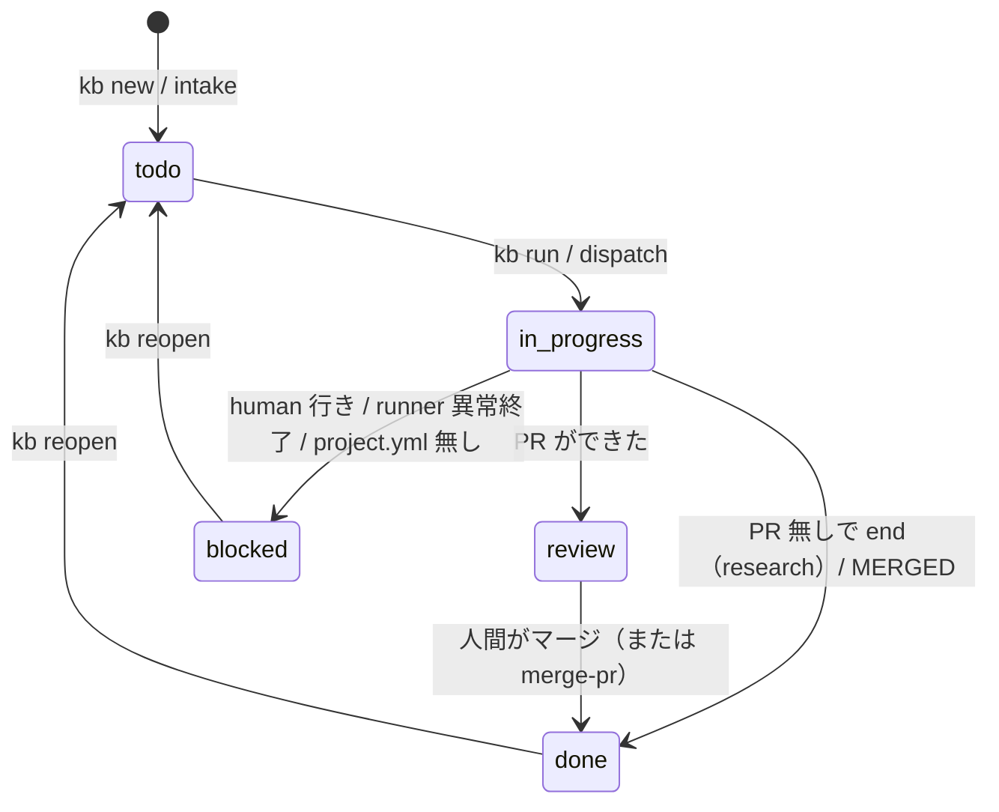
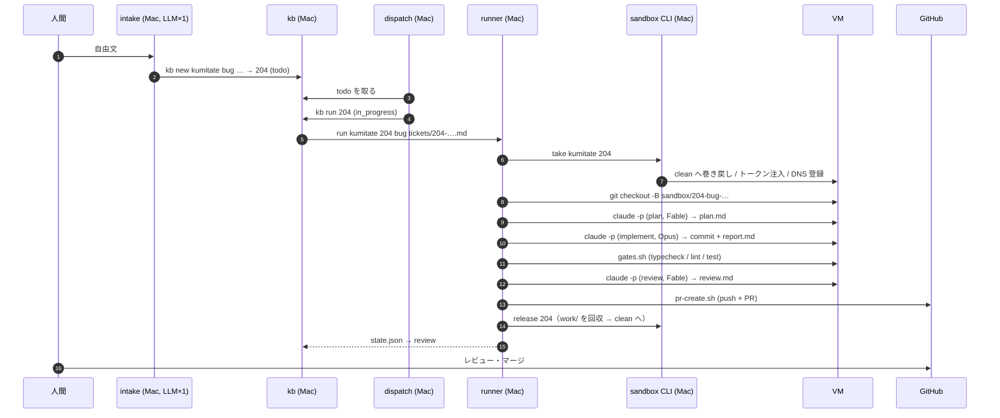

# チケットの作成から完了まで

チケットの作成から PR の作成、レビュー、マージまでの流れを説明します。各段階で、どのプログラムや役割が何を行い、どの記録を残すかを確認できます。

例は kumitate の「calendar のテストが月替わりで落ちる」という依頼（kanban 204、bug ワークフロー）です。

## 状態遷移

| 状態 | 意味 | 次に動くのは |
|---|---|---|
| `todo` | 作成済み。まだ実行していない | dispatch / kb run |
| `in_progress` | runner が実行中 | runner |
| `review` | PR ができた。人間のレビュー待ち | 人間（または merge-pr チケット） |
| `blocked` | 人間待ち。メモに理由 | 人間 |
| `done` | 完了（マージ済み、または PR なしで終了） | 誰も |

## 14 の段階

| # | 誰 | 何をする | 残るもの |
|---|---|---|---|
| 1 | intake | 自由文を読み、LLM に 1 回だけプロジェクト・種別・題名・完了条件を聞く | `workspace/logs/intake.log` |
| 2 | kb new | `MAX(id)+1` で採番。pj / kind の存在を確認。本文をファイルに、状態を DB に | `tickets/204-….md`、`kanban.db`、`BOARD.md` |
| 3 | dispatch | todo を古い順に見る。project.yml の有無とプール空きだけ確認 | `workspace/logs/dispatch.log` |
| 4 | kb run | 状態を `in_progress` に。run ディレクトリ名を記録 | `kanban.db` |
| 5 | runner 起動 | ワークフローの YAML と project.yml を読みスキーマ検証。ブランチ名を決める | `workspace/runs/…/state.json`、`ticket.md` |
| 6 | take | 空き VM を 1 台選び、`clean` へ巻き戻し、トークンを tmpfs に注入、DNS 登録 | `~/.config/sandbox/state.json` |
| 7 | runner | VM 内で base を fetch し作業ブランチを切る。チケットを `~/work/204/` に置く | VM |
| 8 | plan（エージェント） | 依頼文を組み立て VM で `claude -p`。再現条件、範囲、検証方法を `plan.md` に | `prompt-plan-0.md`、`agent-plan-0.log` |
| 9 | implement（エージェント） | 再現テストを先に書いて失敗することを確認、修正して成功を確認、コミット。`report.md` | `prompt-implement-0.md`、`agent-implement-0.log` |
| 10 | gates（code） | プロジェクトの `gates.sh` を VM で実行。失敗したら 9 へ戻す（最大 2 回） | `code-gates-1.log`、`work/gates.txt` |
| 11 | review（エージェント） | 計画・報告・ゲート結果・差分を読み PASS / FAIL。FAIL なら 9 へ（最大 1 回） | `prompt-review-2.md`、`work/review.md` |
| 12 | pr（code） | push して PR を作る。本文に plan / report / review / gates | `code-pr-3.log`、`work/pr_url` |
| 13 | release | `~/work/204/` を Mac に回収し、VM を `clean` へ巻き戻す | `workspace/runs/…/work/` |
| 14 | kb | `state.json` を読み、PR があれば `review` | `kanban.db`、`BOARD.md` |

その後、人間が PR をレビューしてマージします。マージ作業を `merge-pr` チケットにすれば、コンフリクト解消 → gates → review → merge まで無人で回ります。

## 差し戻しと上限

工程の結果で次が決まります。上限を超えると `human` に抜け、成果は `origin/sandbox/<id>-<wf>-wip` に退避されてから VM が巻き戻されます。

| どこで | 戻り先 | 上限 |
|---|---|---|
| gates が失敗 | implement | 2 回 |
| review が FAIL | implement | 1 回 |
| 分岐のない工程が失敗 | human | 即 |

戻すときは前回の結果（ゲートのログ、review の指摘）を依頼文の「前回の結果（直すこと）」に添えます。変更前のブランチでも失敗しているゲートは、`known_red_gates` に登録して参考情報（INFO）として扱います。エージェントには、依頼の範囲外として修正せずに報告するよう伝えます。

## 時間の目安

| 段階 | 時間 |
|---|---|
| intake | 20 秒 |
| take | 10 秒（VM は起動済み。RAM 込みスナップショットから戻る） |
| エージェントが担当する工程 | 1〜10 分 |
| gates | 6〜60 分（プロジェクトのテストの重さ次第） |
| pr / release | 10〜20 秒 |

時間の大半はゲートです。次の改善はゲートの差分実行で、並列化より先に効きます。
