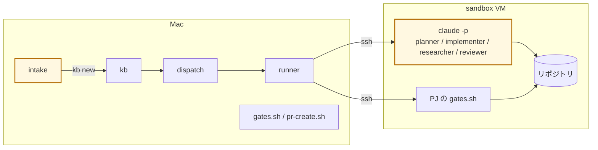

# LLM はどこで動くか

aifactory が Claude Code を起動する場所は、依頼を分類する Mac と、開発作業を行う sandbox VM の 2 箇所です。ワークフローの定義と、それを実行するプログラムの役割を分けて説明します。

## 定義と実行の役割

開発作業を行う **Claude Code は VM 内で起動します**。ワークフローの YAML には、工程、担当する役割、使用するモデルの種類を記述します。Mac 上の Python プログラムである runner がその定義を読み、エージェントが担当する工程に進むと、VM に SSH 接続して `claude -p` を起動します。

ここでいう「動く場所」は、Claude Code のプロセスと、そのツールがファイルを操作する場所を指します。図の黄色は、LLM を利用する処理です。

依頼の分類は Mac 上の intake、リポジトリの調査や編集は VM 内の Claude Code が担当します。

## 2 箇所の比較

| | LLM ①: intake | LLM ②: エージェントが担当する工程 |
|---|---|---|
| 誰が呼ぶ | `glue/bin/intake` | `workflow/bin/run` |
| どこで動く | Mac。一時ディレクトリを作業ディレクトリにし、ツールなし（`--tools ""`） | VM の中。作業ディレクトリは `$SANDBOX_APP_DIR`、ツールあり（ファイル読み書き、テスト実行） |
| 何回 | チケット 1 枚につき 1 回 | エージェントが担当する工程ごとに 1 回。差し戻しがあればその分増える |
| モデル | `routes.env` の judgment（Fable） | 役割の既定クラス → `routes.env` |
| 認証 | Mac の Claude Code ログイン | 鍵プールから用途ごとに選んだ `setup-token` の鍵を take 時に VM へ注入 |
| 入力 | 自由文 + プロジェクト / 種別の一覧 | 8 層の依頼文 |
| 出力 | JSON（pj / kind / title / body / confidence） | 成果物（plan.md 等）と git コミット |
| 失敗したら | JSON が取れずエラー。チケットが作成されない | 指定された出力がなければ工程は失敗。定義された分岐に従って次へ進む |

## LLM を呼ばないもの

| もの | 言語 | 何をする |
|---|---|---|
| `kb` | Python | 採番、状態、履歴、BOARD 生成 |
| `dispatch` | Python | todo を取り、project.yml とプール空きを見て `kb run` |
| runner 本体 | Python | 定義の検証、依頼文の組み立て、ssh、transition、記録 |
| `gates.sh` / `pr-create.sh` / `pr-merge.sh` | bash | テスト実行、push、PR、マージ |
| `sync-base`（runner 内蔵） | Python + git | PR 直前の base 取り込みと、`docs/adr/` の番号重複の検査 |
| `sandbox` CLI | bash | VM の貸出、巻き戻し、トークン注入、DNS |
| Proxmox 側スクリプト | bash | SDN、LXC、テンプレート、プール、ファイアウォール |

これらの処理は、定められた条件と手順に従います。問題が起きたら、エージェントの判断を確認する場合は `agent-*.log`、スクリプトの実行結果を確認する場合は `code-*.log` を読みます。

## VM の中で何が起こるか

- `claude -p` は非対話モード。依頼文を 1 回渡し、終わるまで待つ
- ツール（Bash / Read / Edit）は VM の中で動く。Mac のファイルには触れない
- VM から出られるのはインターネット（GitHub、Anthropic）と sb-gw の DNS だけ。LAN・他 VM・tailnet には届かない
- 終わると VM は `clean` に巻き戻る。残るのは push したものと回収した成果物だけ

## 参考: aifactory 自体の開発に使う Claude Code

メンテナが Mac で対話している Claude Code は、aifactory 自体の開発やドキュメントの編集に使うものです。チケットを処理する VM 内のエージェントとは別に動きます。この Claude Code からも、`kb` / `intake` / `dispatch` や MCP（`console/bin/mcp`）を通じて aifactory を操作できます。
