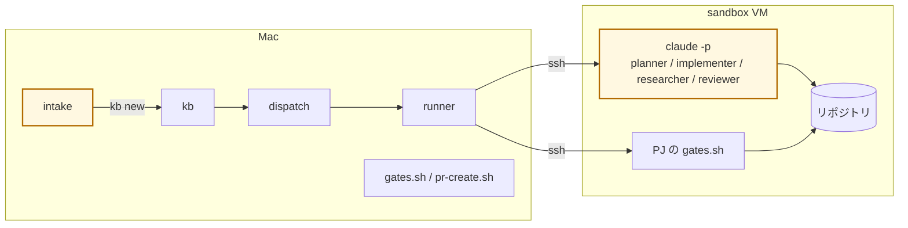
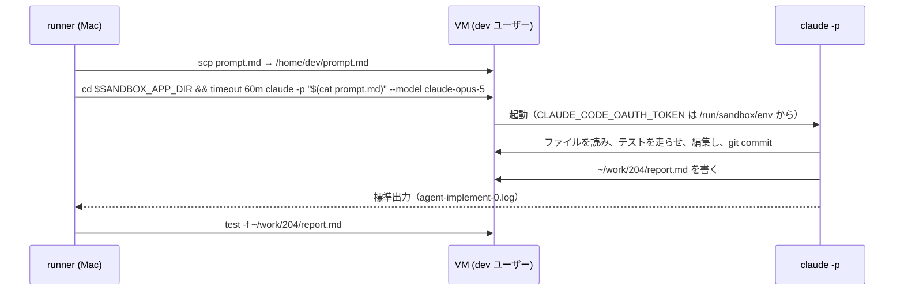

# LLM はどこで動くか

このページで分かること: エージェント（LLM）が実際に動く場所は 2 箇所だけで、workflow は「動かす場所」ではないこと。

## 答え

**workflow では動きません。VM の中で動きます。** workflow（YAML）は「どの step で、どの役割が、どのクラスのモデルを呼ぶか」を書いた定義にすぎず、それを読む runner も Mac 上の Python です。runner は agent step に来ると、VM に ssh して `claude -p` を起動し、終わるのを待ちます。

黄色が LLM の居る場所です。

## 2 箇所の比較

| | LLM ①: intake | LLM ②: agent step |
|---|---|---|
| 誰が呼ぶ | `glue/bin/intake` | `workflow/bin/run` |
| どこで動く | Mac。一時ディレクトリを cwd にし、ツール無し（`--tools ""`） | VM の中。cwd は `$SANDBOX_APP_DIR`、ツールあり（ファイル読み書き、テスト実行） |
| 何回 | チケット 1 枚につき 1 回 | agent step ごとに 1 回。差し戻しがあればその分増える |
| モデル | `routes.env` の judgment（Fable） | 役割の既定クラス → `routes.env` |
| 認証 | Mac の Claude Code ログイン | PJ ごとの `setup-token` を take 時に VM へ注入 |
| 入力 | 自由文 + PJ / 種別の一覧 | 8 層の依頼文 |
| 出力 | JSON（pj / kind / title / body / confidence） | artifact（plan.md 等）と git コミット |
| 失敗したら | JSON が取れずエラー。起票されない | outputs が無く step 失敗 → transition |

## LLM を呼ばないもの

| もの | 言語 | 何をする |
|---|---|---|
| `kb` | Python | 採番、状態、履歴、BOARD 生成 |
| `dispatch` | Python | todo を取り、project.yml とプール空きを見て `kb run` |
| runner 本体 | Python | 定義の検証、依頼文の組み立て、ssh、transition、記録 |
| `gates.sh` / `pr-create.sh` / `pr-merge.sh` | bash | テスト実行、push、PR、マージ |
| `sandbox` CLI | bash | VM の貸出、巻き戻し、トークン注入、DNS |
| Proxmox 側スクリプト | bash | SDN、LXC、テンプレート、プール、firewall |

これらは毎回同じ結果を返します。失敗の切り分けは「判定（LLM）が悪いのか、実行（コード）が失敗したのか」で分かれ、それぞれ `agent-*.log` と `code-*.log` に残ります。

## VM の中で何が起こるか

- `claude -p` は非対話モード。依頼文を 1 回渡し、終わるまで待つ
- ツール（Bash / Read / Edit）は VM の中で動く。Mac のファイルには触れない
- VM から出られるのはインターネット（GitHub、Anthropic）と sb-gw の DNS だけ。LAN・他 VM・tailnet には届かない
- 終わると VM は `clean` に巻き戻る。残るのは push したものと回収した artifact だけ

## 参考: 工場を作っている Claude Code

メンテナが手元の Mac で対話している Claude Code は工場の**外**です。工場を作り、直し、ドキュメントを書く側で、チケットを回す側ではありません。ただし `kb` / `intake` / `dispatch` を叩いて、あるいは MCP（`console/bin/mcp`）経由で工場を使うことはできます。
