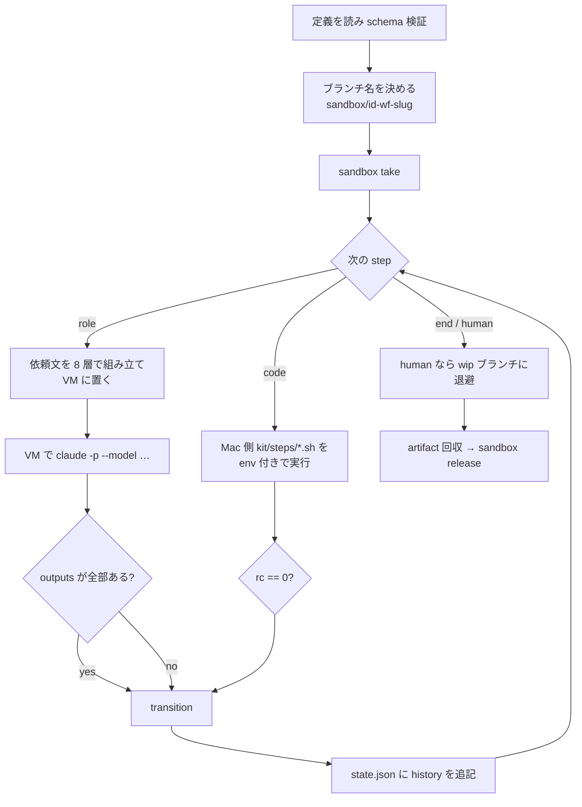
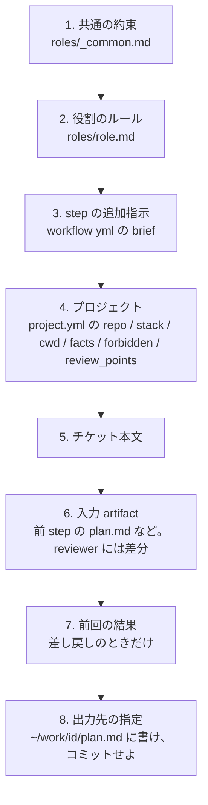

# ワークフローエンジン

ワークフローは作業の順序と分岐を YAML で定義したものです。runner がこの定義を読み、エージェントへの依頼やスクリプトの実行を進めます。定義に使う用語、実行の流れ、依頼文の組み立て方を説明します。

## 定義に使う 5 つの用語

| 用語 | 意味 | 置き場 |
|---|---|---|
| **workflow（ワークフロー）** | チケット種別ごとの手順。工程の並びと分岐 | `workflow/kit/workflows/<name>.yml` |
| **step（工程）** | ワークフローを構成する 1 つの作業。**role**（エージェント）か **code**（スクリプト）が担当する | ワークフローの中 |
| **role（役割）** | エージェントの担当範囲と権限。モデルの種類、行動ルール、出力形式 | `workflow/kit/roles/<role>.md` |
| **artifact（成果物）** | 工程の入出力。**必ずファイル**。VM の `~/work/<id>/` に置き、終了時に `workspace/runs/<run>/work/` へ回収 | ワークフローの `inputs` / `outputs` |
| **transition（次の工程への遷移）** | 結果に応じた次の行き先。ループ回数の上限つき。`human` = 人間に渡して終了 | 工程の `next` / `on_pass` / `on_fail` |

## YAML の形

`bug.yml` の gates と review です。

```yaml
name: bug
description: 不具合修正。計画 → 再現テスト → 修正 → ゲート → レビュー → PR
inputs: [ticket.md]
steps:
  - id: plan
    role: planner
    brief: |
      再現条件を最初に確定させる。再現テストをどこに書くかまで計画に含める。
    outputs: [plan.md]
    next: implement

  - id: implement
    role: implementer
    brief: |
      先に再現テストを書いて赤を確認してから直す。
    inputs: [plan.md]
    outputs: [git, report.md]
    next: gates

  - id: gates
    code: gates.sh                 # code step。kit/steps/gates.sh が VM 内で PJ の gates.sh を実行
    outputs: [gates.txt]
    on_pass: review
    on_fail: { goto: implement, max_loops: 2, else: human }

  - id: review
    role: reviewer
    inputs: [plan.md, report.md, gates.txt]
    outputs: [review.md]
    on_pass: sync
    on_fail: { goto: implement, max_loops: 1, else: human }

  - id: sync
    code: sync-base                # code step。runner 内蔵。PR の直前に base の最新を取り込む
    on_pass: pr
    on_fail: { goto: resolve, max_loops: 2, else: human }

  - id: resolve
    role: implementer              # 衝突は人間でなく implementer に戻す
    outputs: [git, report.md]
    next: gates

  - id: pr
    code: pr-create.sh
    inputs: [plan.md, report.md, review.md, gates.txt]
    outputs: [pr_url]
    next: human
```

- `role` か `code` のどちらか 1 つ。両方は書けない
- `outputs` の `git` は「作業ブランチにコミットせよ」、`pr_url` は「PR の URL を置け」の意味で、ファイルとしては回収しない
- `brief` は工程固有の追加指示。役割ごとの行動ルール（`roles/<role>.md`）の後に貼られる
- `model_class`（judgment / research / coding）で役割の既定クラスを上書きできる。`timeout_min`（既定 60）でエージェントの上限時間

runner は起動時に、`workflow/kit/schema/workflow.schema.json` を使って定義の形式を検証します。

## runner の動き



| 場面 | runner がすること |
|---|---|
| 起動 | `kit/workflows/<wf>.yml` とプロジェクトの `project.yml`（`workspace/projects/<pj>/` → `examples/projects/<pj>/`）を読み、スキーマ検証。ブランチ名 `sandbox/<id>-<wf>-<slug>`。`workspace/runs/<日付>-<pj>-<id>/` を作る（既にあれば `-attemptN` に退避） |
| take | `sandbox take <pj> <id>`。VM 内で base を fetch し作業ブランチを切る。merge-pr なら PR の head を checkout |
| エージェントが担当する工程 | 依頼文を組み立てて `workspace/runs/` に残し、VM の `/home/dev/prompt.md` に置き、`cd $SANDBOX_APP_DIR && timeout <N>m claude -p "$(cat prompt.md)" --model <model>` を実行。終わったら `outputs` のファイルが全部あるかで合否 |
| スクリプトが担当する工程 | `kit/steps/<script>` を Mac で実行。env で `PJ TASK RUN_DIR PROJECT_DIR GATES WORK APP_DIR BASE BRANCH WORKFLOW TITLE PR_NUMBER KNOWN_RED` を渡す。rc で合否 |
| transition | `next` / `on_pass` / `on_fail` を見る。`goto` のループ回数を `state.json` の `loops` に数え、`max_loops` を超えたら `else` |
| 差し戻し | 前回の結果（ゲートのログ、review の内容）を「前回の結果（直すこと）」として次の依頼文に添える。変更前のブランチでも失敗しているなら「直さず報告」と明記 |
| 終了 | `human` なら `origin/sandbox/<id>-<wf>-wip` に push して成果を退避。`~/work/<id>/` を `workspace/runs/…/work/` に回収。`sandbox release` |
| スクリプトの実行前 | GitHub App トークンを払い出し直す（1 時間失効の対策） |

## 依頼文の 8 層

エージェントが受け取る依頼文は、runner が毎回この順で組み立てます。結果は `workspace/runs/<run>/prompt-<step>-<n>.md` に残ります。



| 層 | 出どころ | 変える頻度 |
|---|---|---|
| 1 | `workflow/kit/roles/_common.md` | 低。全役割に効く |
| 2 | `workflow/kit/roles/<role>.md` | 低 |
| 3 | `workflow/kit/workflows/<wf>.yml` の `brief` | 低 |
| 4 | `workspace/projects/<pj>/project.yml` | 中。プロジェクトの状況で |
| 5 | `workspace/kanban/tickets/<id>-….md` | 毎回 |
| 6 | VM の `~/work/<id>/` と `git diff origin/<base>...HEAD` | 毎回 |
| 7 | 直前の工程の結果 | 差し戻し時 |
| 8 | ワークフローの YAML の `outputs` | 低 |

## モデルの決まり方

役割ごとに既定のクラスがあり、クラスは `workflow/kit/routes.env` でモデル名に解決されます。

| 役割 | 既定クラス | モデル |
|---|---|---|
| planner / reviewer | judgment | `claude-fable-5-1` |
| researcher | research | `claude-sonnet-5` |
| implementer | coding | `claude-opus-5` |

上書きは 3 段。工程の `model_class` > 環境変数 `CLAUDE_MODEL`（1 回限り） > 既定。判断は Fable、Web 調査は Sonnet、実装は Opus という型はメンテナの判断（2026-09-06）です。`routes.env` を変えれば別のモデルにできます。

## 4 つのスクリプト工程

| スクリプト | 何をする | 失敗の条件 |
|---|---|---|
| `gates.sh` | プロジェクトの `gates.sh` を VM に scp して実行。赤があればその赤いゲートだけを base でも実行し、base でも赤いものと `known_red_gates` の FAIL を INFO（参考情報）として扱うように変更。結果を `~/work/<id>/gates.txt` に | INFO に落ちなかった FAIL が 1 つでもある |
| `pr-create.sh` | コミットがあるか確認 → push → 成果物を本文にして `gh pr create` → URL を `~/work/<id>/pr_url` に | コミットがない、push 失敗 |
| `pr-merge.sh` | コンフリクトマーカーの残りを検査 → base 取り込み済みか確認 → head へ push → ゲート・レビューの結果を PR コメントに → `gh pr merge` | マーカー残り、base 未取り込み、マージ失敗 |
| `sync-base` | **runner 内蔵**（`kit/steps/` にファイルは無い）。`git fetch origin <base>` → 取り込み済みでなければ `git merge`。衝突したら衝突ファイル名を控えて `git merge --abort` → `docs/adr/` の番号重複を検査 | 衝突した、ADR 番号が重複した、fetch できない |
