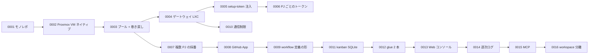

# 設計判断（ADR）

設計を決めた理由は、ADR（Architecture Decision Record）として `docs/adr/NNNN-slug.md` に記録します。1 つの判断につき 1 ファイルを作り、「状況」「決定」「理由」「結果（トレードオフ）」「状態」を記述します。

**既存の ADR は書き換えません。** 判断を変更するときは新しい番号の ADR を作り、`supersedes NNNN` と書いて、どの判断を置き換えるかを示します。

ここは一覧と要約です。本文はリポジトリの `docs/adr/` を読んでください。

## 一覧

| 番号 | 判断 | 要点 | 状態 |
|---|---|---|---|
| 0001 | 1 リポジトリ（モノレポ）で始める | 区画間の契約が見つかる前に分割しない | 採用 |
| 0002 | sandbox は Proxmox VM、アプリは VM 内ネイティブ | Rails をそのまま動かす。Docker を使わない。VM のほうが事故が少ない | 採用 |
| 0003 | プールは使い回し + スナップショット巻き戻し | タスクごとに VM を作らず、常駐プールから貸し出して `clean` へ戻す。DB も巻き戻しで初期化 | 採用 |
| 0004 | Mac からの到達はゲートウェイ LXC の Tailscale subnet router | VM に Tailscale を入れると巻き戻しでノード鍵が重複する。ゲートウェイ 1 台だけ tailnet に | 採用 |
| 0005 | Claude Code 認証は setup-token の長期トークンを take 時に tmpfs 注入 | OAuth の認証状態をテンプレートに保存する方法はリフレッシュトークンの取り合いが起きる | 採用 |
| 0006 | トークンはプロジェクトごとに持ち、貸出中の VM にも差し替えを反映（`token` / `reinject`） | 1 プロジェクトの漏洩が他に及ばない。0005 を拡張 | 採用 |
| 0007 | 複数プロジェクト同居: テンプレート 911x をプロジェクトごとに、VM の IP は VMID から導く | プロジェクト横断で IP が一意。task-id から IP を導かない | 採用 |
| 0008 | GitHub の push / PR 権限は GitHub App の installation token を take のたびに払い出す | 静的 PAT は全リポジトリに効き失効しない。App なら「そのリポジトリだけ・1 時間」 | 採用 |
| 0009 | ワークフローの定義は YAML + JSON Schema、手順は共通の定義に 1 つ、プロジェクト固有は基本情報と作業ルールだけ | 手順をプロジェクトごとに複製しない。プロジェクト固有は `project.yml` の facts / forbidden / review_points | 採用 |
| 0010 | sandbox VM の通信はインターネットと sb-gw の DNS だけ。LAN・他 VM・tailnet へは出さない | 実測で隣の VM やホストの SSH に届いた。Proxmox ファイアウォール + sb-gw の FORWARD DROP | 採用 |
| 0011 | kanban はリポジトリ内の SQLite + CLI（`kb`）。外部システムは取り込み口として後から足す | 個人タスク台帳は ID が衝突し粒度も違う。termboard / Notion は別システム | 採用 |
| 0012 | glue は取り込み（LLM 1 回）と実行の割り当て（スクリプト）の 2 本。ステップ間の状態は runner に任せる | ルーターを LLM 1 回に留めると失敗の切り分けが簡単。状態を二重に持たない | 採用 |
| 0013 | Web コンソールは Mac ローカルの Python 標準ライブラリ製。状態は既存 CLI 経由でしか変えない | UI が独自の書き込み経路を持つと同時セッションとの衝突点が増える。依存ゼロで壊れない | 採用 |
| 0014 | エージェントが担当する工程の出力は stream-json を人が読める形に起こして逐次書き、生イベントはローカルにだけ残す | 60 分の工程の途中が見える。生 JSONL は大きいので git に入れない。`state.json` の `current` で今の工程を指す | 採用 |
| 0015 | 操作口は Web コンソール（HTTP）と MCP（stdio）の 2 つ。読み書きの正本は `console/lib/core.py` に 1 つ | 口ごとに判定を複製すると穴になる。ジョブ記録は flock で共有。MCP は標準ライブラリの最小実装 | 採用 |
| 0016 | 枠組み（リポジトリ）と運用データ（`AIFACTORY_WORKSPACE`）を分ける。置き場の判断は `lib/aifactory_paths.py` に 1 つ | 公開リポジトリに私有プロジェクトの情報が混ざる事故を置き場で構造的に防ぐ。例は `examples/projects/` に同梱し、テストは本番データに依存しない | 採用 |
| [0022](https://github.com/akkijp-oss/aifactory/blob/main/docs/adr/0022-windows-pull-worker.md) | 専用Windows VM内のサービスを共通pull workerにする | 一般ユーザー実行、Job Objectによる子孫プロセス停止、workspace単位の返却を共通workflowにつなぐ | 採用 |

## 判断の流れ

## 保留中の論点（ADR なし）

`docs/ledger.md` の「やりたいこと」に置いてあるもの。着手を決めたら ADR にします。

- hotfix 用の「複数 sandbox で競争させて最速を採る」パターン。プール台数が増えてから
- ノード跨ぎのプール（複数の Proxmox ノード）。共有ストレージがないなら、テンプレートを各ノードに複製するか VXLAN zone にするか
- ゲートの並列化・差分実行。1 周の時間の大半がゲート
- 画面確認（スクショを Mac に回収）と `url` をワークフローに組み込む
- dispatch のプロジェクト単位並列

## ADR を書くとき

1. `ls docs/adr/` で最大番号を取り直す（同時に別セッションが書いていることがある）
2. `docs/adr/NNNN-slug.md` を「状況 / 決定 / 理由 / 結果（トレードオフ）/ 状態」で書く
3. `docs/adr/README.md` の表に 1 行足す
4. `docs/ledger.md` の該当箇所に番号を引用する
5. このサイトの一覧にも 1 行足す（日本語と英語）

- [ADR 0023: Computer use in dedicated VMs](https://github.com/akkijp-oss/aifactory/blob/main/docs/adr/0023-computer-use.md)

- [ADR 0024: Standalone Linux worker](https://github.com/akkijp-oss/aifactory/blob/main/docs/adr/0024-standalone-linux-worker.md)

- [ADR 0026: 記録する時刻はオフセット付き ISO 8601 にする](https://github.com/akkijp-oss/aifactory/blob/main/docs/adr/0026-timestamps-carry-utc-offset.md)
