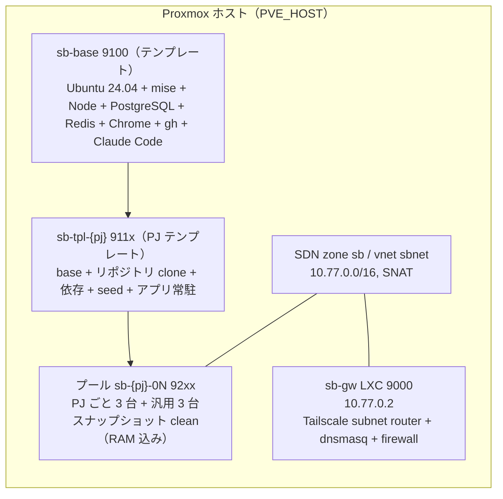

# sandbox の構築

Proxmox 上に、タスクの実行に使う VM をまとめて用意します。この VM の集まりを「プール」と呼びます。

以下では、ネットワークの準備から動作確認まで、各作業の目的と手順を説明します。詳しいコマンドと各段階の完了条件は `sandbox/BUILD.md` にあります。

!!! info "構築済みの環境を引き継ぐ人へ"
    進捗は `sandbox/STATUS.md` に残します。引き継ぐ人は、STATUS の「実機確認」節のコマンドを実行して、書かれている進捗と実機が一致することを確かめてから作業してください。

## 出来上がる構成



## ステップ一覧

| Step | 作るもの | なぜ要るか | 担当 |
|---|---|---|---|
| 0 | 事前確認、Mac 側の鍵と設定、GitHub App | 構築前に環境の正常性を確認し、認証情報の保存先を決める | 🤖 → 🧑（App の作成・インストール） |
| 1 | SDN `sb` / vnet `sbnet`（10.77.0.0/16、SNAT） | VM に専用 IP 空間を与え、外向きは NAT で出す | 🤖 |
| 0c | テナントの器（リソースプール・ロール・ユーザー） | 制御系に渡す権限を自分のプールだけに限る（ADR-0017）。貸出先のテナントでは必須 | 🤖 |
| 2 | ゲートウェイ LXC `sb-gw`（dnsmasq + Tailscale） | Mac から VM に名前で届く経路。VM 側に Tailscale を入れない | 🤖 → 🧑（Tailscale の認証・ルート承認・split DNS）→ 🤖 |
| 2d | 制御系 LXC `sb-ctl`（console + `/docs/` + runner + workspace） | console / docs / runner を Proxmox 上に置き、Mac 側を不要にする（ADR-0017）。貸出先のテナントでは必須、`default` では任意 | 🤖 → 🧑（secrets を入れる） |
| 3 | ベーステンプレート `sb-base` | 全プロジェクトに共通する OS・ツール・DB・Claude Code を用意する | 🤖 |
| 4 | プロジェクトテンプレート `sb-tpl-{pj}` | プロジェクトに合わせて Ruby / Node、依存パッケージ、初期データ、アプリの常駐設定を用意する | 🤖（clone 用トークンは 🧑 から） |
| 5 | プール（clone × 3）+ スナップショット `clean` + CLI | 貸し出す実体。巻き戻しの基準点 | 🤖 |
| 5c | 通信制限（Proxmox ファイアウォール + sb-gw の FORWARD DROP） | VM から LAN・他 VM・tailnet へ出られないようにする（ADR-0010） | 🤖 |
| 6 | 最小ワークフローで 1 周 | sandbox の基本操作でワークフローを最後まで実行できるか確認する | 🤖 + 🧑（PR レビュー） |

## 各ステップの要点

Step 0c（`05-tenant.sh`）と 2d（`25-control-lxc.sh`）の詳細はリポジトリの `sandbox/BUILD.md` と [貸出先ごとの環境（テナント）](../guides/tenants.md)。以下は従来どおりの Step 1〜6。

### Step 1. ネットワーク

Proxmox の SDN で simple zone `sb` と vnet `sbnet` を作り、ゲートウェイ `10.77.0.1`、SNAT を有効にします。VM の IP は VMID から決まる固定値で（プール 92xx → `10.77.1.(VMID−9200)`）、DHCP は使いません。

```bash
sandbox/proxmox/run.sh 10-sdn.sh
```

`run.sh` は `PVE_HOST`（必須）に ssh してスクリプトを流します。ネットワークの設計値は環境変数で変えられ、未設定なら既定です: `SB_NODE`（SDN zone を載せるノード名。既定はホストの hostname）、`SB_NET`（/16 のプレフィックス。既定 `10.77`）、`SB_GW_CT`（ゲートウェイの CT ID。既定 9000）、`SB_BASE_VMID`（既定 9100）、`SB_POOL_BASE`（既定 9200）。変えたら Mac 側の `SB_POOL_NET` / `SB_POOL_BASE` もそろえます。

### Step 2. ゲートウェイ LXC

`sb-gw`（VMID 9000）には、2 つのネットワークインターフェースがあります。eth0 は LAN に DHCP で接続し、eth1 は `sbnet` に固定 IP `10.77.0.2` で接続します。

ゲートウェイでは、dnsmasq が `*.sb.internal` の名前解決を担当し、tailscaled が `10.77.0.0/16` への経路を Tailscale に通知します。また、ファイアウォールで VM からの転送を制限します。

```bash
sandbox/proxmox/run.sh 20-gateway-lxc.sh
```

🧑 ここで人間の操作が 3 つ要ります。

1. `tailscale up` の認証 URL をブラウザで開いて承認
2. Tailscale 管理コンソールで `sb-gw` の route `10.77.0.0/16` を **Approve**
3. tailnet の ACL が grants 形式で subnet 宛てを個別許可している場合、`10.77.0.0/16` を grant に足す。split DNS で `sb.internal` を `10.77.0.2` に向ける

!!! warning "route の承認だけでは届かない"
    tailnet の ACL に grant がないと、承認後も ping が通りません。`journalctl -u tailscaled` に `Drop: … no rules matched` が出ていたら ACL です（`TS_API_KEY` で API 適用できます）。

Tailscale が使えるようになるまでは `~/.config/sandbox/env` に `SB_JUMP=<PVE_HOST と同じ値>`（例: `SB_JUMP=pve1`）を入れると、CLI は Proxmox ホスト経由（ProxyJump）で VM に入れます。

### Step 3. ベーステンプレート

Ubuntu 24.04 の cloud image から VM 9100 を作り、`31-provision-base.sh` で全プロジェクト共通のソフトウェアをインストールします。その後、`qm template` でテンプレートに変換します。入っているものは `sandbox/templates/base/README.md` に一覧があります（mise、Node 22、PostgreSQL 16、Redis、Chrome、gh、Claude Code、`/run/sandbox` の tmpfs など）。Ruby は入れません（プロジェクト層で `.ruby-version` に従います）。

```bash
sandbox/proxmox/run.sh 30-base-template.sh create
```

### Step 4. プロジェクトテンプレート

base から clone した VM でプロジェクトの `provision.sh`（`$AIFACTORY_WORKSPACE/projects/<pj>/`、なければ `examples/projects/<pj>/`）を実行し、リポジトリの clone、`mise install`、依存パッケージのインストール、DB の作成と初期データの投入、systemd によるアプリの常駐設定を行います。その状態をテンプレートとして保存します。

```bash
GH_TOKEN="$(gh auth token)" TPL_VMID=9110 PJ=kumitate sandbox/proxmox/run.sh 32-pj-template.sh
```

clone に使ったトークンはテンプレートに残しません。VM から push するトークンは `take` のたびに注入されます。

### Step 5. プールと CLI

テンプレートを linked clone で 3 台ずつ複製し、アプリが起動した状態で RAM 込みスナップショット `clean` を取ります。これが「貸出前の基準状態」で、`reset` / `release` はここに戻ります。

```bash
TPL_VMID=9110 sandbox/proxmox/run.sh 40-pool.sh kumitate 3
sandbox/bin/install.sh
sandbox take kumitate 001 && sandbox ssh 001 'claude --version' && sandbox release 001
```

### Step 5c. 通信制限

VM は「インターネットと sb-gw の DNS」にだけ出られ、LAN・Proxmox ホスト・隣の VM・tailnet には届かないようにします（ADR-0010）。Proxmox の datacenter ファイアウォールで security group `sandbox` を全 VM に付け、sb-gw では VM 発の NEW 接続の転送を落とします。プールの `clean` スナップショットはファイアウォール設定込みで取り直します。

```bash
LENT="$(jq -r '.[].vmid' ~/.config/sandbox/state.json | tr '\n' ' ')" sandbox/proxmox/run.sh 50-firewall.sh
```

`LENT` は貸出中の VM を飛ばすためです。貸出中の VM を作り替えると、実行中の run が壊れます（[複数セッションで作業する](../guides/multi-session.md)）。

### Step 6. 一連の処理を実行する

[はじめてのチケット実行](first-run.md) に進み、チケットの作成から PR の確認までを試してください。

## 台数とサイズ

| 種別 | VMID | 台数 | サイズ |
|---|---|---|---|
| 汎用（generic） | 9201〜9203 | 3 | 4 GB / 2 vCPU |
| プロジェクトプール | 9204〜（プロジェクトごとに 3 つずつ） | プロジェクト数 × 3 | 8 GB / 4 vCPU（重いテストスイートのため） |

linked clone なので `local-lvm`（thin）の実使用は数 % で済みます。増やすときは `lvs pve/data` の `data%` を見ます。
