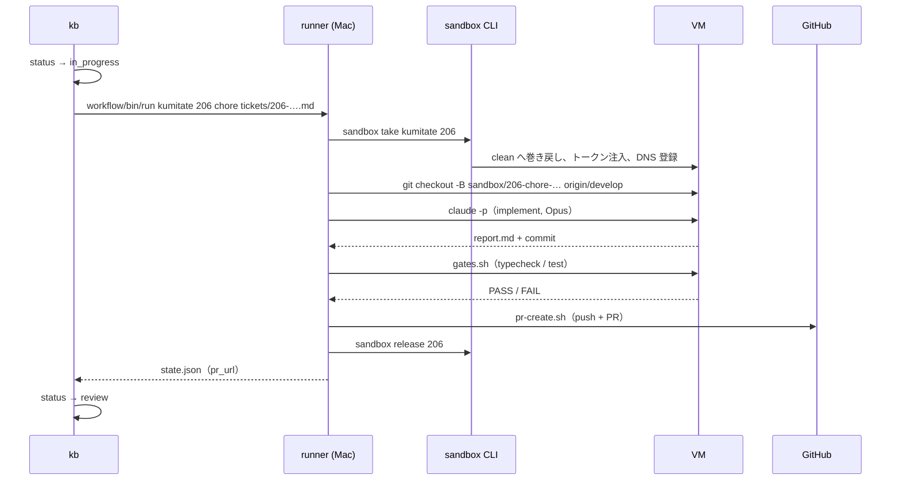

# はじめての 1 周

このページで分かること: チケットを 1 枚作り、VM を触らない dry-run で定義を確かめ、本実行して PR まで届くところ。所要は dry-run が数秒、本実行が 5〜60 分（ゲートの重さで決まります）。

## 0. 事前確認

```bash
sandbox ls                         # VM が見えること。TASK 列が "-" なら空き
sandbox gh-app status              # 対象 PJ が OK
sandbox token show <pj>            # Claude トークンが入っている
kanban/bin/kb list                 # 台帳が読める（空でもよい）
```

## 1. チケットを作る

やり方は 2 つあります。

=== "自由文から（intake）"

    ```bash
    cat > /tmp/memo.txt <<'EOF'
    kumitate の README にある起動コマンドが古い。pnpm dev ではなく pnpm --filter @kumitate/web dev になっている。直して。
    EOF
    glue/bin/intake /tmp/memo.txt
    ```

    LLM が PJ（kumitate）と種別（chore）を判定し、題名と完了条件を付けて起票します。判定を見てから起票したいときは `--dry-run`。

=== "整った ticket.md から（kb new）"

    ```bash
    kanban/bin/kb new kumitate chore "docs: README の起動コマンドを現行に合わせる" --body - <<'EOF'
    README の起動コマンドが `pnpm dev` のままで、実際は `pnpm --filter @kumitate/web dev`。

    ## 完了条件
    - README の該当箇所が現行のコマンドになっている
    - typecheck / test が緑
    EOF
    ```

どちらも id（例: `206`）が返り、`$AIFACTORY_WORKSPACE/kanban/tickets/206-kumitate-….md`（既定は `workspace/kanban/tickets/`）に本文が置かれます。

## 2. dry-run で定義を確かめる

```bash
kanban/bin/kb run 206 --dry-run
```

VM を触らず、workflow yml と project.yml の schema 検証、各 step の依頼文の組み立てだけを行い、`workspace/runs/<日付>-kumitate-206-dry/` に出します。`prompt-implement-0.md` を開くと、agent が受け取る依頼文（共通の約束・役割の憲法・PJ の事実・チケット）が読めます。ここで PJ の facts や forbidden の書き漏れに気づけます。

## 3. 本実行

```bash
kanban/bin/kb run 206
```

流れは次のとおりです。



ターミナルには step ごとの進行が出ます。

```
[run kumitate/206 0s] workflow chore: implement → gates → pr  (branch sandbox/206-chore-readme → develop)
[run kumitate/206 0s] take
[run kumitate/206 9s] agent implement (implementer / coding → claude-opus-5)
[run kumitate/206 75s] implement: PASS → gates
[run kumitate/206 75s] code gates (gates.sh)
[run kumitate/206 960s] gates: PASS → pr
[run kumitate/206 960s] code pr (pr-create.sh)
[run kumitate/206 971s] result: human  PR: https://github.com/akkijp/kumitate/pull/300  run: …/workspace/runs/2026-09-06-kumitate-206
[kb]  206 レビュー待ち kumitate   chore     #300   docs: README の起動コマンドを現行に合わせる
```

## 4. 結果を読む

| 何を | どこ |
|---|---|
| PR | ターミナルの `PR:`、または `kb show 206` の `pr` |
| agent が見た依頼文と出力 | `workspace/runs/<日付>-kumitate-206/prompt-*.md` / `agent-*.log` |
| ゲートの結果 | 同 `code-gates-*.log` と `work/gates.txt` |
| 成果物（report.md など） | 同 `work/` |
| 状態と履歴 | `kb show 206` / `kb history 206` / `workspace/kanban/BOARD.md` |

詳しくは [結果を読む](../guides/results.md)。

## 5. 人間の出番

PR をレビューしてマージします。マージ作業も無人化できます。

```bash
kanban/bin/kb new kumitate merge-pr "PR #300 を develop へマージ" --pr 300 --body - <<'EOF'
コンフリクトがあれば両方の意図を残す形で解消し、ゲートが緑でレビューが PASS ならマージする。
EOF
kanban/bin/kb run 207
```

## うまくいかないとき

| 症状 | 見るところ |
|---|---|
| `take` が「空きなし」 | `sandbox ls`。貸出中の VM が残っていれば `sandbox release <id>` |
| agent が認証エラー | `sandbox token show <pj>`。切れていれば `claude setup-token` → `sandbox token set <pj>` |
| gates が赤で 2 回差し戻されて `human` 行き | `code-gates-*.log`。base で既に赤なら `project.yml` の `known_red_gates` に書く |
| 途中で VM に ssh できなくなった | 別セッションが VM を作り替えていないか。[複数セッションで作業する](../guides/multi-session.md) |

そのほかは [トラブルシューティング](../troubleshooting.md)。
