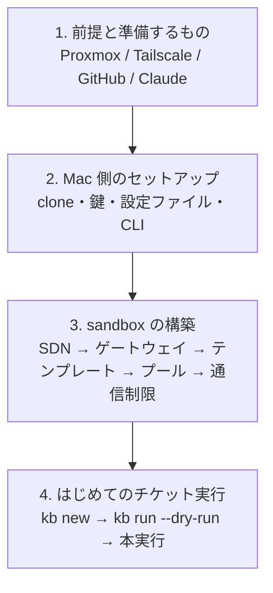

# はじめに

aifactory の導入から、最初のチケットを実行して結果を確認するまでの手順を説明します。所要時間の目安は、Proxmox 側の構築を含めて半日〜1 日です。sandbox が構築済みなら、約 30 分で使い始められます。

## 全体の手順

| 段階 | 主な作業 | 人間の操作が要る箇所 |
|---|---|---|
| [前提と準備するもの](requirements.md) | 何が必要かを確認する | アカウント・機材の用意 |
| [Mac 側のセットアップ](install-mac.md) | リポジトリを clone し、鍵・設定・CLI を置く | `claude setup-token`、GitHub App の作成とインストール |
| [sandbox の構築](build-sandbox.md) | Proxmox に VM プールを作る | Tailscale のルート承認 |
| [はじめてのチケット実行](first-run.md) | チケットを 1 枚実行して結果を読む | PR のレビュー |

!!! tip "既に構築済みの環境で作業を引き継ぐ人へ"
    sandbox が既にある環境なら、[sandbox の構築](build-sandbox.md) は読むだけにして、[Mac 側のセットアップ](install-mac.md) の「確認」節で実機と手元が合っているかを確かめてから [はじめてのチケット実行](first-run.md) に進んでください。

## 記号

このサイトと手順書（`sandbox/BUILD.md`）では、誰が作業するかを記号で示します。

| 記号 | 意味 |
|---|---|
| 🤖 | AI セッション（Claude Code）またはスクリプトが実行できる |
| 🧑 | 人間の操作が必要（ブラウザでの承認、トークンの発行など） |
