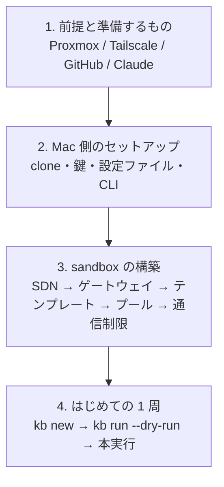

# はじめに

ゼロから工場を立ち上げて、最初のチケットを 1 周させるまでの道筋です。所要は、Proxmox 側の構築を含めて半日から 1 日、既に sandbox がある環境なら 30 分です。

## 全体の手順

| 段階 | 主な作業 | 人間の操作が要る箇所 |
|---|---|---|
| [前提と準備するもの](requirements.md) | 何が必要かを確認する | アカウント・機材の用意 |
| [Mac 側のセットアップ](install-mac.md) | リポジトリを clone し、鍵・設定・CLI を置く | `claude setup-token`、GitHub App の作成と install |
| [sandbox の構築](build-sandbox.md) | Proxmox に VM プールを作る | Tailscale のルート承認 |
| [はじめての 1 周](first-run.md) | チケットを 1 枚回して結果を読む | PR のレビュー |

!!! tip "既に構築済みの環境で作業を引き継ぐ人へ"
    sandbox が既にある環境なら、[sandbox の構築](build-sandbox.md) は読むだけにして、[Mac 側のセットアップ](install-mac.md) の「確認」節で実機と手元が合っているかを確かめてから [はじめての 1 周](first-run.md) に進んでください。

## 記号

このサイトと手順書（`sandbox/BUILD.md`）では、誰が作業するかを記号で示します。

| 記号 | 意味 |
|---|---|
| 🤖 | AI セッション（Claude Code）またはスクリプトが実行できる |
| 🧑 | 人間の操作が必要（ブラウザでの承認、トークンの発行など） |
